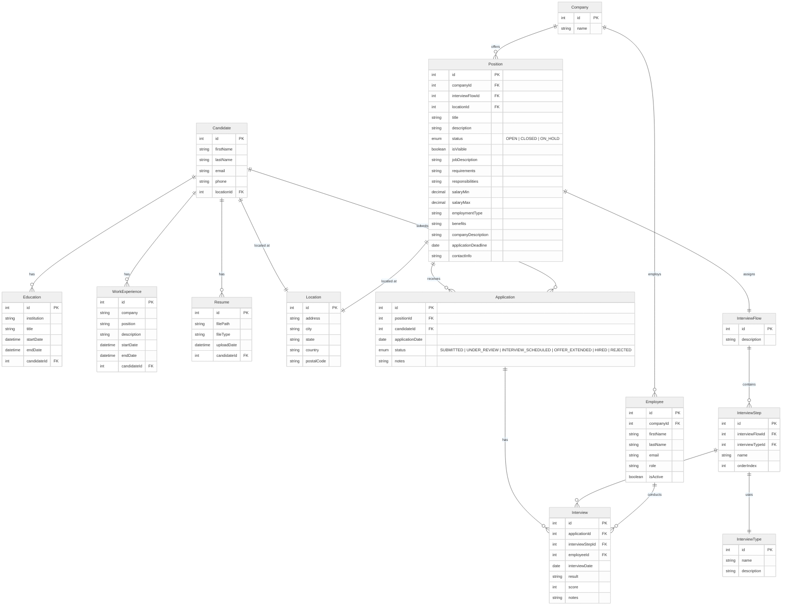

# Prompt 1 Inicial

Actúa como un experto en modelos de datos y PostgresSQL. 
Queremos adaptar el modelo actual de datos para añadir una nueva funcionalidad en esta aplicación: Aplicación de un candidato a diversas vacantes.
Aquí tienes el PRD para saber de qué va el proyecto: @https://github.com/LIDR-academy/AI4Devs-design/blob/main/LTI-mentors/LTI-mentors.md 
El modelo de datos actual lo tenemos descrito en el fichero @schema.prisma  del módulo backend.
Vamos a seguir los siguientes pasos:
El modelo de datos para cubrir dicha funcionalidad viene descrito en el siguiente ERD:
```mermaid
erDiagram
     COMPANY {
         int id PK
         string name
     }
     EMPLOYEE {
         int id PK
         int company_id FK
         string name
         string email
         string role
         boolean is_active
     }
     POSITION {
         int id PK
         int company_id FK
         int interview_flow_id FK
         string title
         text description
         string status
         boolean is_visible
         string location
         text job_description
         text requirements
         text responsibilities
         numeric salary_min
         numeric salary_max
         string employment_type
         text benefits
         text company_description
         date application_deadline
         string contact_info
     }
     INTERVIEW_FLOW {
         int id PK
         string description
     }
     INTERVIEW_STEP {
         int id PK
         int interview_flow_id FK
         int interview_type_id FK
         string name
         int order_index
     }
     INTERVIEW_TYPE {
         int id PK
         string name
         text description
     }
     CANDIDATE {
         int id PK
         string firstName
         string lastName
         string email
         string phone
         string address
     }
     APPLICATION {
         int id PK
         int position_id FK
         int candidate_id FK
         date application_date
         string status
         text notes
     }
     INTERVIEW {
         int id PK
         int application_id FK
         int interview_step_id FK
         int employee_id FK
         date interview_date
         string result
         int score
         text notes
     }

     COMPANY ||--o{ EMPLOYEE : employs
     COMPANY ||--o{ POSITION : offers
     POSITION ||--|| INTERVIEW_FLOW : assigns
     INTERVIEW_FLOW ||--o{ INTERVIEW_STEP : contains
     INTERVIEW_STEP ||--|| INTERVIEW_TYPE : uses
     POSITION ||--o{ APPLICATION : receives
     CANDIDATE ||--o{ APPLICATION : submits
     APPLICATION ||--o{ INTERVIEW : has
     INTERVIEW ||--|| INTERVIEW_STEP : consists_of
     EMPLOYEE ||--o{ INTERVIEW : conducts
 ```

En todo momento vamos a seguir buenas prácticas en BBDD (normalización de la base de datos y buena definición de índices)

Vamos a seguir los pasos uno por uno.
1. Analizar el modelo actual de datos y ver si hay alguna mejora
2. Generar el ERD en mermaid para el esquema definido en schema.prisma
3. Comparar el modelo actual y los cambios en el modelo para la nueva funcionalidad y generar un modelo unificado en formato Mermaid.
4. Analizar la nueva funcionalidad teniendo en cuenta las nuevas tablas y sacar qué consultas y actualizaciones o inserciones se van a producir para determinar los índices y mejoras en el modelo de datos.
5. Aplicar buenas prácticas como normalización de datos y mejoras de rendimiento con índices.

No pases al siguiente paso sin que yo lo confirme.


# Prompt 2: Generar ERD en Mermaid para el esquema actual

Procede con el paso 2, puesto que las mejoras que comentas no considero aplicarlas.

## Respuesta
```mermaid
erDiagram
    Candidate {
        int id PK
        string firstName
        string lastName
        string email
        string phone
        string address
    }
    Education {
        int id PK
        string institution
        string title
        datetime startDate
        datetime endDate
        int candidateId FK
    }
    WorkExperience {
        int id PK
        string company
        string position
        string description
        datetime startDate
        datetime endDate
        int candidateId FK
    }
    Resume {
        int id PK
        string filePath
        string fileType
        datetime uploadDate
        int candidateId FK
    }

    Candidate ||--o{ Education : has
    Candidate ||--o{ WorkExperience : has
    Candidate ||--o{ Resume : has
```


# Prompt 3: Unificar modelos
Si, procede con el paso 3. Comenta aquellos cambios que consideres para unificar ambos modelos.

## Respuesta
Entendido. Procederé con el paso 3, comparando el modelo actual con el modelo propuesto para la nueva funcionalidad y generando un modelo unificado.


Comentarios sobre los cambios para unificar ambos modelos:

1. Entidades existentes:
   - `Candidate`: Se mantiene sin cambios, pero ahora se relaciona con la nueva entidad `APPLICATION`.

2. Nuevas entidades:
   - `COMPANY`: Nueva entidad para representar las empresas.
   - `EMPLOYEE`: Nueva entidad para representar a los empleados de las empresas.
   - `POSITION`: Nueva entidad para representar las vacantes o posiciones disponibles.
   - `INTERVIEW_FLOW`, `INTERVIEW_STEP`, `INTERVIEW_TYPE`: Nuevas entidades para manejar el proceso de entrevistas.
   - `APPLICATION`: Nueva entidad para representar las aplicaciones de los candidatos a las posiciones.
   - `INTERVIEW`: Nueva entidad para representar las entrevistas realizadas.

3. Cambios en relaciones:
   - Se añade una relación entre `Candidate` y `APPLICATION` para representar las aplicaciones de un candidato.
   - Se establecen nuevas relaciones entre las entidades nuevas para representar el flujo completo del proceso de aplicación y entrevistas.

4. Consideraciones para la unificación:
   - El modelo `Candidate` existente se integra bien con el nuevo sistema, permitiendo que los candidatos apliquen a múltiples posiciones.
   - Las entidades `Education`, `WorkExperience` y `Resume` se mantienen asociadas al `Candidate`, proporcionando información detallada para el proceso de aplicación.
   - Se podría considerar añadir una relación entre `Resume` y `APPLICATION` para permitir que los candidatos asocien un CV específico a cada aplicación.

5. Posibles mejoras adicionales:
   - Considerar añadir campos de auditoría (como `createdAt` y `updatedAt`) a las nuevas entidades para un mejor seguimiento de los registros.
   - Evaluar si se necesita una entidad separada para manejar el estado de las aplicaciones o si el campo `status` en `APPLICATION` es suficiente.

Este modelo unificado integra el sistema existente de gestión de candidatos con el nuevo sistema de aplicaciones y entrevistas, permitiendo un flujo completo desde la creación del perfil del candidato hasta la realización de entrevistas para posiciones específicas.


# Prompt 4: Estandarizar nomenclatura
Por favor, unifica el estándar de nomenclatura para nombres de tabla, campos, relaciones, etc. Puesto que el modelo actual ya está en producción, nos adaptaremos a éste y deberemos adaptar el modelo nuevo.

## Respuesta
Entendido. Voy a unificar el estándar de nomenclatura basándome en el modelo actual que está en producción. Adaptaremos el nuevo modelo a este estándar. Aquí está el diagrama ERD actualizado con la nomenclatura unificada:


Cambios realizados para unificar la nomenclatura:

1. Nombres de entidades:
   - Todas las entidades ahora comienzan con mayúscula y están en singular (ej. `Company` en lugar de `COMPANY`).

2. Nombres de campos:
   - Se ha utilizado camelCase para todos los nombres de campos (ej. `firstName`, `lastName`, `isActive`).
   - Se han mantenido los nombres de campos existentes en las entidades originales.
   - Para las nuevas entidades, se han adaptado los nombres de campos al estilo camelCase (ej. `companyId`, `interviewFlowId`).

3. Tipos de datos:
   - Se han mantenido los tipos de datos del modelo original donde sea posible (ej. `string` en lugar de `text`).
   - Para nuevos campos, se han usado tipos similares a los del modelo original (ej. `decimal` para salarios en lugar de `numeric`).

4. Relaciones:
   - Se ha mantenido el estilo de nombrar las relaciones con verbos en tercera persona del singular (ej. "has", "employs", "offers").

5. Claves foráneas:
   - Se han nombrado siguiendo el patrón `entityNameId` en camelCase (ej. `candidateId`, `companyId`).

6. Consistencia en campos comunes:
   - Se ha usado `isActive` para campos booleanos que indican estado activo.
   - Se ha usado `description` de manera consistente para campos de descripción.

Este diagrama ahora presenta un estilo de nomenclatura unificado que se adhiere al estándar del modelo actual en producción, mientras incorpora las nuevas entidades y relaciones necesarias para la funcionalidad de aplicación de candidatos a vacantes.

# Prompt 5: Analizar la funcionalidad para determinar índices y mejoras en el modelo.

Vamos con el paso 4. 

## Respuesta
Entendido. Procederemos con el paso 4: Analizar la nueva funcionalidad teniendo en cuenta las nuevas tablas y sacar qué consultas y actualizaciones o inserciones se van a producir para determinar los índices y mejoras en el modelo de datos.

Basándonos en la nueva funcionalidad de aplicación de candidatos a diversas vacantes, podemos anticipar las siguientes operaciones frecuentes:

1. Búsqueda de posiciones disponibles:
   - Consulta: Seleccionar posiciones activas con filtros por compañía, ubicación, tipo de empleo, rango salarial, etc.
   - Índices recomendados:
     ```sql
     CREATE INDEX idx_position_status ON Position(status, isVisible);
     CREATE INDEX idx_position_location ON Position(location);
     CREATE INDEX idx_position_employment_type ON Position(employmentType);
     CREATE INDEX idx_position_salary ON Position(salaryMin, salaryMax);
     ```

2. Aplicación de un candidato a una posición:
   - Inserción: Crear una nueva entrada en la tabla Application.
   - Índices recomendados:
     ```sql
     CREATE INDEX idx_application_candidate ON Application(candidateId);
     CREATE INDEX idx_application_position ON Application(positionId);
     CREATE INDEX idx_application_status ON Application(status);
     ```

3. Seguimiento de aplicaciones por candidato:
   - Consulta: Seleccionar todas las aplicaciones de un candidato específico.
   - El índice idx_application_candidate ya cubriría esta necesidad.

4. Gestión de entrevistas:
   - Inserción/Actualización: Crear y actualizar entrevistas.
   - Consulta: Obtener entrevistas programadas para un empleado o candidato.
   - Índices recomendados:
     ```sql
     CREATE INDEX idx_interview_application ON Interview(applicationId);
     CREATE INDEX idx_interview_employee ON Interview(employeeId);
     CREATE INDEX idx_interview_date ON Interview(interviewDate);
     ```

5. Flujo de entrevistas:
   - Consulta: Obtener los pasos de entrevista para un flujo específico.
   - Índice recomendado:
     ```sql
     CREATE INDEX idx_interview_step_flow ON InterviewStep(interviewFlowId, orderIndex);
     ```

6. Búsqueda de candidatos:
   - Consulta: Buscar candidatos por nombre, habilidades, experiencia, etc.
   - Índices recomendados:
     ```sql
     CREATE INDEX idx_candidate_name ON Candidate(firstName, lastName);
     CREATE INDEX idx_candidate_email ON Candidate(email);
     ```

7. Gestión de empleados por empresa:
   - Consulta: Obtener todos los empleados de una empresa específica.
   - Índice recomendado:
     ```sql
     CREATE INDEX idx_employee_company ON Employee(companyId);
     ```

8. Estadísticas y reportes:
   - Consultas: Agregaciones sobre aplicaciones, entrevistas, tasas de éxito, etc.
   - Los índices ya mencionados deberían cubrir la mayoría de estas necesidades.

Mejoras adicionales en el modelo de datos:

1. Añadir campos de auditoría:
   ```sql
   ALTER TABLE Application ADD COLUMN createdAt TIMESTAMP DEFAULT CURRENT_TIMESTAMP;
   ALTER TABLE Application ADD COLUMN updatedAt TIMESTAMP DEFAULT CURRENT_TIMESTAMP ON UPDATE CURRENT_TIMESTAMP;
   ```
   (Aplicar esto a todas las tablas nuevas)

2. Considerar la adición de un campo de búsqueda de texto completo para posiciones:
   ```sql
   ALTER TABLE Position ADD COLUMN searchVector TSVECTOR;
   CREATE INDEX idx_position_search ON Position USING GIN(searchVector);
   ```

3. Para mejorar el rendimiento en consultas de rango salarial:
   ```sql
   CREATE INDEX idx_position_salary_range ON Position USING GIST (
     NUMRANGE(salaryMin, salaryMax, '[]')
   );
   ```

4. Si se espera un alto volumen de aplicaciones, considerar la partición de la tabla Application por fecha:
   ```sql
   CREATE TABLE Application (
     -- ... otros campos ...
     applicationDate DATE NOT NULL
   ) PARTITION BY RANGE (applicationDate);
   ```

Estas recomendaciones deberían proporcionar un buen punto de partida para optimizar el rendimiento de las operaciones más comunes en el sistema. La implementación exacta de estos índices y mejoras puede ajustarse según los patrones de uso específicos y el volumen de datos esperado.

## Comentarios
Creo que es mejor empezar por la normalizacíon porque habrá índices que ya estén contemplados en las FK.


# Prompt 6: Normalizar (antes de sugerir índices)
Nos quedaremos con los casos de uso propuestos. Ignoraremos de momento los índices sugeridos hasta normalizar la Base de Datos.

Puedes analizar el esquema combinado y sugerir un listado de normalizaciones? No geners código SQL aún.

## Respuesta
Entendido. Vamos a analizar el esquema combinado y sugerir un listado de normalizaciones sin generar código SQL. Nos centraremos en identificar áreas donde podamos mejorar la estructura de la base de datos para reducir la redundancia y mejorar la integridad de los datos.

Listado de normalizaciones sugeridas:

1. Normalización de datos de contacto:
   - Crear una tabla separada `ContactInfo` para almacenar información de contacto (teléfono, dirección, email).
   - Esta tabla podría ser referenciada por `Candidate`, `Employee`, y `Company`.

2. Normalización de información de ubicación:
   - Crear una tabla `Location` para almacenar información detallada sobre ubicaciones.
   - Esta tabla podría ser referenciada por `Position` y potencialmente por `Company` y `Candidate`.

3. Separación de detalles de posición:
   - Crear una tabla `PositionDetails` para almacenar información detallada sobre la posición (requisitos, responsabilidades, beneficios).
   - Esto reduciría la cantidad de campos en la tabla `Position` y permitiría una gestión más flexible de estos detalles.

4. Normalización de tipos de empleo:
   - Crear una tabla `EmploymentType` para almacenar los diferentes tipos de empleo.
   - `Position` podría referenciar esta tabla en lugar de almacenar el tipo de empleo como una cadena.

5. Gestión de estados:
   - Crear tablas separadas para los diferentes estados (por ejemplo, `ApplicationStatus`, `PositionStatus`) para manejar los posibles estados de manera más estructurada.

6. Normalización de información de la empresa:
   - Crear una tabla `CompanyDetails` para almacenar información adicional sobre la empresa (descripción, beneficios generales).
   - Esto permitiría una gestión más flexible de la información de la empresa y reduciría la redundancia si múltiples posiciones comparten la misma información de la empresa.

7. Manejo de rangos salariales:
   - Considerar la creación de una tabla `SalaryRange` para manejar los rangos salariales de manera más estructurada.
   - Esto podría permitir un manejo más flexible de diferentes tipos de compensación y facilitar las búsquedas por rango salarial.

8. Normalización de flujos de entrevista:
   - Considerar la creación de una tabla `InterviewFlowStep` para manejar la relación entre `InterviewFlow` e `InterviewStep`.
   - Esto permitiría una gestión más flexible de los pasos de entrevista en diferentes flujos.

9. Manejo de habilidades y competencias:
   - Crear tablas `Skill` y `CandidateSkill` para manejar las habilidades de los candidatos de manera más estructurada.
   - Esto facilitaría la búsqueda de candidatos por habilidades específicas.

10. Historial de cambios:
    - Considerar la implementación de tablas de historial (por ejemplo, `ApplicationHistory`, `InterviewHistory`) para rastrear cambios importantes en el estado de las aplicaciones y entrevistas.

Estas sugerencias de normalización ayudarían a:
- Reducir la redundancia de datos
- Mejorar la integridad y consistencia de los datos
- Facilitar futuras expansiones y modificaciones del sistema
- Mejorar la eficiencia en las consultas y actualizaciones de datos

Recuerda que el nivel de normalización debe equilibrarse con las necesidades de rendimiento y la complejidad del sistema. En algunos casos, una desnormalización controlada puede ser beneficiosa para mejorar el rendimiento de ciertas consultas frecuentes.

# Prompt 7: Confirmar cambios de estas mejoras sugeridas
1. Descarta esta normalización
2. Ok, aplica la normalización sobre Position y Candidate, puesto que puede ser interesante para hacer "match" entre candidatos y ofertas. No la apliques en Company.
3. ¿Qué beneficios aportaría esta nueva tabla? ¿Qué tipo de relación tendría?
4. No tenemos esta necesidad
5. Quizá una tabla es excesivo. Podemos usar un tipo Enum? Es compatbile con Postgresql y luego Prisma para volcarlo a NodeJS?
6. No lo apliques puesto que en función de la oferta la empresa se describirá de una u otra forma.
Descarta el resto de opciones.

# Prompt 8

De acuerdo aplica los cambios 1 y 3 y genera el ERD final

## Respuesta

Entendido. Voy a aplicar los cambios 1 (crear tabla `Location`) y 3 (usar ENUM para estados) al modelo de datos, y luego generaré el ERD final. No incluiré el cambio 2 (tabla `PositionDetails`) como solicitado.

Aquí está el ERD final con los cambios aplicados:

```mermaid
erDiagram
    Candidate {
        int id PK
        string firstName
        string lastName
        string email
        string phone
        int locationId FK
    }
    Education {
        int id PK
        string institution
        string title
        datetime startDate
        datetime endDate
        int candidateId FK
    }
    WorkExperience {
        int id PK
        string company
        string position
        string description
        datetime startDate
        datetime endDate
        int candidateId FK
    }
    Resume {
        int id PK
        string filePath
        string fileType
        datetime uploadDate
        int candidateId FK
    }
    Company {
        int id PK
        string name
    }
    Employee {
        int id PK
        int companyId FK
        string firstName
        string lastName
        string email
        string role
        boolean isActive
    }
    Position {
        int id PK
        int companyId FK
        int interviewFlowId FK
        int locationId FK
        string title
        string description
        PositionStatus status
        boolean isVisible
        string jobDescription
        string requirements
        string responsibilities
        decimal salaryMin
        decimal salaryMax
        string employmentType
        string benefits
        string companyDescription
        date applicationDeadline
        string contactInfo
    }
    Location {
        int id PK
        string address
        string city
        string state
        string country
        string postalCode
    }
    InterviewFlow {
        int id PK
        string description
    }
    InterviewStep {
        int id PK
        int interviewFlowId FK
        int interviewTypeId FK
        string name
        int orderIndex
    }
    InterviewType {
        int id PK
        string name
        string description
    }
    Application {
        int id PK
        int positionId FK
        int candidateId FK
        date applicationDate
        ApplicationStatus status
        string notes
    }
    Interview {
        int id PK
        int applicationId FK
        int interviewStepId FK
        int employeeId FK
        date interviewDate
        string result
        int score
        string notes
    }

    Candidate ||--o{ Education : has
    Candidate ||--o{ WorkExperience : has
    Candidate ||--o{ Resume : has
    Candidate ||--|| Location : "located at"
    Company ||--o{ Employee : employs
    Company ||--o{ Position : offers
    Position ||--|| InterviewFlow : assigns
    Position ||--|| Location : "located at"
    InterviewFlow ||--o{ InterviewStep : contains
    InterviewStep ||--|| InterviewType : uses
    Position ||--o{ Application : receives
    Candidate ||--o{ Application : submits
    Application ||--o{ Interview : has
    InterviewStep ||--o{ Interview : consistsOf
    Employee ||--o{ Interview : conducts

    %% Enum definitions
    ApplicationStatus {
        SUBMITTED
        UNDER_REVIEW
        INTERVIEW_SCHEDULED
        OFFER_EXTENDED
        HIRED
        REJECTED
    }
    PositionStatus {
        OPEN
        CLOSED
        ON_HOLD
    }

    %%{init: {'theme': 'base', 'themeVariables': { 'primaryColor': '#f0f0f0', 'edgeLabelBackground':'#ffffff', 'tertiaryColor': '#e6f3ff'}}}%%
```

Cambios aplicados:

1. Se ha añadido la entidad `Location` con los campos relevantes para almacenar información de ubicación.

2. Se han actualizado las entidades `Candidate` y `Position` para incluir una referencia a `Location` (campo `locationId`).

3. Se han añadido las definiciones de ENUM para `ApplicationStatus` y `PositionStatus`.

4. Se ha actualizado el campo `status` en las entidades `Application` y `Position` para usar los tipos ENUM correspondientes.

5. Se han añadido las relaciones correspondientes entre `Location` y las entidades `Candidate` y `Position`.

Este ERD final refleja un modelo de datos más normalizado y estructurado, que debería facilitar las operaciones de búsqueda y coincidencia entre candidatos y ofertas, al tiempo que mantiene la flexibilidad necesaria para el sistema.


# Prompt 9: Revisar formato Mermaid para enums

En Mermaid no se pueden definir los Enum de esta forma. Deben estar en la declaración del atributo. Puedes revisarlo?

## Respuesta 
Tienes razón, me disculpo por el error. En Mermaid, los tipos ENUM deben declararse directamente en los atributos de las entidades. Voy a corregir el diagrama ERD para reflejar esto correctamente:



En esta versión corregida:

1. He eliminado las definiciones separadas de ENUM.
2. He añadido los valores ENUM directamente en los atributos `status` de las entidades `Position` y `Application`.

Para `Position`:
```
enum status "OPEN | CLOSED | ON_HOLD"
```

Para `Application`:
```
enum status "SUBMITTED | UNDER_REVIEW | INTERVIEW_SCHEDULED | OFFER_EXTENDED | HIRED | REJECTED"
```

Esto refleja correctamente cómo se deben definir los tipos ENUM en un diagrama ERD de Mermaid. Gracias por señalar este error, y espero que este diagrama actualizado cumpla con tus expectativas.


# Prompt 10: Analizar la creación de índices

En base a los casos de uso planteados antes sobre la nueva funcionalidad y teniendo en cuenta las foreign key, analiza si hace falta crear índices.

## Respuesta
Entendido. Vamos a analizar la necesidad de índices basándonos en los casos de uso planteados anteriormente y teniendo en cuenta las claves foráneas (FK) existentes. Recordemos que PostgreSQL crea automáticamente índices para las claves primarias y únicas, y que las claves foráneas no tienen índices por defecto.

Análisis de índices necesarios:

1. Búsqueda de posiciones disponibles:
   - Ya existe un índice implícito en `Position.id` (PK)
   - Índices adicionales recomendados:
     ```sql
     CREATE INDEX idx_position_status ON Position(status, isVisible);
     CREATE INDEX idx_position_location ON Position(locationId);
     CREATE INDEX idx_position_salary ON Position(salaryMin, salaryMax);
     ```

2. Aplicación de un candidato a una posición:
   - Ya existen índices implícitos en `Application.id` (PK), `Position.id` (PK), y `Candidate.id` (PK)
   - Índice adicional recomendado:
     ```sql
     CREATE INDEX idx_application_status ON Application(status);
     ```

3. Seguimiento de aplicaciones por candidato:
   - Índice recomendado:
     ```sql
     CREATE INDEX idx_application_candidate ON Application(candidateId);
     ```

4. Gestión de entrevistas:
   - Ya existen índices implícitos en `Interview.id` (PK), `Application.id` (PK), `InterviewStep.id` (PK), y `Employee.id` (PK)
   - Índice adicional recomendado:
     ```sql
     CREATE INDEX idx_interview_date ON Interview(interviewDate);
     ```

5. Flujo de entrevistas:
   - Ya existe un índice implícito en `InterviewStep.id` (PK)
   - Índice adicional recomendado:
     ```sql
     CREATE INDEX idx_interview_step_flow ON InterviewStep(interviewFlowId, orderIndex);
     ```

6. Búsqueda de candidatos:
   - Ya existe un índice implícito en `Candidate.id` (PK)
   - Índices adicionales recomendados:
     ```sql
     CREATE INDEX idx_candidate_name ON Candidate(firstName, lastName);
     CREATE INDEX idx_candidate_location ON Candidate(locationId);
     ```

7. Gestión de empleados por empresa:
   - Ya existe un índice implícito en `Employee.id` (PK)
   - Índice adicional recomendado:
     ```sql
     CREATE INDEX idx_employee_company ON Employee(companyId);
     ```

Consideraciones adicionales:

1. Para `Location`, no se necesitan índices adicionales ya que su PK será suficiente para las búsquedas comunes.

2. Para `Company`, el índice de PK debería ser suficiente para las operaciones comunes.

3. Para `Resume`, `Education`, y `WorkExperience`, los índices de PK y FK (candidateId) deberían ser suficientes para las operaciones típicas.

4. Para `InterviewFlow` e `InterviewType`, los índices de PK deberían ser suficientes para las operaciones comunes.

Resumen de índices recomendados (excluyendo PK y FK implícitas):

```sql
CREATE INDEX idx_position_status ON Position(status, isVisible);
CREATE INDEX idx_position_location ON Position(locationId);
CREATE INDEX idx_position_salary ON Position(salaryMin, salaryMax);
CREATE INDEX idx_application_status ON Application(status);
CREATE INDEX idx_application_candidate ON Application(candidateId);
CREATE INDEX idx_interview_date ON Interview(interviewDate);
CREATE INDEX idx_interview_step_flow ON InterviewStep(interviewFlowId, orderIndex);
CREATE INDEX idx_candidate_name ON Candidate(firstName, lastName);
CREATE INDEX idx_candidate_location ON Candidate(locationId);
CREATE INDEX idx_employee_company ON Employee(companyId);
```

Estos índices deberían cubrir las necesidades de rendimiento para las operaciones más comunes en el sistema, teniendo en cuenta las claves foráneas existentes y los casos de uso planteados. Como siempre, el rendimiento real debe ser monitoreado y los índices ajustados según sea necesario basándose en el uso real del sistema.


# Prompt 11: Duda sobre índices en Prisma

En Prisma se puede indicar la creación de índices?

## Respuesta
Sí, Prisma permite definir índices directamente en el esquema. Esto es una característica muy útil ya que permite mantener la definición de índices junto con la estructura de la base de datos en el mismo archivo.

En Prisma, puedes definir índices de varias maneras:

1. Índices simples
2. Índices compuestos
3. Índices únicos

Aquí te muestro cómo se definirían los índices que hemos recomendado en el esquema de Prisma:

```prisma
model Position {
  id                 Int      @id @default(autoincrement())
  // ... otros campos ...
  status             String
  isVisible          Boolean
  locationId         Int
  salaryMin          Decimal
  salaryMax          Decimal

  @@index([status, isVisible])
  @@index([locationId])
  @@index([salaryMin, salaryMax])
}

model Application {
  id         Int      @id @default(autoincrement())
  // ... otros campos ...
  status     String
  candidateId Int

  @@index([status])
  @@index([candidateId])
}

model Interview {
  id            Int      @id @default(autoincrement())
  // ... otros campos ...
  interviewDate DateTime

  @@index([interviewDate])
}

model InterviewStep {
  id              Int      @id @default(autoincrement())
  // ... otros campos ...
  interviewFlowId Int
  orderIndex      Int

  @@index([interviewFlowId, orderIndex])
}

model Candidate {
  id        Int      @id @default(autoincrement())
  firstName String
  lastName  String
  locationId Int

  @@index([firstName, lastName])
  @@index([locationId])
}

model Employee {
  id        Int      @id @default(autoincrement())
  // ... otros campos ...
  companyId Int

  @@index([companyId])
}
```

Algunas notas sobre la definición de índices en Prisma:

1. Los índices se definen usando la anotación `@@index([campo1, campo2, ...])`.

2. Para índices en un solo campo, puedes usar la anotación `@index` directamente en la definición del campo, por ejemplo:
   ```prisma
   companyId Int @index
   ```

3. Para índices únicos, puedes usar `@@unique([campo1, campo2, ...])` o `@unique` para campos individuales.

4. Prisma generará automáticamente nombres para los índices, pero también puedes especificar nombres personalizados si lo deseas:
   ```prisma
   @@index([firstName, lastName], name: "idx_candidate_name")
   ```

5. Prisma también soporta otros tipos de índices como Full-text search indexes (en bases de datos que lo soporten).

Al definir estos índices en tu esquema de Prisma, se crearán automáticamente en la base de datos cuando ejecutes las migraciones de Prisma. Esto asegura que tu esquema de base de datos y tus definiciones de índices estén siempre sincronizados.


# Prompt 12: Actualizar fichero de Prisma
De acuerdo. Actualiza el esquema de @schema.prisma  según el ERD final y los índices sugeridos.

# Prompt 13:
Puedes aplicar alguna nomenclatura a los índices? por ejemplo idx_nombre-de-la-tabla_misión-del-indice?

# Prompt 14: Petición de datos de ejemplo

Podrías generar algunos datos de ejemplo para rellenar la base de datos?
Genera los datos para:
2 candidatos con 2 o 3 experiencias y 1 o 2 estudios. Uno con Resume y otro sin.
3 ofertas aleatorias de 2 empresas distintas. 
1 empleado por empresa
1 candidato aplicará a 2 ofertas y el otro a ninguna

Genera en formato SQL para insertarlo directamente en base de datos.
Ten en cuenta el órden de las sentencias para prevenir errores de Foreign Key.
Ten en cuenta que la base de datos está vacía para incluir todos los datos de tablas relacionadas como Location.

## Respuesta
Claro, voy a generar datos de ejemplo en formato SQL para rellenar la base de datos según tus especificaciones. Tendré en cuenta el orden de las sentencias para prevenir errores de Foreign Key y asumiré que la base de datos está vacía.

```sql
-- Insertar ubicaciones
INSERT INTO "Location" (address, city, state, country, "postalCode") VALUES
('123 Main St', 'New York', 'NY', 'USA', '10001'),
('456 Elm St', 'Los Angeles', 'CA', 'USA', '90001'),
('789 Oak St', 'Chicago', 'IL', 'USA', '60601');

-- Insertar empresas
INSERT INTO "Company" (name) VALUES
('Tech Innovators Inc.'),
('Global Solutions Corp.');

-- Insertar empleados
INSERT INTO "Employee" ("companyId", "firstName", "lastName", email, role, "isActive") VALUES
(1, 'John', 'Doe', 'john.doe@techinnovators.com', 'HR Manager', true),
(2, 'Jane', 'Smith', 'jane.smith@globalsolutions.com', 'Recruiter', true);

-- Insertar candidatos
INSERT INTO "Candidate" ("firstName", "lastName", email, phone, "locationId") VALUES
('Alice', 'Johnson', 'alice.johnson@email.com', '1234567890', 1),
('Bob', 'Williams', 'bob.williams@email.com', '9876543210', 2);

-- Insertar experiencias laborales
INSERT INTO "WorkExperience" (company, position, description, "startDate", "endDate", "candidateId") VALUES
('Previous Tech', 'Software Developer', 'Developed web applications', '2018-01-01', '2020-12-31', 1),
('IT Solutions', 'Senior Developer', 'Led a team of developers', '2021-01-01', NULL, 1),
('Web Corp', 'Junior Developer', 'Assisted in frontend development', '2019-06-01', '2021-05-31', 2),
('Data Systems', 'Data Analyst', 'Performed data analysis and visualization', '2021-06-01', NULL, 2);

-- Insertar educación
INSERT INTO "Education" (institution, title, "startDate", "endDate", "candidateId") VALUES
('University of Technology', 'Bachelor of Computer Science', '2014-09-01', '2018-05-31', 1),
('Data Science Institute', 'Master of Data Science', '2018-09-01', '2020-05-31', 1),
('City College', 'Associate Degree in Web Development', '2017-09-01', '2019-05-31', 2);

-- Insertar resume para Alice Johnson
INSERT INTO "Resume" ("filePath", "fileType", "uploadDate", "candidateId") VALUES
('/resumes/alice_johnson_resume.pdf', 'application/pdf', '2023-01-15', 1);

-- Insertar flujos de entrevista
INSERT INTO "InterviewFlow" (description) VALUES
('Standard Technical Interview'),
('Management Position Interview');

-- Insertar tipos de entrevista
INSERT INTO "InterviewType" (name, description) VALUES
('Technical', 'Assessing technical skills and knowledge'),
('Behavioral', 'Evaluating soft skills and cultural fit');

-- Insertar pasos de entrevista
INSERT INTO "InterviewStep" ("interviewFlowId", "interviewTypeId", name, "orderIndex") VALUES
(1, 1, 'Technical Screening', 1),
(1, 2, 'Team Fit Interview', 2),
(2, 2, 'Leadership Assessment', 1),
(2, 1, 'Technical Expertise Evaluation', 2);

-- Insertar posiciones
INSERT INTO "Position" ("companyId", "interviewFlowId", "locationId", title, description, status, "isVisible", "jobDescription", requirements, responsibilities, "salaryMin", "salaryMax", "employmentType", benefits, "companyDescription", "applicationDeadline", "contactInfo") VALUES
(1, 1, 1, 'Senior Software Engineer', 'Exciting opportunity for a skilled developer', 'OPEN', true, 'We are seeking a talented Senior Software Engineer to join our innovative team.', 'Bachelor''s degree in Computer Science, 5+ years of experience', 'Lead development projects, mentor junior developers', 90000, 130000, 'Full-time', 'Health insurance, 401k, flexible hours', 'Tech Innovators Inc. is a leading software company', '2023-12-31', 'careers@techinnovators.com'),
(1, 1, 2, 'Frontend Developer', 'Join our UI/UX team', 'OPEN', true, 'Looking for a creative Frontend Developer to enhance our user interfaces.', 'Strong skills in HTML, CSS, and JavaScript', 'Develop responsive web applications, collaborate with designers', 70000, 100000, 'Full-time', 'Health insurance, stock options', 'Tech Innovators Inc. creates cutting-edge software solutions', '2023-11-30', 'careers@techinnovators.com'),
(2, 2, 3, 'Project Manager', 'Lead our exciting projects', 'OPEN', true, 'Seeking an experienced Project Manager to oversee our key initiatives.', 'PMP certification, 7+ years of experience in tech projects', 'Manage project timelines, budgets, and resources', 100000, 150000, 'Full-time', 'Comprehensive benefits package, bonuses', 'Global Solutions Corp. delivers world-class business solutions', '2023-12-15', 'hr@globalsolutions.com');

-- Insertar aplicaciones para Alice Johnson
INSERT INTO "Application" ("positionId", "candidateId", "applicationDate", status, notes) VALUES
(1, 1, '2023-05-01', 'UNDER_REVIEW', 'Strong candidate with relevant experience'),
(2, 1, '2023-05-15', 'SUBMITTED', 'Interesting profile, to be reviewed');

-- Bob Williams no tiene aplicaciones, así que no se insertan datos para él
```


Este script SQL:

1. Inserta los datos necesarios en el orden correcto para evitar errores de Foreign Key.
2. Crea 2 candidatos con sus respectivas experiencias laborales y educación.
3. Añade un resume para Alice Johnson, pero no para Bob Williams.
4. Crea 3 ofertas aleatorias de 2 empresas distintas.
5. Inserta 1 empleado por empresa.
6. Crea aplicaciones para Alice Johnson a 2 ofertas, mientras que Bob Williams no tiene aplicaciones.
7. Incluye todos los datos necesarios para las tablas relacionadas como Location, InterviewFlow, InterviewType, etc.

Puedes ejecutar este script SQL directamente en tu base de datos PostgreSQL para poblarla con estos datos de ejemplo. Asegúrate de que la base de datos esté vacía antes de ejecutar el script para evitar conflictos con datos existentes.