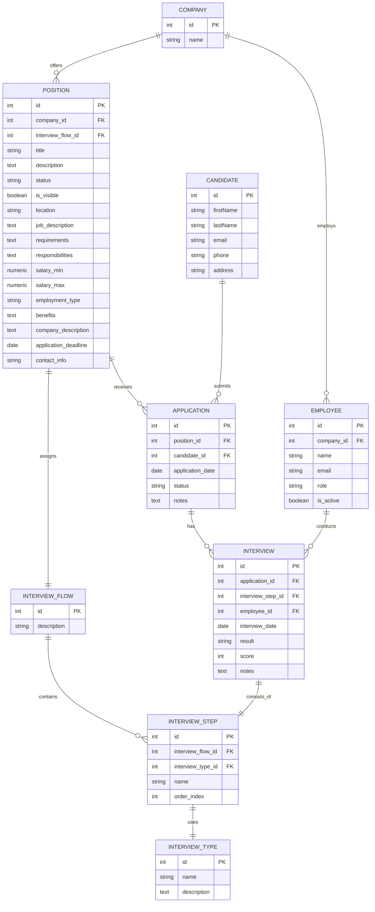
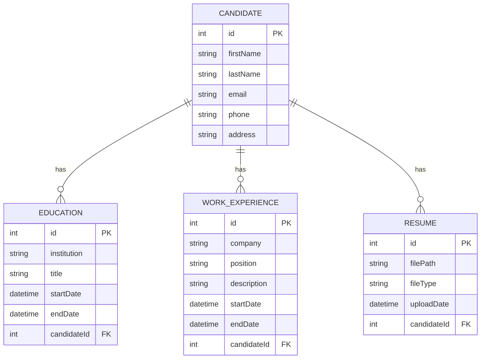
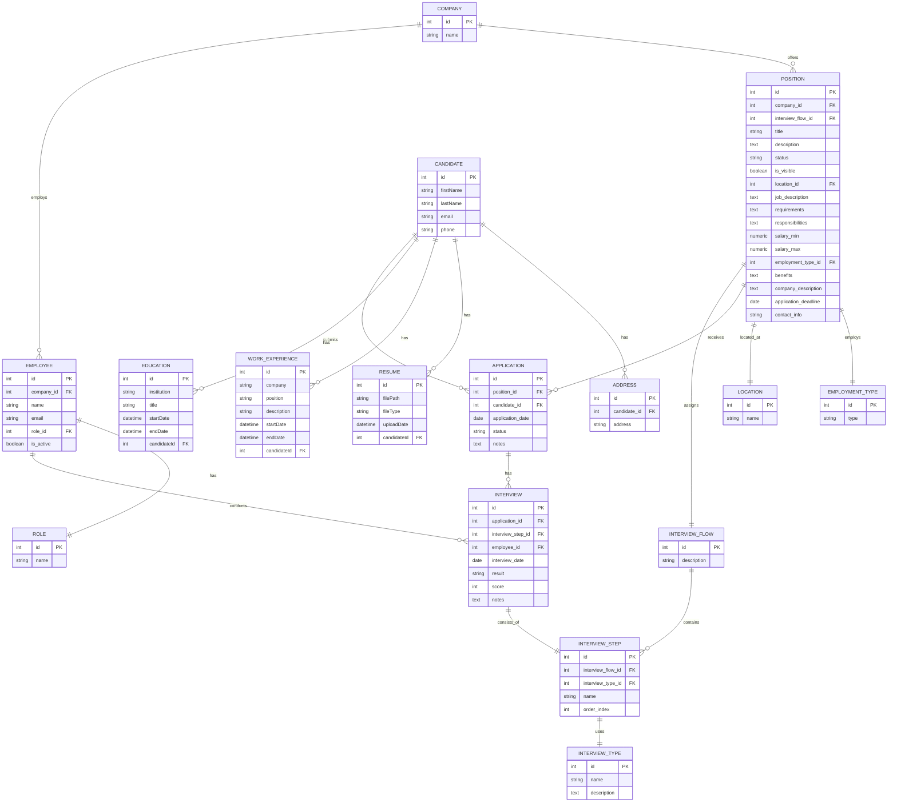

# ATS Database. Cursor

## Prompt 1

Act as a Systems Architect and DBA expert specializing in designing scalable systems using Domain-Driven Design (DDD). Leverage your expertise in selecting the most suitable type of database, whether SQL or NoSQL, based on the specific requirements. You have been hired to provide guidance and make key decisions related to this MVP.

“

### **The platform is ATS a Applicant Tracking System **

### **Visión General del Proyecto**

Nuestro objetivo es desarrollar un sistema de ATS a Applicant Tracking System.

### Funcionalidades Clave

1. **Automatización de Procesos**

   - **Filtrado Automático de Candidatos**: Utilizar IA para analizar currículums y cartas de presentación, destacando a los candidatos más adecuados.
   - **Gestión de Correo Electrónico Automatizado**: Envío automático de correos electrónicos a candidatos para confirmar recepción de solicitudes, actualizaciones del estado de la aplicación y notificaciones de entrevistas.

2. **Colaboración en Tiempo Real**

   - **Panel de Control Compartido**: Plataforma centralizada donde los reclutadores y managers pueden ver el estado de las candidaturas, dejar comentarios y puntuar a los candidatos.
   - **Chat y Mensajería Interna**: Funcionalidad de comunicación en tiempo real para discutir sobre candidatos y coordinar entrevistas.

3. **Asistencia de IA**

   - **Recomendación de Candidatos**: Algoritmos que sugieren candidatos potenciales basados en las descripciones de trabajo y el historial de contrataciones.
   - **Análisis de Sentimiento y Lenguaje**: Herramientas de IA que analizan el tono y la emoción en las entrevistas y comunicaciones escritas para evaluar la idoneidad cultural y la actitud.

4. **Automatización de Tareas Administrativas**

   - **Programación de Entrevistas**: Herramienta que permite a los candidatos seleccionar automáticamente las franjas horarias disponibles para entrevistas, integrándose con los calendarios de los reclutadores.
   - **Gestión de Documentos**: Almacenamiento centralizado y gestión de todos los documentos relacionados con la candidatura, accesibles para todos los stakeholders.

5. **Mejora de la Experiencia del Candidato**

   - **Portal del Candidato**: Portal intuitivo donde los candidatos pueden ver el estado de su aplicación, actualizar su información y recibir feedback.
   - **Feedback Automatizado**: Sistema que proporciona automáticamente retroalimentación a los candidatos sobre el estado de sus aplicaciones y áreas de mejora.

6. **Análisis y Reportes**

   - **Dashboard de KPIs**: Tablero de indicadores clave de rendimiento para evaluar la eficacia de las campañas de contratación y el desempeño de los reclutadores.
   - **Análisis de Diversidad**: Herramientas para monitorear y analizar la diversidad de los candidatos a lo largo del proceso de contratación.

7. **Integraciones y API**

   - **Integraciones con Plataformas de Empleo**: Conexiones con LinkedIn, Indeed, Glassdoor y otras plataformas para publicar ofertas de trabajo y recibir aplicaciones directamente en el ATS.
   - **API Abierta**: Para permitir integraciones con otras herramientas de HR y software empresarial.

8. **Funcionalidades de Seguridad y Cumplimiento**
   - **Cumplimiento de GDPR**: Herramientas para asegurar que todos los datos de los candidatos se manejen conforme a las regulaciones de privacidad.
   - **Autenticación Multifactor**: Implementación de autenticación en dos pasos para proteger la información sensible.

### **ERD new tables diagram in mermeid format**



“

Convert the mermeid given diagram into a sql script. Before start ask me all the questions you need. Do not write code yet

## Answer 1 - AI

Before proceeding with converting the mermaid diagram into a SQL script, I have a few questions to ensure the script meets your requirements:

1. Database Engine: Which SQL database engine are you planning to use (e.g., PostgreSQL, MySQL, SQL Server)?
2. Data Types: Are there any specific data types you prefer for certain fields (e.g., text vs varchar, numeric vs decimal)?
   Constraints and Indexes: Do you have any specific constraints or indexes in mind beyond primary and foreign keys (e.g., unique constraints, composite keys, indexes for performance)?
   Default Values: Should any fields have default values (e.g., is_active defaulting to true)?
   Additional Fields: Are there any additional fields or metadata you would like to include in the tables (e.g., timestamps for creation and updates)?
   Naming Conventions: Do you have any specific naming conventions for tables and columns that should be followed?
   Please provide the answers to these questions so I can tailor the SQL script to your needs.

## Prompt 2 - Answering the AI questions

1. PostgreSQL
2. If you consider the field is going to have more than 200 characters use text if not use varchar
3. Using the context and improve the structure, normalize the database and propose me the indexes to improve the performance
4. add default values for fields like is_visible and others you consider is going to have a default value
5. No, there are not additional fields
6. No, use the same name for the table

Execute all except the indexes creation.

## Answer 2 - AI

```sql
-- Create tables
CREATE TABLE company (
    id SERIAL PRIMARY KEY,
    name VARCHAR(255) NOT NULL
);

CREATE TABLE employee (
    id SERIAL PRIMARY KEY,
    company_id INT REFERENCES company(id),
    name VARCHAR(255) NOT NULL,
    email VARCHAR(255) UNIQUE NOT NULL,
    role VARCHAR(100),
    is_active BOOLEAN DEFAULT TRUE
);

CREATE TABLE interview_type (
    id SERIAL PRIMARY KEY,
    name VARCHAR(255) NOT NULL,
    description TEXT
);

CREATE TABLE interview_flow (
    id SERIAL PRIMARY KEY,
    description TEXT
);

CREATE TABLE interview_step (
    id SERIAL PRIMARY KEY,
    interview_flow_id INT REFERENCES interview_flow(id),
    interview_type_id INT REFERENCES interview_type(id),
    name VARCHAR(255) NOT NULL,
    order_index INT NOT NULL
);

CREATE TABLE position (
    id SERIAL PRIMARY KEY,
    company_id INT REFERENCES company(id),
    interview_flow_id INT REFERENCES interview_flow(id),
    title VARCHAR(255) NOT NULL,
    description TEXT,
    status VARCHAR(50),
    is_visible BOOLEAN DEFAULT TRUE,
    location VARCHAR(255),
    job_description TEXT,
    requirements TEXT,
    responsibilities TEXT,
    salary_min NUMERIC,
    salary_max NUMERIC,
    employment_type VARCHAR(50),
    benefits TEXT,
    company_description TEXT,
    application_deadline DATE,
    contact_info VARCHAR(255)
);

CREATE TABLE candidate (
    id SERIAL PRIMARY KEY,
    first_name VARCHAR(100) NOT NULL,
    last_name VARCHAR(100) NOT NULL,
    email VARCHAR(255) UNIQUE NOT NULL,
    phone VARCHAR(15),
    address VARCHAR(255)
);

CREATE TABLE application (
    id SERIAL PRIMARY KEY,
    position_id INT REFERENCES position(id),
    candidate_id INT REFERENCES candidate(id),
    application_date DATE NOT NULL,
    status VARCHAR(50),
    notes TEXT
);

CREATE TABLE interview (
    id SERIAL PRIMARY KEY,
    application_id INT REFERENCES application(id),
    interview_step_id INT REFERENCES interview_step(id),
    employee_id INT REFERENCES employee(id),
    interview_date DATE NOT NULL,
    result VARCHAR(50),
    score INT,
    notes TEXT
);
```

## Prompt 3 - Indexes creation

Create the proposed indexes, Before start show me you approcahc and why do you propose each index. Do not write code yet

## Answer 3 - AI

To propose the indexes, I'll consider the following factors:

1. **Primary and Foreign Keys**: These are already indexed by default, but I'll ensure they are explicitly mentioned.
2. **Frequent Query Patterns**: Based on the typical operations in an ATS (Applicant Tracking System), such as searching for candidates, filtering applications, and retrieving interview details.
3. **Performance Optimization**: Indexes on columns frequently used in `WHERE`, `JOIN`, and `ORDER BY` clauses to speed up query performance.

### Proposed Indexes

1. **Company Table**:

   - **Primary Key**: `id` (already indexed by default).

2. **Employee Table**:

   - **Primary Key**: `id` (already indexed by default).
   - **Foreign Key**: `company_id` (already indexed by default).
   - **Unique Index**: `email` (to ensure unique email addresses).

3. **Interview Type Table**:

   - **Primary Key**: `id` (already indexed by default).

4. **Interview Flow Table**:

   - **Primary Key**: `id` (already indexed by default).

5. **Interview Step Table**:

   - **Primary Key**: `id` (already indexed by default).
   - **Foreign Keys**: `interview_flow_id`, `interview_type_id` (already indexed by default).
   - **Index**: `order_index` (to optimize ordering of steps).

6. **Position Table**:

   - **Primary Key**: `id` (already indexed by default).
   - **Foreign Keys**: `company_id`, `interview_flow_id` (already indexed by default).
   - **Index**: `status` (to optimize filtering by status).
   - **Index**: `is_visible` (to optimize filtering by visibility).

7. **Candidate Table**:

   - **Primary Key**: `id` (already indexed by default).
   - **Unique Index**: `email` (to ensure unique email addresses).

8. **Application Table**:

   - **Primary Key**: `id` (already indexed by default).
   - **Foreign Keys**: `position_id`, `candidate_id` (already indexed by default).
   - **Index**: `status` (to optimize filtering by status).

9. **Interview Table**:
   - **Primary Key**: `id` (already indexed by default).
   - **Foreign Keys**: `application_id`, `interview_step_id`, `employee_id` (already indexed by default).
   - **Index**: `interview_date` (to optimize filtering by date).

### Justification for Each Index

- **Primary Keys**: Ensure each record can be uniquely identified and accessed quickly.
- **Foreign Keys**: Facilitate efficient joins between related tables.
- **Unique Indexes on `email`**: Ensure data integrity by preventing duplicate email addresses.
- **Indexes on `status` and `is_visible`**: Commonly used in filtering operations to quickly retrieve records based on these fields.
- **Index on `order_index`**: Optimize the ordering of interview steps.
- **Index on `interview_date`**: Optimize queries that filter or sort by interview date.

This approach ensures that the most common and performance-critical queries are optimized, leading to faster data retrieval and better overall system performance. If you have any specific query patterns or additional requirements, please let me know!

## Prompt 4 - create the indexes code

Okey, give the proposed indexes code

## Answer 4 - AI

```sql
-- Company Table
-- Primary Key is already indexed by default

-- Employee Table
-- Primary Key is already indexed by default
-- Foreign Key is already indexed by default
CREATE UNIQUE INDEX idx_employee_email ON employee(email);

-- Interview Type Table
-- Primary Key is already indexed by default

-- Interview Flow Table
-- Primary Key is already indexed by default

-- Interview Step Table
-- Primary Key is already indexed by default
-- Foreign Keys are already indexed by default
CREATE INDEX idx_interview_step_order_index ON interview_step(order_index);

-- Position Table
-- Primary Key is already indexed by default
-- Foreign Keys are already indexed by default
CREATE INDEX idx_position_status ON position(status);
CREATE INDEX idx_position_is_visible ON position(is_visible);

-- Candidate Table
-- Primary Key is already indexed by default
CREATE UNIQUE INDEX idx_candidate_email ON candidate(email);

-- Application Table
-- Primary Key is already indexed by default
-- Foreign Keys are already indexed by default
CREATE INDEX idx_application_status ON application(status);

-- Interview Table
-- Primary Key is already indexed by default
-- Foreign Keys are already indexed by default
CREATE INDEX idx_interview_interview_date ON interview(interview_date);
```

## Prompt 5 - Propose 3FN improvements

For the model you just provided, do you have any recommendations for normalizing the tables to Third Normal Form (3NF)? Please share your suggestions before I proceed with writing any code.

## Answer 5 - AI

To ensure the database schema is normalized to Third Normal Form (3NF), we need to follow these steps:

1. **Eliminate Repeating Groups**: Ensure that each table contains atomic values and no repeating groups.
2. **Eliminate Redundant Data**: Ensure that each table contains only data related to a single entity.
3. **Eliminate Columns Not Dependent on the Key**: Ensure that all non-key columns are fully functionally dependent on the primary key.

### Recommendations for Normalizing to 3NF

1. **Employee Table**:

   - The `role` column could potentially be normalized into a separate `role` table if there are predefined roles.

2. **Position Table**:

   - The `location` column could be normalized into a separate `location` table if locations are reused across multiple positions.
   - The `employment_type` column could be normalized into a separate `employment_type` table if there are predefined employment types.

3. **Candidate Table**:

   - The `address` column could be normalized into a separate `address` table if candidates can have multiple addresses or if addresses are reused.

4. **Interview Step Table**:
   - The `order_index` column should be kept as it is since it is dependent on the `interview_flow_id`.

### Example of Normalization

#### Employee Table Normalization

```sql
-- Create role table
CREATE TABLE role (
    id SERIAL PRIMARY KEY,
    name VARCHAR(100) NOT NULL
);

-- Modify employee table to reference role
CREATE TABLE employee (
    id SERIAL PRIMARY KEY,
    company_id INT REFERENCES company(id),
    name VARCHAR(255) NOT NULL,
    email VARCHAR(255) UNIQUE NOT NULL,
    role_id INT REFERENCES role(id),
    is_active BOOLEAN DEFAULT TRUE
);
```

#### Position Table Normalization

```sql
-- Create location table
CREATE TABLE location (
    id SERIAL PRIMARY KEY,
    name VARCHAR(255) NOT NULL
);

-- Create employment_type table
CREATE TABLE employment_type (
    id SERIAL PRIMARY KEY,
    type VARCHAR(50) NOT NULL
);

-- Modify position table to reference location and employment_type
CREATE TABLE position (
    id SERIAL PRIMARY KEY,
    company_id INT REFERENCES company(id),
    interview_flow_id INT REFERENCES interview_flow(id),
    title VARCHAR(255) NOT NULL,
    description TEXT,
    status VARCHAR(50),
    is_visible BOOLEAN DEFAULT TRUE,
    location_id INT REFERENCES location(id),
    job_description TEXT,
    requirements TEXT,
    responsibilities TEXT,
    salary_min NUMERIC,
    salary_max NUMERIC,
    employment_type_id INT REFERENCES employment_type(id),
    benefits TEXT,
    company_description TEXT,
    application_deadline DATE,
    contact_info VARCHAR(255)
);
```

#### Candidate Table Normalization

```sql
-- Create address table
CREATE TABLE address (
    id SERIAL PRIMARY KEY,
    candidate_id INT REFERENCES candidate(id),
    address VARCHAR(255) NOT NULL
);

-- Modify candidate table to remove address
CREATE TABLE candidate (
    id SERIAL PRIMARY KEY,
    first_name VARCHAR(100) NOT NULL,
    last_name VARCHAR(100) NOT NULL,
    email VARCHAR(255) UNIQUE NOT NULL,
    phone VARCHAR(15)
);
```

### Summary

- **Employee Table**: Normalize `role` into a separate `role` table.
- **Position Table**: Normalize `location` and `employment_type` into separate tables.
- **Candidate Table**: Normalize `address` into a separate `address` table.

These changes will ensure that the database schema adheres to 3NF, reducing redundancy and improving data integrity. If you have any specific requirements or additional questions, please let me know!

# Prompt 6 - Apply the 3FN changes

Apply the proposed changes to the sql creeated before and add indexes for the new tables if it is necessary.

## Answer 6 - AI

```sql
-- Create tables
CREATE TABLE company (
    id SERIAL PRIMARY KEY,
    name VARCHAR(255) NOT NULL
);

CREATE TABLE role (
    id SERIAL PRIMARY KEY,
    name VARCHAR(100) NOT NULL
);

CREATE TABLE employee (
    id SERIAL PRIMARY KEY,
    company_id INT REFERENCES company(id),
    name VARCHAR(255) NOT NULL,
    email VARCHAR(255) UNIQUE NOT NULL,
    role_id INT REFERENCES role(id),
    is_active BOOLEAN DEFAULT TRUE
);

CREATE TABLE interview_type (
    id SERIAL PRIMARY KEY,
    name VARCHAR(255) NOT NULL,
    description TEXT
);

CREATE TABLE interview_flow (
    id SERIAL PRIMARY KEY,
    description TEXT
);

CREATE TABLE interview_step (
    id SERIAL PRIMARY KEY,
    interview_flow_id INT REFERENCES interview_flow(id),
    interview_type_id INT REFERENCES interview_type(id),
    name VARCHAR(255) NOT NULL,
    order_index INT NOT NULL
);

CREATE TABLE location (
    id SERIAL PRIMARY KEY,
    name VARCHAR(255) NOT NULL
);

CREATE TABLE employment_type (
    id SERIAL PRIMARY KEY,
    type VARCHAR(50) NOT NULL
);

CREATE TABLE position (
    id SERIAL PRIMARY KEY,
    company_id INT REFERENCES company(id),
    interview_flow_id INT REFERENCES interview_flow(id),
    title VARCHAR(255) NOT NULL,
    description TEXT,
    status VARCHAR(50),
    is_visible BOOLEAN DEFAULT TRUE,
    location_id INT REFERENCES location(id),
    job_description TEXT,
    requirements TEXT,
    responsibilities TEXT,
    salary_min NUMERIC,
    salary_max NUMERIC,
    employment_type_id INT REFERENCES employment_type(id),
    benefits TEXT,
    company_description TEXT,
    application_deadline DATE,
    contact_info VARCHAR(255)
);

CREATE TABLE candidate (
    id SERIAL PRIMARY KEY,
    first_name VARCHAR(100) NOT NULL,
    last_name VARCHAR(100) NOT NULL,
    email VARCHAR(255) UNIQUE NOT NULL,
    phone VARCHAR(15)
);

CREATE TABLE address (
    id SERIAL PRIMARY KEY,
    candidate_id INT REFERENCES candidate(id),
    address VARCHAR(255) NOT NULL
);

CREATE TABLE application (
    id SERIAL PRIMARY KEY,
    position_id INT REFERENCES position(id),
    candidate_id INT REFERENCES candidate(id),
    application_date DATE NOT NULL,
    status VARCHAR(50),
    notes TEXT
);

CREATE TABLE interview (
    id SERIAL PRIMARY KEY,
    application_id INT REFERENCES application(id),
    interview_step_id INT REFERENCES interview_step(id),
    employee_id INT REFERENCES employee(id),
    interview_date DATE NOT NULL,
    result VARCHAR(50),
    score INT,
    notes TEXT
);

-- Indexes
-- Employee Table
CREATE UNIQUE INDEX idx_employee_email ON employee(email);

-- Interview Step Table
CREATE INDEX idx_interview_step_order_index ON interview_step(order_index);

-- Position Table
CREATE INDEX idx_position_status ON position(status);
CREATE INDEX idx_position_is_visible ON position(is_visible);

-- Candidate Table
CREATE UNIQUE INDEX idx_candidate_email ON candidate(email);

-- Application Table
CREATE INDEX idx_application_status ON application(status);

-- Interview Table
CREATE INDEX idx_interview_interview_date ON interview(interview_date);

-- Role Table
-- Primary Key is already indexed by default

-- Location Table
-- Primary Key is already indexed by default

-- Employment Type Table
-- Primary Key is already indexed by default

-- Address Table
-- Primary Key is already indexed by default
-- Foreign Key is already indexed by default
CREATE INDEX idx_address_candidate_id ON address(candidate_id);
```

## Prompt 7 - Get current ERD prisma in mermeid format

Go to file @schema.prisma and provide me a mermeid diagram of the mode

## Answer 7 - AI

Go to file @schema.prisma and provide me a mermeid diagram of the model, we are going to call this tables as: "Existing tables", and the tables we were working we are going to call as "new tables". FOr now just give me mermeid diagram of existing tables

### Existing Tables



## Prompt 8 - Next steps merge with existing tables

Next, we will proceed with the following steps. Please refrain from writing any code until I provide further instructions for each point:

1. Merge the existing tables with the new tables. Before writing code show me the mermeid diagram
2. Improve the existings tables to normalize to 3FN, take in account if the table already exist in the new tables use the same one and create the relationships.
3. Create the missing indexes for the existing tables.

## Answer 8 - AI

### Step 1: Merge the Existing Tables with the New Tables

Here is the merged mermaid diagram combining the existing tables with the new tables:



### Next Steps

1. **Improve the existing tables to normalize to 3NF**: We will ensure that the existing tables are normalized and create the necessary relationships.
2. **Create the missing indexes for the existing tables**: We will add indexes to optimize the performance of the existing tables.

Please review the merged diagram and let me know if you have any questions or if we can proceed with the next steps.

## Prompt 9 - Get improments to normalize to 3FN

The created diagram is ok, continue with the next step 1 Improve the "existing tables" to normalize to 3NF. Please give me the proposed mermeid diagram first

## Answer 9 - AI

### Proposed Mermaid Diagram for Normalizing Existing Tables to 3NF

Here is the updated mermaid diagram with the improvements to normalize the existing tables to 3NF:


### Summary of Changes

1. **Employee Table**:

   - Normalized `role` into a separate `role` table.

2. **Position Table**:

   - Normalized `location` and `employment_type` into separate `location` and `employment_type` tables.

3. **Candidate Table**:
   - Normalized `address` into a separate `address` table.

Please review the proposed diagram and let me know if you have any questions or if we can proceed with the next steps.

## Prompt 10 - Create the missing indexes for the existing tables

2. Create the missing indexes for the existing tables: We will add indexes to optimize the performance of the existing tables.

## Answer 10 - AI

Here are the SQL statements to create the missing indexes for the existing tables:

```sql
-- Candidate Table
CREATE UNIQUE INDEX idx_candidate_email ON candidate(email);

-- Education Table
CREATE INDEX idx_education_candidate_id ON education(candidate_id);

-- WorkExperience Table
CREATE INDEX idx_work_experience_candidate_id ON work_experience(candidate_id);

-- Resume Table
CREATE INDEX idx_resume_candidate_id ON resume(candidate_id);
```

These indexes will help optimize the performance of the existing tables by improving the speed of queries that involve these columns. If you have any further questions or need additional modifications, please let me know!

## Prompt 11 - Create code

Use the next mermeid diagram and apply the changes and new tables in @schema.prisma :
"
erDiagram
COMPANY {
int id PK
string name
}
EMPLOYEE {
int id PK
int company_id FK
string name
string email
int role_id FK
boolean is_active
}
ROLE {
int id PK
string name
}
POSITION {
int id PK
int company_id FK
int interview_flow_id FK
string title
text description
string status
boolean is_visible
int location_id FK
text job_description
text requirements
text responsibilities
numeric salary_min
numeric salary_max
int employment_type_id FK
text benefits
text company_description
date application_deadline
string contact_info
}
LOCATION {
int id PK
string name
}
EMPLOYMENT_TYPE {
int id PK
string type
}
INTERVIEW_FLOW {
int id PK
string description
}
INTERVIEW_STEP {
int id PK
int interview_flow_id FK
int interview_type_id FK
string name
int order_index
}
INTERVIEW_TYPE {
int id PK
string name
text description
}
CANDIDATE {
int id PK
string firstName
string lastName
string email
string phone
}
ADDRESS {
int id PK
int candidate_id FK
string address
}
EDUCATION {
int id PK
string institution
string title
datetime startDate
datetime endDate
int candidateId FK
}
WORK_EXPERIENCE {
int id PK
string company
string position
string description
datetime startDate
datetime endDate
int candidateId FK
}
RESUME {
int id PK
string filePath
string fileType
datetime uploadDate
int candidateId FK
}
APPLICATION {
int id PK
int position_id FK
int candidate_id FK
date application_date
string status
text notes
}
INTERVIEW {
int id PK
int application_id FK
int interview_step_id FK
int employee_id FK
date interview_date
string result
int score
text notes
}

    COMPANY ||--o{ EMPLOYEE : employs
    COMPANY ||--o{ POSITION : offers
    POSITION ||--|| INTERVIEW_FLOW : assigns
    INTERVIEW_FLOW ||--o{ INTERVIEW_STEP : contains
    INTERVIEW_STEP ||--|| INTERVIEW_TYPE : uses
    POSITION ||--o{ APPLICATION : receives
    CANDIDATE ||--o{ APPLICATION : submits
    APPLICATION ||--o{ INTERVIEW : has
    INTERVIEW ||--|| INTERVIEW_STEP : consists_of
    EMPLOYEE ||--o{ INTERVIEW : conducts
    CANDIDATE ||--o{ EDUCATION : has
    CANDIDATE ||--o{ WORK_EXPERIENCE : has
    CANDIDATE ||--o{ RESUME : has
    CANDIDATE ||--o{ ADDRESS : has
    EMPLOYEE ||--|| ROLE : has
    POSITION ||--|| LOCATION : located_at
    POSITION ||--|| EMPLOYMENT_TYPE : employs

"

## Answer 11 - AI

Here is the updated `schema.prisma` file with the changes and new tables based on the provided mermaid diagram:

```prisma:backend/prisma/schema.prisma
// This is your Prisma schema file,
// learn more about it in the docs: https://pris.ly/d/prisma-schema

// Looking for ways to speed up your queries, or scale easily with your serverless or edge functions?
// Try Prisma Accelerate: https://pris.ly/cli/accelerate-init

generator client {
  provider      = "prisma-client-js"
  binaryTargets = ["native", "debian-openssl-3.0.x"]
}

datasource db {
  provider = "postgresql"
  url      = env("DATABASE_URL")
}

model Company {
  id   Int    @id @default(autoincrement())
  name String @db.VarChar(255)
  employees Employee[]
  positions Position[]
}

model Employee {
  id         Int      @id @default(autoincrement())
  companyId  Int
  name       String   @db.VarChar(255)
  email      String   @unique @db.VarChar(255)
  roleId     Int
  isActive   Boolean  @default(true)
  company    Company  @relation(fields: [companyId], references: [id])
  role       Role     @relation(fields: [roleId], references: [id])
  interviews Interview[]
}

model Role {
  id   Int    @id @default(autoincrement())
  name String @db.VarChar(100)
  employees Employee[]
}

model Position {
  id                 Int             @id @default(autoincrement())
  companyId          Int
  interviewFlowId    Int
  title              String          @db.VarChar(255)
  description        String?         @db.Text
  status             String?         @db.VarChar(50)
  isVisible          Boolean         @default(true)
  locationId         Int
  jobDescription     String?         @db.Text
  requirements       String?         @db.Text
  responsibilities   String?         @db.Text
  salaryMin          Float?
  salaryMax          Float?
  employmentTypeId   Int
  benefits           String?         @db.Text
  companyDescription String?         @db.Text
  applicationDeadline DateTime?
  contactInfo        String?         @db.VarChar(255)
  company            Company         @relation(fields: [companyId], references: [id])
  interviewFlow      InterviewFlow   @relation(fields: [interviewFlowId], references: [id])
  location           Location        @relation(fields: [locationId], references: [id])
  employmentType     EmploymentType  @relation(fields: [employmentTypeId], references: [id])
  applications       Application[]
}

model Location {
  id        Int        @id @default(autoincrement())
  name      String     @db.VarChar(255)
  positions Position[]
}

model EmploymentType {
  id        Int        @id @default(autoincrement())
  type      String     @db.VarChar(50)
  positions Position[]
}

model InterviewFlow {
  id            Int             @id @default(autoincrement())
  description   String?         @db.Text
  positions     Position[]
  interviewSteps InterviewStep[]
}

model InterviewStep {
  id              Int            @id @default(autoincrement())
  interviewFlowId Int
  interviewTypeId Int
  name            String         @db.VarChar(255)
  orderIndex      Int
  interviewFlow   InterviewFlow  @relation(fields: [interviewFlowId], references: [id])
  interviewType   InterviewType  @relation(fields: [interviewTypeId], references: [id])
  interviews      Interview[]
}

model InterviewType {
  id              Int             @id @default(autoincrement())
  name            String          @db.VarChar(255)
  description     String?         @db.Text
  interviewSteps  InterviewStep[]
}

model Candidate {
  id              Int              @id @default(autoincrement())
  firstName       String           @db.VarChar(100)
  lastName        String           @db.VarChar(100)
  email           String           @unique @db.VarChar(255)
  phone           String?          @db.VarChar(15)
  educations      Education[]
  workExperiences WorkExperience[]
  resumes         Resume[]
  addresses       Address[]
  applications    Application[]
}

model Address {
  id          Int       @id @default(autoincrement())
  candidateId Int
  address     String    @db.VarChar(255)
  candidate   Candidate @relation(fields: [candidateId], references: [id])
}

model Education {
  id            Int       @id @default(autoincrement())
  institution   String    @db.VarChar(100)
  title         String    @db.VarChar(250)
  startDate     DateTime
  endDate       DateTime?
  candidateId   Int
  candidate     Candidate @relation(fields: [candidateId], references: [id])
}

model WorkExperience {
  id          Int       @id @default(autoincrement())
  company     String    @db.VarChar(100)
  position    String    @db.VarChar(100)
  description String?   @db.VarChar(200)
  startDate   DateTime
  endDate     DateTime?
  candidateId Int
  candidate   Candidate @relation(fields: [candidateId], references: [id])
}

model Resume {
  id          Int       @id @default(autoincrement())
  filePath    String    @db.VarChar(500)
  fileType    String    @db.VarChar(50)
  uploadDate  DateTime
  candidateId Int
  candidate   Candidate @relation(fields: [candidateId], references: [id])
}

model Application {
  id              Int         @id @default(autoincrement())
  positionId      Int
  candidateId     Int
  applicationDate DateTime
  status          String?     @db.VarChar(50)
  notes           String?     @db.Text
  position        Position    @relation(fields: [positionId], references: [id])
  candidate       Candidate   @relation(fields: [candidateId], references: [id])
  interviews      Interview[]
}

model Interview {
  id              Int            @id @default(autoincrement())
  applicationId   Int
  interviewStepId Int
  employeeId      Int
  interviewDate   DateTime
  result          String?        @db.VarChar(50)
  score           Int?
  notes           String?        @db.Text
  application     Application    @relation(fields: [applicationId], references: [id])
  interviewStep   InterviewStep  @relation(fields: [interviewStepId], references: [id])
  employee        Employee       @relation(fields: [employeeId], references: [id])
}
```

This updated schema includes the new tables and relationships as specified in the mermaid diagram. If you have any further questions or need additional modifications, please let me know!

## Prompt 12

Create the sql migration prisma queries for the changes applyed before in @schema.prisma , include the indexes provided in all the conversation

## Answer 12 - AI

```sql

-- Create tables
CREATE TABLE company (
    id SERIAL PRIMARY KEY,
    name VARCHAR(255) NOT NULL
);

CREATE TABLE role (
    id SERIAL PRIMARY KEY,
    name VARCHAR(100) NOT NULL
);

CREATE TABLE employee (
    id SERIAL PRIMARY KEY,
    company_id INT REFERENCES company(id),
    name VARCHAR(255) NOT NULL,
    email VARCHAR(255) UNIQUE NOT NULL,
    role_id INT REFERENCES role(id),
    is_active BOOLEAN DEFAULT TRUE
);

CREATE TABLE location (
    id SERIAL PRIMARY KEY,
    name VARCHAR(255) NOT NULL
);

CREATE TABLE employment_type (
    id SERIAL PRIMARY KEY,
    type VARCHAR(50) NOT NULL
);

CREATE TABLE interview_type (
    id SERIAL PRIMARY KEY,
    name VARCHAR(255) NOT NULL,
    description TEXT
);

CREATE TABLE interview_flow (
    id SERIAL PRIMARY KEY,
    description TEXT
);

CREATE TABLE interview_step (
    id SERIAL PRIMARY KEY,
    interview_flow_id INT REFERENCES interview_flow(id),
    interview_type_id INT REFERENCES interview_type(id),
    name VARCHAR(255) NOT NULL,
    order_index INT NOT NULL
);

CREATE TABLE position (
    id SERIAL PRIMARY KEY,
    company_id INT REFERENCES company(id),
    interview_flow_id INT REFERENCES interview_flow(id),
    title VARCHAR(255) NOT NULL,
    description TEXT,
    status VARCHAR(50),
    is_visible BOOLEAN DEFAULT TRUE,
    location_id INT REFERENCES location(id),
    job_description TEXT,
    requirements TEXT,
    responsibilities TEXT,
    salary_min NUMERIC,
    salary_max NUMERIC,
    employment_type_id INT REFERENCES employment_type(id),
    benefits TEXT,
    company_description TEXT,
    application_deadline DATE,
    contact_info VARCHAR(255)
);

CREATE TABLE candidate (
    id SERIAL PRIMARY KEY,
    first_name VARCHAR(100) NOT NULL,
    last_name VARCHAR(100) NOT NULL,
    email VARCHAR(255) UNIQUE NOT NULL,
    phone VARCHAR(15)
);

CREATE TABLE address (
    id SERIAL PRIMARY KEY,
    candidate_id INT REFERENCES candidate(id),
    address VARCHAR(255) NOT NULL
);

CREATE TABLE education (
    id SERIAL PRIMARY KEY,
    institution VARCHAR(100) NOT NULL,
    title VARCHAR(250) NOT NULL,
    start_date DATE NOT NULL,
    end_date DATE,
    candidate_id INT REFERENCES candidate(id)
);

CREATE TABLE work_experience (
    id SERIAL PRIMARY KEY,
    company VARCHAR(100) NOT NULL,
    position VARCHAR(100) NOT NULL,
    description VARCHAR(200),
    start_date DATE NOT NULL,
    end_date DATE,
    candidate_id INT REFERENCES candidate(id)
);

CREATE TABLE resume (
    id SERIAL PRIMARY KEY,
    file_path VARCHAR(500) NOT NULL,
    file_type VARCHAR(50) NOT NULL,
    upload_date DATE NOT NULL,
    candidate_id INT REFERENCES candidate(id)
);

CREATE TABLE application (
    id SERIAL PRIMARY KEY,
    position_id INT REFERENCES position(id),
    candidate_id INT REFERENCES candidate(id),
    application_date DATE NOT NULL,
    status VARCHAR(50),
    notes TEXT
);

CREATE TABLE interview (
    id SERIAL PRIMARY KEY,
    application_id INT REFERENCES application(id),
    interview_step_id INT REFERENCES interview_step(id),
    employee_id INT REFERENCES employee(id),
    interview_date DATE NOT NULL,
    result VARCHAR(50),
    score INT,
    notes TEXT
);

-- Indexes
CREATE UNIQUE INDEX idx_candidate_email ON candidate(email);
CREATE INDEX idx_education_candidate_id ON education(candidate_id);
CREATE INDEX idx_work_experience_candidate_id ON work_experience(candidate_id);
CREATE INDEX idx_resume_candidate_id ON resume(candidate_id);
CREATE UNIQUE INDEX idx_employee_email ON employee(email);
CREATE INDEX idx_interview_step_order_index ON interview_step(order_index);
CREATE INDEX idx_position_status ON position(status);
CREATE INDEX idx_position_is_visible ON position(is_visible);
CREATE INDEX idx_application_status ON application(status);
CREATE INDEX idx_interview_interview_date ON interview(interview_date);
CREATE INDEX idx_address_candidate_id ON address(candidate_id);
```

These indexes will help optimize the performance of the existing tables by improving the speed of queries that involve these columns. If you have any further questions or need additional modifications, please let me know!

## Prompt 13

Give me 5 testing sql queries to see the performance and the most possible common queries in the DB

## AI - Answer 13

Here are 5 testing SQL queries to evaluate the performance and cover common use cases in the database:

1. **Query to fetch all employees along with their company and role information**:

```sql
SELECT
    e.id, e.name, e.email, e.is_active,
    c.name AS company_name,
    r.name AS role_name
FROM
    employee e
JOIN
    company c ON e.company_id = c.id
JOIN
    role r ON e.role_id = r.id;
```

2. **Query to fetch all positions along with their company, location, and employment type**:

```sql
SELECT
    p.id, p.title, p.description, p.status, p.is_visible,
    c.name AS company_name,
    l.name AS location_name,
    et.type AS employment_type
FROM
    position p
JOIN
    company c ON p.company_id = c.id
JOIN
    location l ON p.location_id = l.id
JOIN
    employment_type et ON p.employment_type_id = et.id;
```

3. **Query to fetch all candidates along with their applications and the positions they applied for**:

```sql
SELECT
    ca.id, ca.first_name, ca.last_name, ca.email, ca.phone,
    a.id AS application_id, a.application_date, a.status,
    p.title AS position_title
FROM
    candidate ca
JOIN
    application a ON ca.id = a.candidate_id
JOIN
    position p ON a.position_id = p.id;
```

4. **Query to fetch all interviews along with their application, interview step, and employee conducting the interview**:

```sql
SELECT
    i.id, i.interview_date, i.result, i.score, i.notes,
    a.id AS application_id,
    is.name AS interview_step_name,
    e.name AS employee_name
FROM
    interview i
JOIN
    application a ON i.application_id = a.id
JOIN
    interview_step is ON i.interview_step_id = is.id
JOIN
    employee e ON i.employee_id = e.id;
```

5. **Query to fetch all candidates along with their education and work experience**:

```sql
SELECT
    ca.id, ca.first_name, ca.last_name, ca.email, ca.phone,
    ed.institution, ed.title, ed.start_date AS education_start_date, ed.end_date AS education_end_date,
    we.company, we.position, we.start_date AS work_start_date, we.end_date AS work_end_date
FROM
    candidate ca
LEFT JOIN
    education ed ON ca.id = ed.candidate_id
LEFT JOIN
    work_experience we ON ca.id = we.candidate_id;
```

These queries cover common operations such as fetching employee details, position details, candidate applications, interview details, and candidate education and work experience. They also help in evaluating the performance of the database by involving multiple joins and fetching related data.
