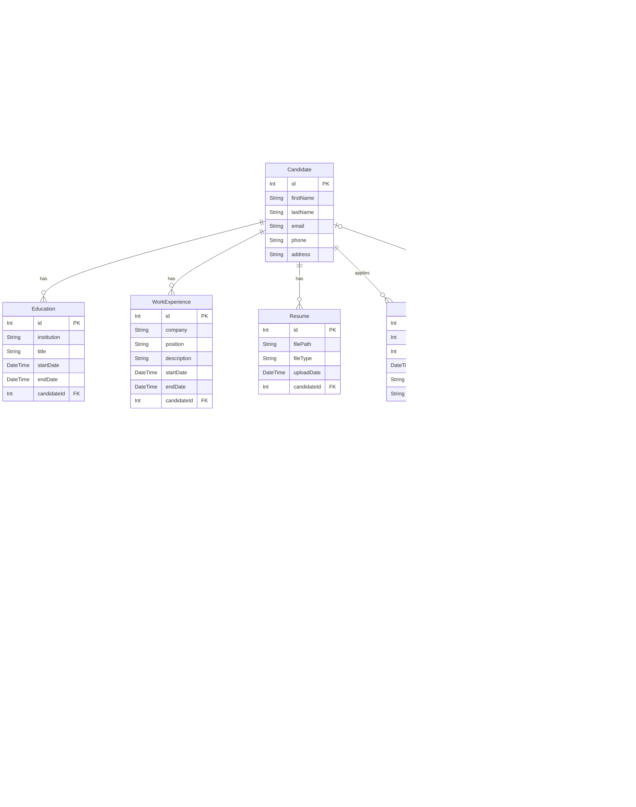

# Results of the prompts

Workspace: ### Summary of the Current Database Model

The current database model for the application is defined using Prisma and is reflected in the migration SQL file. Here is a summary of the key components:

#### Models

1. **Candidate**
   - **Fields**: [`id`](command:_github.copilot.openSymbolFromReferences?%5B%22%22%2C%5B%7B%22uri%22%3A%7B%22scheme%22%3A%22file%22%2C%22authority%22%3A%22%22%2C%22path%22%3A%22%2Fc%3A%2FUsers%2Fjesus.abreu%2Frepos%2F__custom%2FAI%2FAI4Devs-db%2Fbackend%2Fsrc%2Fdomain%2Fmodels%2FEducation.ts%22%2C%22query%22%3A%22%22%2C%22fragment%22%3A%22%22%7D%2C%22pos%22%3A%7B%22line%22%3A5%2C%22character%22%3A4%7D%7D%2C%7B%22uri%22%3A%7B%22scheme%22%3A%22file%22%2C%22authority%22%3A%22%22%2C%22path%22%3A%22%2Fc%3A%2FUsers%2Fjesus.abreu%2Frepos%2F__custom%2FAI%2FAI4Devs-db%2Fbackend%2Fsrc%2Fdomain%2Fmodels%2FCandidate.ts%22%2C%22query%22%3A%22%22%2C%22fragment%22%3A%22%22%7D%2C%22pos%22%3A%7B%22line%22%3A8%2C%22character%22%3A4%7D%7D%2C%7B%22uri%22%3A%7B%22scheme%22%3A%22file%22%2C%22authority%22%3A%22%22%2C%22path%22%3A%22%2Fc%3A%2FUsers%2Fjesus.abreu%2Frepos%2F__custom%2FAI%2FAI4Devs-db%2Fbackend%2Fsrc%2Fdomain%2Fmodels%2FWorkExperience.ts%22%2C%22query%22%3A%22%22%2C%22fragment%22%3A%22%22%7D%2C%22pos%22%3A%7B%22line%22%3A5%2C%22character%22%3A4%7D%7D%2C%7B%22uri%22%3A%7B%22scheme%22%3A%22file%22%2C%22authority%22%3A%22%22%2C%22path%22%3A%22%2Fc%3A%2FUsers%2Fjesus.abreu%2Frepos%2F__custom%2FAI%2FAI4Devs-db%2Fbackend%2Fsrc%2Fdomain%2Fmodels%2FResume.ts%22%2C%22query%22%3A%22%22%2C%22fragment%22%3A%22%22%7D%2C%22pos%22%3A%7B%22line%22%3A5%2C%22character%22%3A4%7D%7D%2C%7B%22uri%22%3A%7B%22scheme%22%3A%22file%22%2C%22authority%22%3A%22%22%2C%22path%22%3A%22%2Fc%3A%2FUsers%2Fjesus.abreu%2Frepos%2F__custom%2FAI%2FAI4Devs-db%2Fbackend%2Fprisma%2Fmigrations%2F20240908114336_initial%2Fmigration.sql%22%2C%22query%22%3A%22%22%2C%22fragment%22%3A%22%22%7D%2C%22pos%22%3A%7B%22line%22%3A2%2C%22character%22%3A5%7D%7D%2C%7B%22uri%22%3A%7B%22scheme%22%3A%22file%22%2C%22authority%22%3A%22%22%2C%22path%22%3A%22%2Fc%3A%2FUsers%2Fjesus.abreu%2Frepos%2F__custom%2FAI%2FAI4Devs-db%2Fbackend%2Fprisma%2Fschema.prisma%22%2C%22query%22%3A%22%22%2C%22fragment%22%3A%22%22%7D%2C%22pos%22%3A%7B%22line%22%3A17%2C%22character%22%3A2%7D%7D%2C%7B%22uri%22%3A%7B%22scheme%22%3A%22file%22%2C%22authority%22%3A%22%22%2C%22path%22%3A%22%2FC%3A%2FUsers%2Fjesus.abreu%2Frepos%2F__custom%2FAI%2FAI4Devs-db%2Fbackend%2Fprisma%2Fschema.prisma%22%2C%22query%22%3A%22%22%2C%22fragment%22%3A%22%22%7D%2C%22pos%22%3A%7B%22line%22%3A17%2C%22character%22%3A2%7D%7D%2C%7B%22uri%22%3A%7B%22scheme%22%3A%22file%22%2C%22authority%22%3A%22%22%2C%22path%22%3A%22%2Fc%3A%2FUsers%2Fjesus.abreu%2Frepos%2F__custom%2FAI%2FAI4Devs-db%2Fbackend%2Fprisma%2Fmigrations%2F20240908114336_initial%2Fmigration.sql%22%2C%22query%22%3A%22%22%2C%22fragment%22%3A%22%22%7D%2C%22pos%22%3A%7B%22line%22%3A2%2C%22character%22%3A5%7D%7D%5D%2C%229477db6f-c83a-47c0-a3ea-f1f64aec4d74%22%5D "Go to definition"), [`firstName`](command:_github.copilot.openSymbolFromReferences?%5B%22%22%2C%5B%7B%22uri%22%3A%7B%22scheme%22%3A%22file%22%2C%22authority%22%3A%22%22%2C%22path%22%3A%22%2Fc%3A%2FUsers%2Fjesus.abreu%2Frepos%2F__custom%2FAI%2FAI4Devs-db%2Fbackend%2Fsrc%2Fdomain%2Fmodels%2FCandidate.ts%22%2C%22query%22%3A%22%22%2C%22fragment%22%3A%22%22%7D%2C%22pos%22%3A%7B%22line%22%3A9%2C%22character%22%3A4%7D%7D%2C%7B%22uri%22%3A%7B%22scheme%22%3A%22file%22%2C%22authority%22%3A%22%22%2C%22path%22%3A%22%2Fc%3A%2FUsers%2Fjesus.abreu%2Frepos%2F__custom%2FAI%2FAI4Devs-db%2Fbackend%2Fprisma%2Fmigrations%2F20240908114336_initial%2Fmigration.sql%22%2C%22query%22%3A%22%22%2C%22fragment%22%3A%22%22%7D%2C%22pos%22%3A%7B%22line%22%3A3%2C%22character%22%3A5%7D%7D%2C%7B%22uri%22%3A%7B%22scheme%22%3A%22file%22%2C%22authority%22%3A%22%22%2C%22path%22%3A%22%2Fc%3A%2FUsers%2Fjesus.abreu%2Frepos%2F__custom%2FAI%2FAI4Devs-db%2Fbackend%2Fprisma%2Fschema.prisma%22%2C%22query%22%3A%22%22%2C%22fragment%22%3A%22%22%7D%2C%22pos%22%3A%7B%22line%22%3A18%2C%22character%22%3A2%7D%7D%2C%7B%22uri%22%3A%7B%22scheme%22%3A%22file%22%2C%22authority%22%3A%22%22%2C%22path%22%3A%22%2FC%3A%2FUsers%2Fjesus.abreu%2Frepos%2F__custom%2FAI%2FAI4Devs-db%2Fbackend%2Fprisma%2Fschema.prisma%22%2C%22query%22%3A%22%22%2C%22fragment%22%3A%22%22%7D%2C%22pos%22%3A%7B%22line%22%3A18%2C%22character%22%3A2%7D%7D%2C%7B%22uri%22%3A%7B%22scheme%22%3A%22file%22%2C%22authority%22%3A%22%22%2C%22path%22%3A%22%2Fc%3A%2FUsers%2Fjesus.abreu%2Frepos%2F__custom%2FAI%2FAI4Devs-db%2Fbackend%2Fprisma%2Fmigrations%2F20240908114336_initial%2Fmigration.sql%22%2C%22query%22%3A%22%22%2C%22fragment%22%3A%22%22%7D%2C%22pos%22%3A%7B%22line%22%3A3%2C%22character%22%3A5%7D%7D%5D%2C%229477db6f-c83a-47c0-a3ea-f1f64aec4d74%22%5D "Go to definition"), [`lastName`](command:_github.copilot.openSymbolFromReferences?%5B%22%22%2C%5B%7B%22uri%22%3A%7B%22scheme%22%3A%22file%22%2C%22authority%22%3A%22%22%2C%22path%22%3A%22%2Fc%3A%2FUsers%2Fjesus.abreu%2Frepos%2F__custom%2FAI%2FAI4Devs-db%2Fbackend%2Fsrc%2Fdomain%2Fmodels%2FCandidate.ts%22%2C%22query%22%3A%22%22%2C%22fragment%22%3A%22%22%7D%2C%22pos%22%3A%7B%22line%22%3A10%2C%22character%22%3A4%7D%7D%2C%7B%22uri%22%3A%7B%22scheme%22%3A%22file%22%2C%22authority%22%3A%22%22%2C%22path%22%3A%22%2Fc%3A%2FUsers%2Fjesus.abreu%2Frepos%2F__custom%2FAI%2FAI4Devs-db%2Fbackend%2Fprisma%2Fmigrations%2F20240908114336_initial%2Fmigration.sql%22%2C%22query%22%3A%22%22%2C%22fragment%22%3A%22%22%7D%2C%22pos%22%3A%7B%22line%22%3A4%2C%22character%22%3A5%7D%7D%2C%7B%22uri%22%3A%7B%22scheme%22%3A%22file%22%2C%22authority%22%3A%22%22%2C%22path%22%3A%22%2Fc%3A%2FUsers%2Fjesus.abreu%2Frepos%2F__custom%2FAI%2FAI4Devs-db%2Fbackend%2Fprisma%2Fschema.prisma%22%2C%22query%22%3A%22%22%2C%22fragment%22%3A%22%22%7D%2C%22pos%22%3A%7B%22line%22%3A19%2C%22character%22%3A2%7D%7D%2C%7B%22uri%22%3A%7B%22scheme%22%3A%22file%22%2C%22authority%22%3A%22%22%2C%22path%22%3A%22%2FC%3A%2FUsers%2Fjesus.abreu%2Frepos%2F__custom%2FAI%2FAI4Devs-db%2Fbackend%2Fprisma%2Fschema.prisma%22%2C%22query%22%3A%22%22%2C%22fragment%22%3A%22%22%7D%2C%22pos%22%3A%7B%22line%22%3A19%2C%22character%22%3A2%7D%7D%2C%7B%22uri%22%3A%7B%22scheme%22%3A%22file%22%2C%22authority%22%3A%22%22%2C%22path%22%3A%22%2Fc%3A%2FUsers%2Fjesus.abreu%2Frepos%2F__custom%2FAI%2FAI4Devs-db%2Fbackend%2Fprisma%2Fmigrations%2F20240908114336_initial%2Fmigration.sql%22%2C%22query%22%3A%22%22%2C%22fragment%22%3A%22%22%7D%2C%22pos%22%3A%7B%22line%22%3A4%2C%22character%22%3A5%7D%7D%5D%2C%229477db6f-c83a-47c0-a3ea-f1f64aec4d74%22%5D "Go to definition"), [`email`](command:_github.copilot.openSymbolFromReferences?%5B%22%22%2C%5B%7B%22uri%22%3A%7B%22scheme%22%3A%22file%22%2C%22authority%22%3A%22%22%2C%22path%22%3A%22%2Fc%3A%2FUsers%2Fjesus.abreu%2Frepos%2F__custom%2FAI%2FAI4Devs-db%2Fbackend%2Fsrc%2Fdomain%2Fmodels%2FCandidate.ts%22%2C%22query%22%3A%22%22%2C%22fragment%22%3A%22%22%7D%2C%22pos%22%3A%7B%22line%22%3A11%2C%22character%22%3A4%7D%7D%2C%7B%22uri%22%3A%7B%22scheme%22%3A%22file%22%2C%22authority%22%3A%22%22%2C%22path%22%3A%22%2Fc%3A%2FUsers%2Fjesus.abreu%2Frepos%2F__custom%2FAI%2FAI4Devs-db%2Fbackend%2Fprisma%2Fmigrations%2F20240908114336_initial%2Fmigration.sql%22%2C%22query%22%3A%22%22%2C%22fragment%22%3A%22%22%7D%2C%22pos%22%3A%7B%22line%22%3A5%2C%22character%22%3A5%7D%7D%2C%7B%22uri%22%3A%7B%22scheme%22%3A%22file%22%2C%22authority%22%3A%22%22%2C%22path%22%3A%22%2Fc%3A%2FUsers%2Fjesus.abreu%2Frepos%2F__custom%2FAI%2FAI4Devs-db%2Fbackend%2Fprisma%2Fschema.prisma%22%2C%22query%22%3A%22%22%2C%22fragment%22%3A%22%22%7D%2C%22pos%22%3A%7B%22line%22%3A20%2C%22character%22%3A2%7D%7D%2C%7B%22uri%22%3A%7B%22scheme%22%3A%22file%22%2C%22authority%22%3A%22%22%2C%22path%22%3A%22%2FC%3A%2FUsers%2Fjesus.abreu%2Frepos%2F__custom%2FAI%2FAI4Devs-db%2Fbackend%2Fprisma%2Fschema.prisma%22%2C%22query%22%3A%22%22%2C%22fragment%22%3A%22%22%7D%2C%22pos%22%3A%7B%22line%22%3A20%2C%22character%22%3A2%7D%7D%2C%7B%22uri%22%3A%7B%22scheme%22%3A%22file%22%2C%22authority%22%3A%22%22%2C%22path%22%3A%22%2Fc%3A%2FUsers%2Fjesus.abreu%2Frepos%2F__custom%2FAI%2FAI4Devs-db%2Fbackend%2Fprisma%2Fmigrations%2F20240908114336_initial%2Fmigration.sql%22%2C%22query%22%3A%22%22%2C%22fragment%22%3A%22%22%7D%2C%22pos%22%3A%7B%22line%22%3A5%2C%22character%22%3A5%7D%7D%5D%2C%229477db6f-c83a-47c0-a3ea-f1f64aec4d74%22%5D "Go to definition"), [`phone`](command:_github.copilot.openSymbolFromReferences?%5B%22%22%2C%5B%7B%22uri%22%3A%7B%22scheme%22%3A%22file%22%2C%22authority%22%3A%22%22%2C%22path%22%3A%22%2Fc%3A%2FUsers%2Fjesus.abreu%2Frepos%2F__custom%2FAI%2FAI4Devs-db%2Fbackend%2Fsrc%2Fdomain%2Fmodels%2FCandidate.ts%22%2C%22query%22%3A%22%22%2C%22fragment%22%3A%22%22%7D%2C%22pos%22%3A%7B%22line%22%3A12%2C%22character%22%3A4%7D%7D%2C%7B%22uri%22%3A%7B%22scheme%22%3A%22file%22%2C%22authority%22%3A%22%22%2C%22path%22%3A%22%2Fc%3A%2FUsers%2Fjesus.abreu%2Frepos%2F__custom%2FAI%2FAI4Devs-db%2Fbackend%2Fprisma%2Fmigrations%2F20240908114336_initial%2Fmigration.sql%22%2C%22query%22%3A%22%22%2C%22fragment%22%3A%22%22%7D%2C%22pos%22%3A%7B%22line%22%3A6%2C%22character%22%3A5%7D%7D%2C%7B%22uri%22%3A%7B%22scheme%22%3A%22file%22%2C%22authority%22%3A%22%22%2C%22path%22%3A%22%2Fc%3A%2FUsers%2Fjesus.abreu%2Frepos%2F__custom%2FAI%2FAI4Devs-db%2Fbackend%2Fprisma%2Fschema.prisma%22%2C%22query%22%3A%22%22%2C%22fragment%22%3A%22%22%7D%2C%22pos%22%3A%7B%22line%22%3A21%2C%22character%22%3A2%7D%7D%2C%7B%22uri%22%3A%7B%22scheme%22%3A%22file%22%2C%22authority%22%3A%22%22%2C%22path%22%3A%22%2FC%3A%2FUsers%2Fjesus.abreu%2Frepos%2F__custom%2FAI%2FAI4Devs-db%2Fbackend%2Fprisma%2Fschema.prisma%22%2C%22query%22%3A%22%22%2C%22fragment%22%3A%22%22%7D%2C%22pos%22%3A%7B%22line%22%3A21%2C%22character%22%3A2%7D%7D%2C%7B%22uri%22%3A%7B%22scheme%22%3A%22file%22%2C%22authority%22%3A%22%22%2C%22path%22%3A%22%2Fc%3A%2FUsers%2Fjesus.abreu%2Frepos%2F__custom%2FAI%2FAI4Devs-db%2Fbackend%2Fprisma%2Fmigrations%2F20240908114336_initial%2Fmigration.sql%22%2C%22query%22%3A%22%22%2C%22fragment%22%3A%22%22%7D%2C%22pos%22%3A%7B%22line%22%3A6%2C%22character%22%3A5%7D%7D%5D%2C%229477db6f-c83a-47c0-a3ea-f1f64aec4d74%22%5D "Go to definition"), [`address`](command:_github.copilot.openSymbolFromReferences?%5B%22%22%2C%5B%7B%22uri%22%3A%7B%22scheme%22%3A%22file%22%2C%22authority%22%3A%22%22%2C%22path%22%3A%22%2Fc%3A%2FUsers%2Fjesus.abreu%2Frepos%2F__custom%2FAI%2FAI4Devs-db%2Fbackend%2Fsrc%2Fdomain%2Fmodels%2FCandidate.ts%22%2C%22query%22%3A%22%22%2C%22fragment%22%3A%22%22%7D%2C%22pos%22%3A%7B%22line%22%3A13%2C%22character%22%3A4%7D%7D%2C%7B%22uri%22%3A%7B%22scheme%22%3A%22file%22%2C%22authority%22%3A%22%22%2C%22path%22%3A%22%2Fc%3A%2FUsers%2Fjesus.abreu%2Frepos%2F__custom%2FAI%2FAI4Devs-db%2Fbackend%2Fprisma%2Fmigrations%2F20240908114336_initial%2Fmigration.sql%22%2C%22query%22%3A%22%22%2C%22fragment%22%3A%22%22%7D%2C%22pos%22%3A%7B%22line%22%3A7%2C%22character%22%3A5%7D%7D%2C%7B%22uri%22%3A%7B%22scheme%22%3A%22file%22%2C%22authority%22%3A%22%22%2C%22path%22%3A%22%2Fc%3A%2FUsers%2Fjesus.abreu%2Frepos%2F__custom%2FAI%2FAI4Devs-db%2Fbackend%2Fprisma%2Fschema.prisma%22%2C%22query%22%3A%22%22%2C%22fragment%22%3A%22%22%7D%2C%22pos%22%3A%7B%22line%22%3A22%2C%22character%22%3A2%7D%7D%2C%7B%22uri%22%3A%7B%22scheme%22%3A%22file%22%2C%22authority%22%3A%22%22%2C%22path%22%3A%22%2FC%3A%2FUsers%2Fjesus.abreu%2Frepos%2F__custom%2FAI%2FAI4Devs-db%2Fbackend%2Fprisma%2Fschema.prisma%22%2C%22query%22%3A%22%22%2C%22fragment%22%3A%22%22%7D%2C%22pos%22%3A%7B%22line%22%3A22%2C%22character%22%3A2%7D%7D%2C%7B%22uri%22%3A%7B%22scheme%22%3A%22file%22%2C%22authority%22%3A%22%22%2C%22path%22%3A%22%2Fc%3A%2FUsers%2Fjesus.abreu%2Frepos%2F__custom%2FAI%2FAI4Devs-db%2Fbackend%2Fprisma%2Fmigrations%2F20240908114336_initial%2Fmigration.sql%22%2C%22query%22%3A%22%22%2C%22fragment%22%3A%22%22%7D%2C%22pos%22%3A%7B%22line%22%3A7%2C%22character%22%3A5%7D%7D%5D%2C%229477db6f-c83a-47c0-a3ea-f1f64aec4d74%22%5D "Go to definition")
   - **Relations**: Has many [`Education`](command:_github.copilot.openSymbolFromReferences?%5B%22%22%2C%5B%7B%22uri%22%3A%7B%22scheme%22%3A%22file%22%2C%22authority%22%3A%22%22%2C%22path%22%3A%22%2Fc%3A%2FUsers%2Fjesus.abreu%2Frepos%2F__custom%2FAI%2FAI4Devs-db%2Fbackend%2Fsrc%2Fdomain%2Fmodels%2FCandidate.ts%22%2C%22query%22%3A%22%22%2C%22fragment%22%3A%22%22%7D%2C%22pos%22%3A%7B%22line%22%3A1%2C%22character%22%3A9%7D%7D%2C%7B%22uri%22%3A%7B%22scheme%22%3A%22file%22%2C%22authority%22%3A%22%22%2C%22path%22%3A%22%2Fc%3A%2FUsers%2Fjesus.abreu%2Frepos%2F__custom%2FAI%2FAI4Devs-db%2Fbackend%2Fsrc%2Fdomain%2Fmodels%2FEducation.ts%22%2C%22query%22%3A%22%22%2C%22fragment%22%3A%22%22%7D%2C%22pos%22%3A%7B%22line%22%3A4%2C%22character%22%3A13%7D%7D%2C%7B%22uri%22%3A%7B%22scheme%22%3A%22file%22%2C%22authority%22%3A%22%22%2C%22path%22%3A%22%2Fc%3A%2FUsers%2Fjesus.abreu%2Frepos%2F__custom%2FAI%2FAI4Devs-db%2Fbackend%2Fprisma%2Fmigrations%2F20240908114336_initial%2Fmigration.sql%22%2C%22query%22%3A%22%22%2C%22fragment%22%3A%22%22%7D%2C%22pos%22%3A%7B%22line%22%3A13%2C%22character%22%3A14%7D%7D%2C%7B%22uri%22%3A%7B%22scheme%22%3A%22file%22%2C%22authority%22%3A%22%22%2C%22path%22%3A%22%2Fc%3A%2FUsers%2Fjesus.abreu%2Frepos%2F__custom%2FAI%2FAI4Devs-db%2Fbackend%2Fprisma%2Fschema.prisma%22%2C%22query%22%3A%22%22%2C%22fragment%22%3A%22%22%7D%2C%22pos%22%3A%7B%22line%22%3A23%2C%22character%22%3A20%7D%7D%2C%7B%22uri%22%3A%7B%22scheme%22%3A%22file%22%2C%22authority%22%3A%22%22%2C%22path%22%3A%22%2FC%3A%2FUsers%2Fjesus.abreu%2Frepos%2F__custom%2FAI%2FAI4Devs-db%2Fbackend%2Fprisma%2Fschema.prisma%22%2C%22query%22%3A%22%22%2C%22fragment%22%3A%22%22%7D%2C%22pos%22%3A%7B%22line%22%3A23%2C%22character%22%3A20%7D%7D%2C%7B%22uri%22%3A%7B%22scheme%22%3A%22file%22%2C%22authority%22%3A%22%22%2C%22path%22%3A%22%2Fc%3A%2FUsers%2Fjesus.abreu%2Frepos%2F__custom%2FAI%2FAI4Devs-db%2Fbackend%2Fprisma%2Fmigrations%2F20240908114336_initial%2Fmigration.sql%22%2C%22query%22%3A%22%22%2C%22fragment%22%3A%22%22%7D%2C%22pos%22%3A%7B%22line%22%3A13%2C%22character%22%3A14%7D%7D%5D%2C%229477db6f-c83a-47c0-a3ea-f1f64aec4d74%22%5D "Go to definition"), [`WorkExperience`](command:_github.copilot.openSymbolFromReferences?%5B%22%22%2C%5B%7B%22uri%22%3A%7B%22scheme%22%3A%22file%22%2C%22authority%22%3A%22%22%2C%22path%22%3A%22%2Fc%3A%2FUsers%2Fjesus.abreu%2Frepos%2F__custom%2FAI%2FAI4Devs-db%2Fbackend%2Fsrc%2Fdomain%2Fmodels%2FCandidate.ts%22%2C%22query%22%3A%22%22%2C%22fragment%22%3A%22%22%7D%2C%22pos%22%3A%7B%22line%22%3A2%2C%22character%22%3A9%7D%7D%2C%7B%22uri%22%3A%7B%22scheme%22%3A%22file%22%2C%22authority%22%3A%22%22%2C%22path%22%3A%22%2Fc%3A%2FUsers%2Fjesus.abreu%2Frepos%2F__custom%2FAI%2FAI4Devs-db%2Fbackend%2Fsrc%2Fdomain%2Fmodels%2FWorkExperience.ts%22%2C%22query%22%3A%22%22%2C%22fragment%22%3A%22%22%7D%2C%22pos%22%3A%7B%22line%22%3A4%2C%22character%22%3A13%7D%7D%2C%7B%22uri%22%3A%7B%22scheme%22%3A%22file%22%2C%22authority%22%3A%22%22%2C%22path%22%3A%22%2Fc%3A%2FUsers%2Fjesus.abreu%2Frepos%2F__custom%2FAI%2FAI4Devs-db%2Fbackend%2Fprisma%2Fmigrations%2F20240908114336_initial%2Fmigration.sql%22%2C%22query%22%3A%22%22%2C%22fragment%22%3A%22%22%7D%2C%22pos%22%3A%7B%22line%22%3A25%2C%22character%22%3A14%7D%7D%2C%7B%22uri%22%3A%7B%22scheme%22%3A%22file%22%2C%22authority%22%3A%22%22%2C%22path%22%3A%22%2Fc%3A%2FUsers%2Fjesus.abreu%2Frepos%2F__custom%2FAI%2FAI4Devs-db%2Fbackend%2Fprisma%2Fschema.prisma%22%2C%22query%22%3A%22%22%2C%22fragment%22%3A%22%22%7D%2C%22pos%22%3A%7B%22line%22%3A24%2C%22character%22%3A20%7D%7D%2C%7B%22uri%22%3A%7B%22scheme%22%3A%22file%22%2C%22authority%22%3A%22%22%2C%22path%22%3A%22%2FC%3A%2FUsers%2Fjesus.abreu%2Frepos%2F__custom%2FAI%2FAI4Devs-db%2Fbackend%2Fprisma%2Fschema.prisma%22%2C%22query%22%3A%22%22%2C%22fragment%22%3A%22%22%7D%2C%22pos%22%3A%7B%22line%22%3A24%2C%22character%22%3A20%7D%7D%2C%7B%22uri%22%3A%7B%22scheme%22%3A%22file%22%2C%22authority%22%3A%22%22%2C%22path%22%3A%22%2Fc%3A%2FUsers%2Fjesus.abreu%2Frepos%2F__custom%2FAI%2FAI4Devs-db%2Fbackend%2Fprisma%2Fmigrations%2F20240908114336_initial%2Fmigration.sql%22%2C%22query%22%3A%22%22%2C%22fragment%22%3A%22%22%7D%2C%22pos%22%3A%7B%22line%22%3A25%2C%22character%22%3A14%7D%7D%5D%2C%229477db6f-c83a-47c0-a3ea-f1f64aec4d74%22%5D "Go to definition"), and [`Resume`](command:_github.copilot.openSymbolFromReferences?%5B%22%22%2C%5B%7B%22uri%22%3A%7B%22scheme%22%3A%22file%22%2C%22authority%22%3A%22%22%2C%22path%22%3A%22%2Fc%3A%2FUsers%2Fjesus.abreu%2Frepos%2F__custom%2FAI%2FAI4Devs-db%2Fbackend%2Fsrc%2Fdomain%2Fmodels%2FCandidate.ts%22%2C%22query%22%3A%22%22%2C%22fragment%22%3A%22%22%7D%2C%22pos%22%3A%7B%22line%22%3A3%2C%22character%22%3A9%7D%7D%2C%7B%22uri%22%3A%7B%22scheme%22%3A%22file%22%2C%22authority%22%3A%22%22%2C%22path%22%3A%22%2Fc%3A%2FUsers%2Fjesus.abreu%2Frepos%2F__custom%2FAI%2FAI4Devs-db%2Fbackend%2Fsrc%2Fdomain%2Fmodels%2FResume.ts%22%2C%22query%22%3A%22%22%2C%22fragment%22%3A%22%22%7D%2C%22pos%22%3A%7B%22line%22%3A4%2C%22character%22%3A13%7D%7D%2C%7B%22uri%22%3A%7B%22scheme%22%3A%22file%22%2C%22authority%22%3A%22%22%2C%22path%22%3A%22%2Fc%3A%2FUsers%2Fjesus.abreu%2Frepos%2F__custom%2FAI%2FAI4Devs-db%2Fbackend%2Fprisma%2Fmigrations%2F20240908114336_initial%2Fmigration.sql%22%2C%22query%22%3A%22%22%2C%22fragment%22%3A%22%22%7D%2C%22pos%22%3A%7B%22line%22%3A38%2C%22character%22%3A14%7D%7D%2C%7B%22uri%22%3A%7B%22scheme%22%3A%22file%22%2C%22authority%22%3A%22%22%2C%22path%22%3A%22%2Fc%3A%2FUsers%2Fjesus.abreu%2Frepos%2F__custom%2FAI%2FAI4Devs-db%2Fbackend%2Fprisma%2Fschema.prisma%22%2C%22query%22%3A%22%22%2C%22fragment%22%3A%22%22%7D%2C%22pos%22%3A%7B%22line%22%3A25%2C%22character%22%3A20%7D%7D%2C%7B%22uri%22%3A%7B%22scheme%22%3A%22file%22%2C%22authority%22%3A%22%22%2C%22path%22%3A%22%2FC%3A%2FUsers%2Fjesus.abreu%2Frepos%2F__custom%2FAI%2FAI4Devs-db%2Fbackend%2Fprisma%2Fschema.prisma%22%2C%22query%22%3A%22%22%2C%22fragment%22%3A%22%22%7D%2C%22pos%22%3A%7B%22line%22%3A25%2C%22character%22%3A20%7D%7D%2C%7B%22uri%22%3A%7B%22scheme%22%3A%22file%22%2C%22authority%22%3A%22%22%2C%22path%22%3A%22%2Fc%3A%2FUsers%2Fjesus.abreu%2Frepos%2F__custom%2FAI%2FAI4Devs-db%2Fbackend%2Fprisma%2Fmigrations%2F20240908114336_initial%2Fmigration.sql%22%2C%22query%22%3A%22%22%2C%22fragment%22%3A%22%22%7D%2C%22pos%22%3A%7B%22line%22%3A38%2C%22character%22%3A14%7D%7D%5D%2C%229477db6f-c83a-47c0-a3ea-f1f64aec4d74%22%5D "Go to definition") entries.
   - **Constraints**: Primary key on [`id`](command:_github.copilot.openSymbolFromReferences?%5B%22%22%2C%5B%7B%22uri%22%3A%7B%22scheme%22%3A%22file%22%2C%22authority%22%3A%22%22%2C%22path%22%3A%22%2Fc%3A%2FUsers%2Fjesus.abreu%2Frepos%2F__custom%2FAI%2FAI4Devs-db%2Fbackend%2Fsrc%2Fdomain%2Fmodels%2FEducation.ts%22%2C%22query%22%3A%22%22%2C%22fragment%22%3A%22%22%7D%2C%22pos%22%3A%7B%22line%22%3A5%2C%22character%22%3A4%7D%7D%2C%7B%22uri%22%3A%7B%22scheme%22%3A%22file%22%2C%22authority%22%3A%22%22%2C%22path%22%3A%22%2Fc%3A%2FUsers%2Fjesus.abreu%2Frepos%2F__custom%2FAI%2FAI4Devs-db%2Fbackend%2Fsrc%2Fdomain%2Fmodels%2FCandidate.ts%22%2C%22query%22%3A%22%22%2C%22fragment%22%3A%22%22%7D%2C%22pos%22%3A%7B%22line%22%3A8%2C%22character%22%3A4%7D%7D%2C%7B%22uri%22%3A%7B%22scheme%22%3A%22file%22%2C%22authority%22%3A%22%22%2C%22path%22%3A%22%2Fc%3A%2FUsers%2Fjesus.abreu%2Frepos%2F__custom%2FAI%2FAI4Devs-db%2Fbackend%2Fsrc%2Fdomain%2Fmodels%2FWorkExperience.ts%22%2C%22query%22%3A%22%22%2C%22fragment%22%3A%22%22%7D%2C%22pos%22%3A%7B%22line%22%3A5%2C%22character%22%3A4%7D%7D%2C%7B%22uri%22%3A%7B%22scheme%22%3A%22file%22%2C%22authority%22%3A%22%22%2C%22path%22%3A%22%2Fc%3A%2FUsers%2Fjesus.abreu%2Frepos%2F__custom%2FAI%2FAI4Devs-db%2Fbackend%2Fsrc%2Fdomain%2Fmodels%2FResume.ts%22%2C%22query%22%3A%22%22%2C%22fragment%22%3A%22%22%7D%2C%22pos%22%3A%7B%22line%22%3A5%2C%22character%22%3A4%7D%7D%2C%7B%22uri%22%3A%7B%22scheme%22%3A%22file%22%2C%22authority%22%3A%22%22%2C%22path%22%3A%22%2Fc%3A%2FUsers%2Fjesus.abreu%2Frepos%2F__custom%2FAI%2FAI4Devs-db%2Fbackend%2Fprisma%2Fmigrations%2F20240908114336_initial%2Fmigration.sql%22%2C%22query%22%3A%22%22%2C%22fragment%22%3A%22%22%7D%2C%22pos%22%3A%7B%22line%22%3A2%2C%22character%22%3A5%7D%7D%2C%7B%22uri%22%3A%7B%22scheme%22%3A%22file%22%2C%22authority%22%3A%22%22%2C%22path%22%3A%22%2Fc%3A%2FUsers%2Fjesus.abreu%2Frepos%2F__custom%2FAI%2FAI4Devs-db%2Fbackend%2Fprisma%2Fschema.prisma%22%2C%22query%22%3A%22%22%2C%22fragment%22%3A%22%22%7D%2C%22pos%22%3A%7B%22line%22%3A17%2C%22character%22%3A2%7D%7D%2C%7B%22uri%22%3A%7B%22scheme%22%3A%22file%22%2C%22authority%22%3A%22%22%2C%22path%22%3A%22%2FC%3A%2FUsers%2Fjesus.abreu%2Frepos%2F__custom%2FAI%2FAI4Devs-db%2Fbackend%2Fprisma%2Fschema.prisma%22%2C%22query%22%3A%22%22%2C%22fragment%22%3A%22%22%7D%2C%22pos%22%3A%7B%22line%22%3A17%2C%22character%22%3A2%7D%7D%2C%7B%22uri%22%3A%7B%22scheme%22%3A%22file%22%2C%22authority%22%3A%22%22%2C%22path%22%3A%22%2Fc%3A%2FUsers%2Fjesus.abreu%2Frepos%2F__custom%2FAI%2FAI4Devs-db%2Fbackend%2Fprisma%2Fmigrations%2F20240908114336_initial%2Fmigration.sql%22%2C%22query%22%3A%22%22%2C%22fragment%22%3A%22%22%7D%2C%22pos%22%3A%7B%22line%22%3A2%2C%22character%22%3A5%7D%7D%5D%2C%229477db6f-c83a-47c0-a3ea-f1f64aec4d74%22%5D "Go to definition"), unique index on [`email`](command:_github.copilot.openSymbolFromReferences?%5B%22%22%2C%5B%7B%22uri%22%3A%7B%22scheme%22%3A%22file%22%2C%22authority%22%3A%22%22%2C%22path%22%3A%22%2Fc%3A%2FUsers%2Fjesus.abreu%2Frepos%2F__custom%2FAI%2FAI4Devs-db%2Fbackend%2Fsrc%2Fdomain%2Fmodels%2FCandidate.ts%22%2C%22query%22%3A%22%22%2C%22fragment%22%3A%22%22%7D%2C%22pos%22%3A%7B%22line%22%3A11%2C%22character%22%3A4%7D%7D%2C%7B%22uri%22%3A%7B%22scheme%22%3A%22file%22%2C%22authority%22%3A%22%22%2C%22path%22%3A%22%2Fc%3A%2FUsers%2Fjesus.abreu%2Frepos%2F__custom%2FAI%2FAI4Devs-db%2Fbackend%2Fprisma%2Fmigrations%2F20240908114336_initial%2Fmigration.sql%22%2C%22query%22%3A%22%22%2C%22fragment%22%3A%22%22%7D%2C%22pos%22%3A%7B%22line%22%3A5%2C%22character%22%3A5%7D%7D%2C%7B%22uri%22%3A%7B%22scheme%22%3A%22file%22%2C%22authority%22%3A%22%22%2C%22path%22%3A%22%2Fc%3A%2FUsers%2Fjesus.abreu%2Frepos%2F__custom%2FAI%2FAI4Devs-db%2Fbackend%2Fprisma%2Fschema.prisma%22%2C%22query%22%3A%22%22%2C%22fragment%22%3A%22%22%7D%2C%22pos%22%3A%7B%22line%22%3A20%2C%22character%22%3A2%7D%7D%2C%7B%22uri%22%3A%7B%22scheme%22%3A%22file%22%2C%22authority%22%3A%22%22%2C%22path%22%3A%22%2FC%3A%2FUsers%2Fjesus.abreu%2Frepos%2F__custom%2FAI%2FAI4Devs-db%2Fbackend%2Fprisma%2Fschema.prisma%22%2C%22query%22%3A%22%22%2C%22fragment%22%3A%22%22%7D%2C%22pos%22%3A%7B%22line%22%3A20%2C%22character%22%3A2%7D%7D%2C%7B%22uri%22%3A%7B%22scheme%22%3A%22file%22%2C%22authority%22%3A%22%22%2C%22path%22%3A%22%2Fc%3A%2FUsers%2Fjesus.abreu%2Frepos%2F__custom%2FAI%2FAI4Devs-db%2Fbackend%2Fprisma%2Fmigrations%2F20240908114336_initial%2Fmigration.sql%22%2C%22query%22%3A%22%22%2C%22fragment%22%3A%22%22%7D%2C%22pos%22%3A%7B%22line%22%3A5%2C%22character%22%3A5%7D%7D%5D%2C%229477db6f-c83a-47c0-a3ea-f1f64aec4d74%22%5D "Go to definition").

2. **Education**
   - **Fields**: [`id`](command:_github.copilot.openSymbolFromReferences?%5B%22%22%2C%5B%7B%22uri%22%3A%7B%22scheme%22%3A%22file%22%2C%22authority%22%3A%22%22%2C%22path%22%3A%22%2Fc%3A%2FUsers%2Fjesus.abreu%2Frepos%2F__custom%2FAI%2FAI4Devs-db%2Fbackend%2Fsrc%2Fdomain%2Fmodels%2FEducation.ts%22%2C%22query%22%3A%22%22%2C%22fragment%22%3A%22%22%7D%2C%22pos%22%3A%7B%22line%22%3A5%2C%22character%22%3A4%7D%7D%2C%7B%22uri%22%3A%7B%22scheme%22%3A%22file%22%2C%22authority%22%3A%22%22%2C%22path%22%3A%22%2Fc%3A%2FUsers%2Fjesus.abreu%2Frepos%2F__custom%2FAI%2FAI4Devs-db%2Fbackend%2Fsrc%2Fdomain%2Fmodels%2FCandidate.ts%22%2C%22query%22%3A%22%22%2C%22fragment%22%3A%22%22%7D%2C%22pos%22%3A%7B%22line%22%3A8%2C%22character%22%3A4%7D%7D%2C%7B%22uri%22%3A%7B%22scheme%22%3A%22file%22%2C%22authority%22%3A%22%22%2C%22path%22%3A%22%2Fc%3A%2FUsers%2Fjesus.abreu%2Frepos%2F__custom%2FAI%2FAI4Devs-db%2Fbackend%2Fsrc%2Fdomain%2Fmodels%2FWorkExperience.ts%22%2C%22query%22%3A%22%22%2C%22fragment%22%3A%22%22%7D%2C%22pos%22%3A%7B%22line%22%3A5%2C%22character%22%3A4%7D%7D%2C%7B%22uri%22%3A%7B%22scheme%22%3A%22file%22%2C%22authority%22%3A%22%22%2C%22path%22%3A%22%2Fc%3A%2FUsers%2Fjesus.abreu%2Frepos%2F__custom%2FAI%2FAI4Devs-db%2Fbackend%2Fsrc%2Fdomain%2Fmodels%2FResume.ts%22%2C%22query%22%3A%22%22%2C%22fragment%22%3A%22%22%7D%2C%22pos%22%3A%7B%22line%22%3A5%2C%22character%22%3A4%7D%7D%2C%7B%22uri%22%3A%7B%22scheme%22%3A%22file%22%2C%22authority%22%3A%22%22%2C%22path%22%3A%22%2Fc%3A%2FUsers%2Fjesus.abreu%2Frepos%2F__custom%2FAI%2FAI4Devs-db%2Fbackend%2Fprisma%2Fmigrations%2F20240908114336_initial%2Fmigration.sql%22%2C%22query%22%3A%22%22%2C%22fragment%22%3A%22%22%7D%2C%22pos%22%3A%7B%22line%22%3A2%2C%22character%22%3A5%7D%7D%2C%7B%22uri%22%3A%7B%22scheme%22%3A%22file%22%2C%22authority%22%3A%22%22%2C%22path%22%3A%22%2Fc%3A%2FUsers%2Fjesus.abreu%2Frepos%2F__custom%2FAI%2FAI4Devs-db%2Fbackend%2Fprisma%2Fschema.prisma%22%2C%22query%22%3A%22%22%2C%22fragment%22%3A%22%22%7D%2C%22pos%22%3A%7B%22line%22%3A17%2C%22character%22%3A2%7D%7D%2C%7B%22uri%22%3A%7B%22scheme%22%3A%22file%22%2C%22authority%22%3A%22%22%2C%22path%22%3A%22%2FC%3A%2FUsers%2Fjesus.abreu%2Frepos%2F__custom%2FAI%2FAI4Devs-db%2Fbackend%2Fprisma%2Fschema.prisma%22%2C%22query%22%3A%22%22%2C%22fragment%22%3A%22%22%7D%2C%22pos%22%3A%7B%22line%22%3A17%2C%22character%22%3A2%7D%7D%2C%7B%22uri%22%3A%7B%22scheme%22%3A%22file%22%2C%22authority%22%3A%22%22%2C%22path%22%3A%22%2Fc%3A%2FUsers%2Fjesus.abreu%2Frepos%2F__custom%2FAI%2FAI4Devs-db%2Fbackend%2Fprisma%2Fmigrations%2F20240908114336_initial%2Fmigration.sql%22%2C%22query%22%3A%22%22%2C%22fragment%22%3A%22%22%7D%2C%22pos%22%3A%7B%22line%22%3A2%2C%22character%22%3A5%7D%7D%5D%2C%229477db6f-c83a-47c0-a3ea-f1f64aec4d74%22%5D "Go to definition"), [`institution`](command:_github.copilot.openSymbolFromReferences?%5B%22%22%2C%5B%7B%22uri%22%3A%7B%22scheme%22%3A%22file%22%2C%22authority%22%3A%22%22%2C%22path%22%3A%22%2Fc%3A%2FUsers%2Fjesus.abreu%2Frepos%2F__custom%2FAI%2FAI4Devs-db%2Fbackend%2Fsrc%2Fdomain%2Fmodels%2FCandidate.ts%22%2C%22query%22%3A%22%22%2C%22fragment%22%3A%22%22%7D%2C%22pos%22%3A%7B%22line%22%3A44%2C%22character%22%3A20%7D%7D%2C%7B%22uri%22%3A%7B%22scheme%22%3A%22file%22%2C%22authority%22%3A%22%22%2C%22path%22%3A%22%2Fc%3A%2FUsers%2Fjesus.abreu%2Frepos%2F__custom%2FAI%2FAI4Devs-db%2Fbackend%2Fsrc%2Fdomain%2Fmodels%2FEducation.ts%22%2C%22query%22%3A%22%22%2C%22fragment%22%3A%22%22%7D%2C%22pos%22%3A%7B%22line%22%3A6%2C%22character%22%3A4%7D%7D%2C%7B%22uri%22%3A%7B%22scheme%22%3A%22file%22%2C%22authority%22%3A%22%22%2C%22path%22%3A%22%2Fc%3A%2FUsers%2Fjesus.abreu%2Frepos%2F__custom%2FAI%2FAI4Devs-db%2Fbackend%2Fprisma%2Fmigrations%2F20240908114336_initial%2Fmigration.sql%22%2C%22query%22%3A%22%22%2C%22fragment%22%3A%22%22%7D%2C%22pos%22%3A%7B%22line%22%3A15%2C%22character%22%3A5%7D%7D%2C%7B%22uri%22%3A%7B%22scheme%22%3A%22file%22%2C%22authority%22%3A%22%22%2C%22path%22%3A%22%2Fc%3A%2FUsers%2Fjesus.abreu%2Frepos%2F__custom%2FAI%2FAI4Devs-db%2Fbackend%2Fprisma%2Fschema.prisma%22%2C%22query%22%3A%22%22%2C%22fragment%22%3A%22%22%7D%2C%22pos%22%3A%7B%22line%22%3A30%2C%22character%22%3A2%7D%7D%2C%7B%22uri%22%3A%7B%22scheme%22%3A%22file%22%2C%22authority%22%3A%22%22%2C%22path%22%3A%22%2FC%3A%2FUsers%2Fjesus.abreu%2Frepos%2F__custom%2FAI%2FAI4Devs-db%2Fbackend%2Fprisma%2Fschema.prisma%22%2C%22query%22%3A%22%22%2C%22fragment%22%3A%22%22%7D%2C%22pos%22%3A%7B%22line%22%3A30%2C%22character%22%3A2%7D%7D%2C%7B%22uri%22%3A%7B%22scheme%22%3A%22file%22%2C%22authority%22%3A%22%22%2C%22path%22%3A%22%2Fc%3A%2FUsers%2Fjesus.abreu%2Frepos%2F__custom%2FAI%2FAI4Devs-db%2Fbackend%2Fprisma%2Fmigrations%2F20240908114336_initial%2Fmigration.sql%22%2C%22query%22%3A%22%22%2C%22fragment%22%3A%22%22%7D%2C%22pos%22%3A%7B%22line%22%3A15%2C%22character%22%3A5%7D%7D%5D%2C%229477db6f-c83a-47c0-a3ea-f1f64aec4d74%22%5D "Go to definition"), [`title`](command:_github.copilot.openSymbolFromReferences?%5B%22%22%2C%5B%7B%22uri%22%3A%7B%22scheme%22%3A%22file%22%2C%22authority%22%3A%22%22%2C%22path%22%3A%22%2Fc%3A%2FUsers%2Fjesus.abreu%2Frepos%2F__custom%2FAI%2FAI4Devs-db%2Fbackend%2Fsrc%2Fdomain%2Fmodels%2FEducation.ts%22%2C%22query%22%3A%22%22%2C%22fragment%22%3A%22%22%7D%2C%22pos%22%3A%7B%22line%22%3A7%2C%22character%22%3A4%7D%7D%2C%7B%22uri%22%3A%7B%22scheme%22%3A%22file%22%2C%22authority%22%3A%22%22%2C%22path%22%3A%22%2Fc%3A%2FUsers%2Fjesus.abreu%2Frepos%2F__custom%2FAI%2FAI4Devs-db%2Fbackend%2Fsrc%2Fdomain%2Fmodels%2FCandidate.ts%22%2C%22query%22%3A%22%22%2C%22fragment%22%3A%22%22%7D%2C%22pos%22%3A%7B%22line%22%3A45%2C%22character%22%3A20%7D%7D%2C%7B%22uri%22%3A%7B%22scheme%22%3A%22file%22%2C%22authority%22%3A%22%22%2C%22path%22%3A%22%2Fc%3A%2FUsers%2Fjesus.abreu%2Frepos%2F__custom%2FAI%2FAI4Devs-db%2Fbackend%2Fprisma%2Fmigrations%2F20240908114336_initial%2Fmigration.sql%22%2C%22query%22%3A%22%22%2C%22fragment%22%3A%22%22%7D%2C%22pos%22%3A%7B%22line%22%3A16%2C%22character%22%3A5%7D%7D%2C%7B%22uri%22%3A%7B%22scheme%22%3A%22file%22%2C%22authority%22%3A%22%22%2C%22path%22%3A%22%2Fc%3A%2FUsers%2Fjesus.abreu%2Frepos%2F__custom%2FAI%2FAI4Devs-db%2Fbackend%2Fprisma%2Fschema.prisma%22%2C%22query%22%3A%22%22%2C%22fragment%22%3A%22%22%7D%2C%22pos%22%3A%7B%22line%22%3A31%2C%22character%22%3A2%7D%7D%2C%7B%22uri%22%3A%7B%22scheme%22%3A%22file%22%2C%22authority%22%3A%22%22%2C%22path%22%3A%22%2FC%3A%2FUsers%2Fjesus.abreu%2Frepos%2F__custom%2FAI%2FAI4Devs-db%2Fbackend%2Fprisma%2Fschema.prisma%22%2C%22query%22%3A%22%22%2C%22fragment%22%3A%22%22%7D%2C%22pos%22%3A%7B%22line%22%3A31%2C%22character%22%3A2%7D%7D%2C%7B%22uri%22%3A%7B%22scheme%22%3A%22file%22%2C%22authority%22%3A%22%22%2C%22path%22%3A%22%2Fc%3A%2FUsers%2Fjesus.abreu%2Frepos%2F__custom%2FAI%2FAI4Devs-db%2Fbackend%2Fprisma%2Fmigrations%2F20240908114336_initial%2Fmigration.sql%22%2C%22query%22%3A%22%22%2C%22fragment%22%3A%22%22%7D%2C%22pos%22%3A%7B%22line%22%3A16%2C%22character%22%3A5%7D%7D%5D%2C%229477db6f-c83a-47c0-a3ea-f1f64aec4d74%22%5D "Go to definition"), [`startDate`](command:_github.copilot.openSymbolFromReferences?%5B%22%22%2C%5B%7B%22uri%22%3A%7B%22scheme%22%3A%22file%22%2C%22authority%22%3A%22%22%2C%22path%22%3A%22%2Fc%3A%2FUsers%2Fjesus.abreu%2Frepos%2F__custom%2FAI%2FAI4Devs-db%2Fbackend%2Fsrc%2Fdomain%2Fmodels%2FCandidate.ts%22%2C%22query%22%3A%22%22%2C%22fragment%22%3A%22%22%7D%2C%22pos%22%3A%7B%22line%22%3A46%2C%22character%22%3A20%7D%7D%2C%7B%22uri%22%3A%7B%22scheme%22%3A%22file%22%2C%22authority%22%3A%22%22%2C%22path%22%3A%22%2Fc%3A%2FUsers%2Fjesus.abreu%2Frepos%2F__custom%2FAI%2FAI4Devs-db%2Fbackend%2Fsrc%2Fdomain%2Fmodels%2FEducation.ts%22%2C%22query%22%3A%22%22%2C%22fragment%22%3A%22%22%7D%2C%22pos%22%3A%7B%22line%22%3A8%2C%22character%22%3A4%7D%7D%2C%7B%22uri%22%3A%7B%22scheme%22%3A%22file%22%2C%22authority%22%3A%22%22%2C%22path%22%3A%22%2Fc%3A%2FUsers%2Fjesus.abreu%2Frepos%2F__custom%2FAI%2FAI4Devs-db%2Fbackend%2Fsrc%2Fdomain%2Fmodels%2FWorkExperience.ts%22%2C%22query%22%3A%22%22%2C%22fragment%22%3A%22%22%7D%2C%22pos%22%3A%7B%22line%22%3A9%2C%22character%22%3A4%7D%7D%2C%7B%22uri%22%3A%7B%22scheme%22%3A%22file%22%2C%22authority%22%3A%22%22%2C%22path%22%3A%22%2Fc%3A%2FUsers%2Fjesus.abreu%2Frepos%2F__custom%2FAI%2FAI4Devs-db%2Fbackend%2Fprisma%2Fmigrations%2F20240908114336_initial%2Fmigration.sql%22%2C%22query%22%3A%22%22%2C%22fragment%22%3A%22%22%7D%2C%22pos%22%3A%7B%22line%22%3A17%2C%22character%22%3A5%7D%7D%2C%7B%22uri%22%3A%7B%22scheme%22%3A%22file%22%2C%22authority%22%3A%22%22%2C%22path%22%3A%22%2Fc%3A%2FUsers%2Fjesus.abreu%2Frepos%2F__custom%2FAI%2FAI4Devs-db%2Fbackend%2Fprisma%2Fschema.prisma%22%2C%22query%22%3A%22%22%2C%22fragment%22%3A%22%22%7D%2C%22pos%22%3A%7B%22line%22%3A32%2C%22character%22%3A2%7D%7D%2C%7B%22uri%22%3A%7B%22scheme%22%3A%22file%22%2C%22authority%22%3A%22%22%2C%22path%22%3A%22%2FC%3A%2FUsers%2Fjesus.abreu%2Frepos%2F__custom%2FAI%2FAI4Devs-db%2Fbackend%2Fprisma%2Fschema.prisma%22%2C%22query%22%3A%22%22%2C%22fragment%22%3A%22%22%7D%2C%22pos%22%3A%7B%22line%22%3A32%2C%22character%22%3A2%7D%7D%2C%7B%22uri%22%3A%7B%22scheme%22%3A%22file%22%2C%22authority%22%3A%22%22%2C%22path%22%3A%22%2Fc%3A%2FUsers%2Fjesus.abreu%2Frepos%2F__custom%2FAI%2FAI4Devs-db%2Fbackend%2Fprisma%2Fmigrations%2F20240908114336_initial%2Fmigration.sql%22%2C%22query%22%3A%22%22%2C%22fragment%22%3A%22%22%7D%2C%22pos%22%3A%7B%22line%22%3A17%2C%22character%22%3A5%7D%7D%5D%2C%229477db6f-c83a-47c0-a3ea-f1f64aec4d74%22%5D "Go to definition"), [`endDate`](command:_github.copilot.openSymbolFromReferences?%5B%22%22%2C%5B%7B%22uri%22%3A%7B%22scheme%22%3A%22file%22%2C%22authority%22%3A%22%22%2C%22path%22%3A%22%2Fc%3A%2FUsers%2Fjesus.abreu%2Frepos%2F__custom%2FAI%2FAI4Devs-db%2Fbackend%2Fsrc%2Fdomain%2Fmodels%2FCandidate.ts%22%2C%22query%22%3A%22%22%2C%22fragment%22%3A%22%22%7D%2C%22pos%22%3A%7B%22line%22%3A47%2C%22character%22%3A20%7D%7D%2C%7B%22uri%22%3A%7B%22scheme%22%3A%22file%22%2C%22authority%22%3A%22%22%2C%22path%22%3A%22%2Fc%3A%2FUsers%2Fjesus.abreu%2Frepos%2F__custom%2FAI%2FAI4Devs-db%2Fbackend%2Fsrc%2Fdomain%2Fmodels%2FEducation.ts%22%2C%22query%22%3A%22%22%2C%22fragment%22%3A%22%22%7D%2C%22pos%22%3A%7B%22line%22%3A9%2C%22character%22%3A4%7D%7D%2C%7B%22uri%22%3A%7B%22scheme%22%3A%22file%22%2C%22authority%22%3A%22%22%2C%22path%22%3A%22%2Fc%3A%2FUsers%2Fjesus.abreu%2Frepos%2F__custom%2FAI%2FAI4Devs-db%2Fbackend%2Fsrc%2Fdomain%2Fmodels%2FWorkExperience.ts%22%2C%22query%22%3A%22%22%2C%22fragment%22%3A%22%22%7D%2C%22pos%22%3A%7B%22line%22%3A10%2C%22character%22%3A4%7D%7D%2C%7B%22uri%22%3A%7B%22scheme%22%3A%22file%22%2C%22authority%22%3A%22%22%2C%22path%22%3A%22%2Fc%3A%2FUsers%2Fjesus.abreu%2Frepos%2F__custom%2FAI%2FAI4Devs-db%2Fbackend%2Fprisma%2Fmigrations%2F20240908114336_initial%2Fmigration.sql%22%2C%22query%22%3A%22%22%2C%22fragment%22%3A%22%22%7D%2C%22pos%22%3A%7B%22line%22%3A18%2C%22character%22%3A5%7D%7D%2C%7B%22uri%22%3A%7B%22scheme%22%3A%22file%22%2C%22authority%22%3A%22%22%2C%22path%22%3A%22%2Fc%3A%2FUsers%2Fjesus.abreu%2Frepos%2F__custom%2FAI%2FAI4Devs-db%2Fbackend%2Fprisma%2Fschema.prisma%22%2C%22query%22%3A%22%22%2C%22fragment%22%3A%22%22%7D%2C%22pos%22%3A%7B%22line%22%3A33%2C%22character%22%3A2%7D%7D%2C%7B%22uri%22%3A%7B%22scheme%22%3A%22file%22%2C%22authority%22%3A%22%22%2C%22path%22%3A%22%2FC%3A%2FUsers%2Fjesus.abreu%2Frepos%2F__custom%2FAI%2FAI4Devs-db%2Fbackend%2Fprisma%2Fschema.prisma%22%2C%22query%22%3A%22%22%2C%22fragment%22%3A%22%22%7D%2C%22pos%22%3A%7B%22line%22%3A33%2C%22character%22%3A2%7D%7D%2C%7B%22uri%22%3A%7B%22scheme%22%3A%22file%22%2C%22authority%22%3A%22%22%2C%22path%22%3A%22%2Fc%3A%2FUsers%2Fjesus.abreu%2Frepos%2F__custom%2FAI%2FAI4Devs-db%2Fbackend%2Fprisma%2Fmigrations%2F20240908114336_initial%2Fmigration.sql%22%2C%22query%22%3A%22%22%2C%22fragment%22%3A%22%22%7D%2C%22pos%22%3A%7B%22line%22%3A18%2C%22character%22%3A5%7D%7D%5D%2C%229477db6f-c83a-47c0-a3ea-f1f64aec4d74%22%5D "Go to definition"), [`candidateId`](command:_github.copilot.openSymbolFromReferences?%5B%22%22%2C%5B%7B%22uri%22%3A%7B%22scheme%22%3A%22file%22%2C%22authority%22%3A%22%22%2C%22path%22%3A%22%2Fc%3A%2FUsers%2Fjesus.abreu%2Frepos%2F__custom%2FAI%2FAI4Devs-db%2Fbackend%2Fsrc%2Fdomain%2Fmodels%2FEducation.ts%22%2C%22query%22%3A%22%22%2C%22fragment%22%3A%22%22%7D%2C%22pos%22%3A%7B%22line%22%3A10%2C%22character%22%3A4%7D%7D%2C%7B%22uri%22%3A%7B%22scheme%22%3A%22file%22%2C%22authority%22%3A%22%22%2C%22path%22%3A%22%2Fc%3A%2FUsers%2Fjesus.abreu%2Frepos%2F__custom%2FAI%2FAI4Devs-db%2Fbackend%2Fsrc%2Fdomain%2Fmodels%2FResume.ts%22%2C%22query%22%3A%22%22%2C%22fragment%22%3A%22%22%7D%2C%22pos%22%3A%7B%22line%22%3A6%2C%22character%22%3A4%7D%7D%2C%7B%22uri%22%3A%7B%22scheme%22%3A%22file%22%2C%22authority%22%3A%22%22%2C%22path%22%3A%22%2Fc%3A%2FUsers%2Fjesus.abreu%2Frepos%2F__custom%2FAI%2FAI4Devs-db%2Fbackend%2Fsrc%2Fdomain%2Fmodels%2FWorkExperience.ts%22%2C%22query%22%3A%22%22%2C%22fragment%22%3A%22%22%7D%2C%22pos%22%3A%7B%22line%22%3A11%2C%22character%22%3A4%7D%7D%2C%7B%22uri%22%3A%7B%22scheme%22%3A%22file%22%2C%22authority%22%3A%22%22%2C%22path%22%3A%22%2Fc%3A%2FUsers%2Fjesus.abreu%2Frepos%2F__custom%2FAI%2FAI4Devs-db%2Fbackend%2Fprisma%2Fmigrations%2F20240908114336_initial%2Fmigration.sql%22%2C%22query%22%3A%22%22%2C%22fragment%22%3A%22%22%7D%2C%22pos%22%3A%7B%22line%22%3A19%2C%22character%22%3A5%7D%7D%2C%7B%22uri%22%3A%7B%22scheme%22%3A%22file%22%2C%22authority%22%3A%22%22%2C%22path%22%3A%22%2Fc%3A%2FUsers%2Fjesus.abreu%2Frepos%2F__custom%2FAI%2FAI4Devs-db%2Fbackend%2Fprisma%2Fschema.prisma%22%2C%22query%22%3A%22%22%2C%22fragment%22%3A%22%22%7D%2C%22pos%22%3A%7B%22line%22%3A34%2C%22character%22%3A2%7D%7D%2C%7B%22uri%22%3A%7B%22scheme%22%3A%22file%22%2C%22authority%22%3A%22%22%2C%22path%22%3A%22%2FC%3A%2FUsers%2Fjesus.abreu%2Frepos%2F__custom%2FAI%2FAI4Devs-db%2Fbackend%2Fprisma%2Fschema.prisma%22%2C%22query%22%3A%22%22%2C%22fragment%22%3A%22%22%7D%2C%22pos%22%3A%7B%22line%22%3A34%2C%22character%22%3A2%7D%7D%2C%7B%22uri%22%3A%7B%22scheme%22%3A%22file%22%2C%22authority%22%3A%22%22%2C%22path%22%3A%22%2Fc%3A%2FUsers%2Fjesus.abreu%2Frepos%2F__custom%2FAI%2FAI4Devs-db%2Fbackend%2Fprisma%2Fmigrations%2F20240908114336_initial%2Fmigration.sql%22%2C%22query%22%3A%22%22%2C%22fragment%22%3A%22%22%7D%2C%22pos%22%3A%7B%22line%22%3A19%2C%22character%22%3A5%7D%7D%5D%2C%229477db6f-c83a-47c0-a3ea-f1f64aec4d74%22%5D "Go to definition")
   - **Relations**: Belongs to [`Candidate`](command:_github.copilot.openSymbolFromReferences?%5B%22%22%2C%5B%7B%22uri%22%3A%7B%22scheme%22%3A%22file%22%2C%22authority%22%3A%22%22%2C%22path%22%3A%22%2Fc%3A%2FUsers%2Fjesus.abreu%2Frepos%2F__custom%2FAI%2FAI4Devs-db%2Fbackend%2Fsrc%2Fdomain%2Fmodels%2FCandidate.ts%22%2C%22query%22%3A%22%22%2C%22fragment%22%3A%22%22%7D%2C%22pos%22%3A%7B%22line%22%3A7%2C%22character%22%3A13%7D%7D%2C%7B%22uri%22%3A%7B%22scheme%22%3A%22file%22%2C%22authority%22%3A%22%22%2C%22path%22%3A%22%2Fc%3A%2FUsers%2Fjesus.abreu%2Frepos%2F__custom%2FAI%2FAI4Devs-db%2Fbackend%2Fprisma%2Fmigrations%2F20240908114336_initial%2Fmigration.sql%22%2C%22query%22%3A%22%22%2C%22fragment%22%3A%22%22%7D%2C%22pos%22%3A%7B%22line%22%3A1%2C%22character%22%3A14%7D%7D%2C%7B%22uri%22%3A%7B%22scheme%22%3A%22file%22%2C%22authority%22%3A%22%22%2C%22path%22%3A%22%2Fc%3A%2FUsers%2Fjesus.abreu%2Frepos%2F__custom%2FAI%2FAI4Devs-db%2Fbackend%2Fprisma%2Fschema.prisma%22%2C%22query%22%3A%22%22%2C%22fragment%22%3A%22%22%7D%2C%22pos%22%3A%7B%22line%22%3A16%2C%22character%22%3A6%7D%7D%2C%7B%22uri%22%3A%7B%22scheme%22%3A%22file%22%2C%22authority%22%3A%22%22%2C%22path%22%3A%22%2FC%3A%2FUsers%2Fjesus.abreu%2Frepos%2F__custom%2FAI%2FAI4Devs-db%2Fbackend%2Fprisma%2Fschema.prisma%22%2C%22query%22%3A%22%22%2C%22fragment%22%3A%22%22%7D%2C%22pos%22%3A%7B%22line%22%3A16%2C%22character%22%3A6%7D%7D%2C%7B%22uri%22%3A%7B%22scheme%22%3A%22file%22%2C%22authority%22%3A%22%22%2C%22path%22%3A%22%2Fc%3A%2FUsers%2Fjesus.abreu%2Frepos%2F__custom%2FAI%2FAI4Devs-db%2Fbackend%2Fprisma%2Fmigrations%2F20240908114336_initial%2Fmigration.sql%22%2C%22query%22%3A%22%22%2C%22fragment%22%3A%22%22%7D%2C%22pos%22%3A%7B%22line%22%3A1%2C%22character%22%3A14%7D%7D%5D%2C%229477db6f-c83a-47c0-a3ea-f1f64aec4d74%22%5D "Go to definition").
   - **Constraints**: Primary key on [`id`](command:_github.copilot.openSymbolFromReferences?%5B%22%22%2C%5B%7B%22uri%22%3A%7B%22scheme%22%3A%22file%22%2C%22authority%22%3A%22%22%2C%22path%22%3A%22%2Fc%3A%2FUsers%2Fjesus.abreu%2Frepos%2F__custom%2FAI%2FAI4Devs-db%2Fbackend%2Fsrc%2Fdomain%2Fmodels%2FEducation.ts%22%2C%22query%22%3A%22%22%2C%22fragment%22%3A%22%22%7D%2C%22pos%22%3A%7B%22line%22%3A5%2C%22character%22%3A4%7D%7D%2C%7B%22uri%22%3A%7B%22scheme%22%3A%22file%22%2C%22authority%22%3A%22%22%2C%22path%22%3A%22%2Fc%3A%2FUsers%2Fjesus.abreu%2Frepos%2F__custom%2FAI%2FAI4Devs-db%2Fbackend%2Fsrc%2Fdomain%2Fmodels%2FCandidate.ts%22%2C%22query%22%3A%22%22%2C%22fragment%22%3A%22%22%7D%2C%22pos%22%3A%7B%22line%22%3A8%2C%22character%22%3A4%7D%7D%2C%7B%22uri%22%3A%7B%22scheme%22%3A%22file%22%2C%22authority%22%3A%22%22%2C%22path%22%3A%22%2Fc%3A%2FUsers%2Fjesus.abreu%2Frepos%2F__custom%2FAI%2FAI4Devs-db%2Fbackend%2Fsrc%2Fdomain%2Fmodels%2FWorkExperience.ts%22%2C%22query%22%3A%22%22%2C%22fragment%22%3A%22%22%7D%2C%22pos%22%3A%7B%22line%22%3A5%2C%22character%22%3A4%7D%7D%2C%7B%22uri%22%3A%7B%22scheme%22%3A%22file%22%2C%22authority%22%3A%22%22%2C%22path%22%3A%22%2Fc%3A%2FUsers%2Fjesus.abreu%2Frepos%2F__custom%2FAI%2FAI4Devs-db%2Fbackend%2Fsrc%2Fdomain%2Fmodels%2FResume.ts%22%2C%22query%22%3A%22%22%2C%22fragment%22%3A%22%22%7D%2C%22pos%22%3A%7B%22line%22%3A5%2C%22character%22%3A4%7D%7D%2C%7B%22uri%22%3A%7B%22scheme%22%3A%22file%22%2C%22authority%22%3A%22%22%2C%22path%22%3A%22%2Fc%3A%2FUsers%2Fjesus.abreu%2Frepos%2F__custom%2FAI%2FAI4Devs-db%2Fbackend%2Fprisma%2Fmigrations%2F20240908114336_initial%2Fmigration.sql%22%2C%22query%22%3A%22%22%2C%22fragment%22%3A%22%22%7D%2C%22pos%22%3A%7B%22line%22%3A2%2C%22character%22%3A5%7D%7D%2C%7B%22uri%22%3A%7B%22scheme%22%3A%22file%22%2C%22authority%22%3A%22%22%2C%22path%22%3A%22%2Fc%3A%2FUsers%2Fjesus.abreu%2Frepos%2F__custom%2FAI%2FAI4Devs-db%2Fbackend%2Fprisma%2Fschema.prisma%22%2C%22query%22%3A%22%22%2C%22fragment%22%3A%22%22%7D%2C%22pos%22%3A%7B%22line%22%3A17%2C%22character%22%3A2%7D%7D%2C%7B%22uri%22%3A%7B%22scheme%22%3A%22file%22%2C%22authority%22%3A%22%22%2C%22path%22%3A%22%2FC%3A%2FUsers%2Fjesus.abreu%2Frepos%2F__custom%2FAI%2FAI4Devs-db%2Fbackend%2Fprisma%2Fschema.prisma%22%2C%22query%22%3A%22%22%2C%22fragment%22%3A%22%22%7D%2C%22pos%22%3A%7B%22line%22%3A17%2C%22character%22%3A2%7D%7D%2C%7B%22uri%22%3A%7B%22scheme%22%3A%22file%22%2C%22authority%22%3A%22%22%2C%22path%22%3A%22%2Fc%3A%2FUsers%2Fjesus.abreu%2Frepos%2F__custom%2FAI%2FAI4Devs-db%2Fbackend%2Fprisma%2Fmigrations%2F20240908114336_initial%2Fmigration.sql%22%2C%22query%22%3A%22%22%2C%22fragment%22%3A%22%22%7D%2C%22pos%22%3A%7B%22line%22%3A2%2C%22character%22%3A5%7D%7D%5D%2C%229477db6f-c83a-47c0-a3ea-f1f64aec4d74%22%5D "Go to definition"), foreign key on [`candidateId`](command:_github.copilot.openSymbolFromReferences?%5B%22%22%2C%5B%7B%22uri%22%3A%7B%22scheme%22%3A%22file%22%2C%22authority%22%3A%22%22%2C%22path%22%3A%22%2Fc%3A%2FUsers%2Fjesus.abreu%2Frepos%2F__custom%2FAI%2FAI4Devs-db%2Fbackend%2Fsrc%2Fdomain%2Fmodels%2FEducation.ts%22%2C%22query%22%3A%22%22%2C%22fragment%22%3A%22%22%7D%2C%22pos%22%3A%7B%22line%22%3A10%2C%22character%22%3A4%7D%7D%2C%7B%22uri%22%3A%7B%22scheme%22%3A%22file%22%2C%22authority%22%3A%22%22%2C%22path%22%3A%22%2Fc%3A%2FUsers%2Fjesus.abreu%2Frepos%2F__custom%2FAI%2FAI4Devs-db%2Fbackend%2Fsrc%2Fdomain%2Fmodels%2FResume.ts%22%2C%22query%22%3A%22%22%2C%22fragment%22%3A%22%22%7D%2C%22pos%22%3A%7B%22line%22%3A6%2C%22character%22%3A4%7D%7D%2C%7B%22uri%22%3A%7B%22scheme%22%3A%22file%22%2C%22authority%22%3A%22%22%2C%22path%22%3A%22%2Fc%3A%2FUsers%2Fjesus.abreu%2Frepos%2F__custom%2FAI%2FAI4Devs-db%2Fbackend%2Fsrc%2Fdomain%2Fmodels%2FWorkExperience.ts%22%2C%22query%22%3A%22%22%2C%22fragment%22%3A%22%22%7D%2C%22pos%22%3A%7B%22line%22%3A11%2C%22character%22%3A4%7D%7D%2C%7B%22uri%22%3A%7B%22scheme%22%3A%22file%22%2C%22authority%22%3A%22%22%2C%22path%22%3A%22%2Fc%3A%2FUsers%2Fjesus.abreu%2Frepos%2F__custom%2FAI%2FAI4Devs-db%2Fbackend%2Fprisma%2Fmigrations%2F20240908114336_initial%2Fmigration.sql%22%2C%22query%22%3A%22%22%2C%22fragment%22%3A%22%22%7D%2C%22pos%22%3A%7B%22line%22%3A19%2C%22character%22%3A5%7D%7D%2C%7B%22uri%22%3A%7B%22scheme%22%3A%22file%22%2C%22authority%22%3A%22%22%2C%22path%22%3A%22%2Fc%3A%2FUsers%2Fjesus.abreu%2Frepos%2F__custom%2FAI%2FAI4Devs-db%2Fbackend%2Fprisma%2Fschema.prisma%22%2C%22query%22%3A%22%22%2C%22fragment%22%3A%22%22%7D%2C%22pos%22%3A%7B%22line%22%3A34%2C%22character%22%3A2%7D%7D%2C%7B%22uri%22%3A%7B%22scheme%22%3A%22file%22%2C%22authority%22%3A%22%22%2C%22path%22%3A%22%2FC%3A%2FUsers%2Fjesus.abreu%2Frepos%2F__custom%2FAI%2FAI4Devs-db%2Fbackend%2Fprisma%2Fschema.prisma%22%2C%22query%22%3A%22%22%2C%22fragment%22%3A%22%22%7D%2C%22pos%22%3A%7B%22line%22%3A34%2C%22character%22%3A2%7D%7D%2C%7B%22uri%22%3A%7B%22scheme%22%3A%22file%22%2C%22authority%22%3A%22%22%2C%22path%22%3A%22%2Fc%3A%2FUsers%2Fjesus.abreu%2Frepos%2F__custom%2FAI%2FAI4Devs-db%2Fbackend%2Fprisma%2Fmigrations%2F20240908114336_initial%2Fmigration.sql%22%2C%22query%22%3A%22%22%2C%22fragment%22%3A%22%22%7D%2C%22pos%22%3A%7B%22line%22%3A19%2C%22character%22%3A5%7D%7D%5D%2C%229477db6f-c83a-47c0-a3ea-f1f64aec4d74%22%5D "Go to definition") referencing [`Candidate(id)`](command:_github.copilot.openSymbolFromReferences?%5B%22%22%2C%5B%7B%22uri%22%3A%7B%22scheme%22%3A%22file%22%2C%22authority%22%3A%22%22%2C%22path%22%3A%22%2Fc%3A%2FUsers%2Fjesus.abreu%2Frepos%2F__custom%2FAI%2FAI4Devs-db%2Fbackend%2Fsrc%2Fdomain%2Fmodels%2FCandidate.ts%22%2C%22query%22%3A%22%22%2C%22fragment%22%3A%22%22%7D%2C%22pos%22%3A%7B%22line%22%3A7%2C%22character%22%3A13%7D%7D%5D%2C%229477db6f-c83a-47c0-a3ea-f1f64aec4d74%22%5D "Go to definition").

3. **WorkExperience**
   - **Fields**: [`id`](command:_github.copilot.openSymbolFromReferences?%5B%22%22%2C%5B%7B%22uri%22%3A%7B%22scheme%22%3A%22file%22%2C%22authority%22%3A%22%22%2C%22path%22%3A%22%2Fc%3A%2FUsers%2Fjesus.abreu%2Frepos%2F__custom%2FAI%2FAI4Devs-db%2Fbackend%2Fsrc%2Fdomain%2Fmodels%2FEducation.ts%22%2C%22query%22%3A%22%22%2C%22fragment%22%3A%22%22%7D%2C%22pos%22%3A%7B%22line%22%3A5%2C%22character%22%3A4%7D%7D%2C%7B%22uri%22%3A%7B%22scheme%22%3A%22file%22%2C%22authority%22%3A%22%22%2C%22path%22%3A%22%2Fc%3A%2FUsers%2Fjesus.abreu%2Frepos%2F__custom%2FAI%2FAI4Devs-db%2Fbackend%2Fsrc%2Fdomain%2Fmodels%2FCandidate.ts%22%2C%22query%22%3A%22%22%2C%22fragment%22%3A%22%22%7D%2C%22pos%22%3A%7B%22line%22%3A8%2C%22character%22%3A4%7D%7D%2C%7B%22uri%22%3A%7B%22scheme%22%3A%22file%22%2C%22authority%22%3A%22%22%2C%22path%22%3A%22%2Fc%3A%2FUsers%2Fjesus.abreu%2Frepos%2F__custom%2FAI%2FAI4Devs-db%2Fbackend%2Fsrc%2Fdomain%2Fmodels%2FWorkExperience.ts%22%2C%22query%22%3A%22%22%2C%22fragment%22%3A%22%22%7D%2C%22pos%22%3A%7B%22line%22%3A5%2C%22character%22%3A4%7D%7D%2C%7B%22uri%22%3A%7B%22scheme%22%3A%22file%22%2C%22authority%22%3A%22%22%2C%22path%22%3A%22%2Fc%3A%2FUsers%2Fjesus.abreu%2Frepos%2F__custom%2FAI%2FAI4Devs-db%2Fbackend%2Fsrc%2Fdomain%2Fmodels%2FResume.ts%22%2C%22query%22%3A%22%22%2C%22fragment%22%3A%22%22%7D%2C%22pos%22%3A%7B%22line%22%3A5%2C%22character%22%3A4%7D%7D%2C%7B%22uri%22%3A%7B%22scheme%22%3A%22file%22%2C%22authority%22%3A%22%22%2C%22path%22%3A%22%2Fc%3A%2FUsers%2Fjesus.abreu%2Frepos%2F__custom%2FAI%2FAI4Devs-db%2Fbackend%2Fprisma%2Fmigrations%2F20240908114336_initial%2Fmigration.sql%22%2C%22query%22%3A%22%22%2C%22fragment%22%3A%22%22%7D%2C%22pos%22%3A%7B%22line%22%3A2%2C%22character%22%3A5%7D%7D%2C%7B%22uri%22%3A%7B%22scheme%22%3A%22file%22%2C%22authority%22%3A%22%22%2C%22path%22%3A%22%2Fc%3A%2FUsers%2Fjesus.abreu%2Frepos%2F__custom%2FAI%2FAI4Devs-db%2Fbackend%2Fprisma%2Fschema.prisma%22%2C%22query%22%3A%22%22%2C%22fragment%22%3A%22%22%7D%2C%22pos%22%3A%7B%22line%22%3A17%2C%22character%22%3A2%7D%7D%2C%7B%22uri%22%3A%7B%22scheme%22%3A%22file%22%2C%22authority%22%3A%22%22%2C%22path%22%3A%22%2FC%3A%2FUsers%2Fjesus.abreu%2Frepos%2F__custom%2FAI%2FAI4Devs-db%2Fbackend%2Fprisma%2Fschema.prisma%22%2C%22query%22%3A%22%22%2C%22fragment%22%3A%22%22%7D%2C%22pos%22%3A%7B%22line%22%3A17%2C%22character%22%3A2%7D%7D%2C%7B%22uri%22%3A%7B%22scheme%22%3A%22file%22%2C%22authority%22%3A%22%22%2C%22path%22%3A%22%2Fc%3A%2FUsers%2Fjesus.abreu%2Frepos%2F__custom%2FAI%2FAI4Devs-db%2Fbackend%2Fprisma%2Fmigrations%2F20240908114336_initial%2Fmigration.sql%22%2C%22query%22%3A%22%22%2C%22fragment%22%3A%22%22%7D%2C%22pos%22%3A%7B%22line%22%3A2%2C%22character%22%3A5%7D%7D%5D%2C%229477db6f-c83a-47c0-a3ea-f1f64aec4d74%22%5D "Go to definition"), [`company`](command:_github.copilot.openSymbolFromReferences?%5B%22%22%2C%5B%7B%22uri%22%3A%7B%22scheme%22%3A%22file%22%2C%22authority%22%3A%22%22%2C%22path%22%3A%22%2Fc%3A%2FUsers%2Fjesus.abreu%2Frepos%2F__custom%2FAI%2FAI4Devs-db%2Fbackend%2Fsrc%2Fdomain%2Fmodels%2FWorkExperience.ts%22%2C%22query%22%3A%22%22%2C%22fragment%22%3A%22%22%7D%2C%22pos%22%3A%7B%22line%22%3A6%2C%22character%22%3A4%7D%7D%2C%7B%22uri%22%3A%7B%22scheme%22%3A%22file%22%2C%22authority%22%3A%22%22%2C%22path%22%3A%22%2Fc%3A%2FUsers%2Fjesus.abreu%2Frepos%2F__custom%2FAI%2FAI4Devs-db%2Fbackend%2Fsrc%2Fdomain%2Fmodels%2FCandidate.ts%22%2C%22query%22%3A%22%22%2C%22fragment%22%3A%22%22%7D%2C%22pos%22%3A%7B%22line%22%3A56%2C%22character%22%3A20%7D%7D%2C%7B%22uri%22%3A%7B%22scheme%22%3A%22file%22%2C%22authority%22%3A%22%22%2C%22path%22%3A%22%2Fc%3A%2FUsers%2Fjesus.abreu%2Frepos%2F__custom%2FAI%2FAI4Devs-db%2Fbackend%2Fprisma%2Fmigrations%2F20240908114336_initial%2Fmigration.sql%22%2C%22query%22%3A%22%22%2C%22fragment%22%3A%22%22%7D%2C%22pos%22%3A%7B%22line%22%3A27%2C%22character%22%3A5%7D%7D%2C%7B%22uri%22%3A%7B%22scheme%22%3A%22file%22%2C%22authority%22%3A%22%22%2C%22path%22%3A%22%2Fc%3A%2FUsers%2Fjesus.abreu%2Frepos%2F__custom%2FAI%2FAI4Devs-db%2Fbackend%2Fprisma%2Fschema.prisma%22%2C%22query%22%3A%22%22%2C%22fragment%22%3A%22%22%7D%2C%22pos%22%3A%7B%22line%22%3A40%2C%22character%22%3A2%7D%7D%2C%7B%22uri%22%3A%7B%22scheme%22%3A%22file%22%2C%22authority%22%3A%22%22%2C%22path%22%3A%22%2FC%3A%2FUsers%2Fjesus.abreu%2Frepos%2F__custom%2FAI%2FAI4Devs-db%2Fbackend%2Fprisma%2Fschema.prisma%22%2C%22query%22%3A%22%22%2C%22fragment%22%3A%22%22%7D%2C%22pos%22%3A%7B%22line%22%3A40%2C%22character%22%3A2%7D%7D%2C%7B%22uri%22%3A%7B%22scheme%22%3A%22file%22%2C%22authority%22%3A%22%22%2C%22path%22%3A%22%2Fc%3A%2FUsers%2Fjesus.abreu%2Frepos%2F__custom%2FAI%2FAI4Devs-db%2Fbackend%2Fprisma%2Fmigrations%2F20240908114336_initial%2Fmigration.sql%22%2C%22query%22%3A%22%22%2C%22fragment%22%3A%22%22%7D%2C%22pos%22%3A%7B%22line%22%3A27%2C%22character%22%3A5%7D%7D%5D%2C%229477db6f-c83a-47c0-a3ea-f1f64aec4d74%22%5D "Go to definition"), [`position`](command:_github.copilot.openSymbolFromReferences?%5B%22%22%2C%5B%7B%22uri%22%3A%7B%22scheme%22%3A%22file%22%2C%22authority%22%3A%22%22%2C%22path%22%3A%22%2Fc%3A%2FUsers%2Fjesus.abreu%2Frepos%2F__custom%2FAI%2FAI4Devs-db%2Fbackend%2Fsrc%2Fdomain%2Fmodels%2FCandidate.ts%22%2C%22query%22%3A%22%22%2C%22fragment%22%3A%22%22%7D%2C%22pos%22%3A%7B%22line%22%3A57%2C%22character%22%3A20%7D%7D%2C%7B%22uri%22%3A%7B%22scheme%22%3A%22file%22%2C%22authority%22%3A%22%22%2C%22path%22%3A%22%2Fc%3A%2FUsers%2Fjesus.abreu%2Frepos%2F__custom%2FAI%2FAI4Devs-db%2Fbackend%2Fsrc%2Fdomain%2Fmodels%2FWorkExperience.ts%22%2C%22query%22%3A%22%22%2C%22fragment%22%3A%22%22%7D%2C%22pos%22%3A%7B%22line%22%3A7%2C%22character%22%3A4%7D%7D%2C%7B%22uri%22%3A%7B%22scheme%22%3A%22file%22%2C%22authority%22%3A%22%22%2C%22path%22%3A%22%2Fc%3A%2FUsers%2Fjesus.abreu%2Frepos%2F__custom%2FAI%2FAI4Devs-db%2Fbackend%2Fprisma%2Fmigrations%2F20240908114336_initial%2Fmigration.sql%22%2C%22query%22%3A%22%22%2C%22fragment%22%3A%22%22%7D%2C%22pos%22%3A%7B%22line%22%3A28%2C%22character%22%3A5%7D%7D%2C%7B%22uri%22%3A%7B%22scheme%22%3A%22file%22%2C%22authority%22%3A%22%22%2C%22path%22%3A%22%2Fc%3A%2FUsers%2Fjesus.abreu%2Frepos%2F__custom%2FAI%2FAI4Devs-db%2Fbackend%2Fprisma%2Fschema.prisma%22%2C%22query%22%3A%22%22%2C%22fragment%22%3A%22%22%7D%2C%22pos%22%3A%7B%22line%22%3A41%2C%22character%22%3A2%7D%7D%2C%7B%22uri%22%3A%7B%22scheme%22%3A%22file%22%2C%22authority%22%3A%22%22%2C%22path%22%3A%22%2FC%3A%2FUsers%2Fjesus.abreu%2Frepos%2F__custom%2FAI%2FAI4Devs-db%2Fbackend%2Fprisma%2Fschema.prisma%22%2C%22query%22%3A%22%22%2C%22fragment%22%3A%22%22%7D%2C%22pos%22%3A%7B%22line%22%3A41%2C%22character%22%3A2%7D%7D%2C%7B%22uri%22%3A%7B%22scheme%22%3A%22file%22%2C%22authority%22%3A%22%22%2C%22path%22%3A%22%2Fc%3A%2FUsers%2Fjesus.abreu%2Frepos%2F__custom%2FAI%2FAI4Devs-db%2Fbackend%2Fprisma%2Fmigrations%2F20240908114336_initial%2Fmigration.sql%22%2C%22query%22%3A%22%22%2C%22fragment%22%3A%22%22%7D%2C%22pos%22%3A%7B%22line%22%3A28%2C%22character%22%3A5%7D%7D%5D%2C%229477db6f-c83a-47c0-a3ea-f1f64aec4d74%22%5D "Go to definition"), [`description`](command:_github.copilot.openSymbolFromReferences?%5B%22%22%2C%5B%7B%22uri%22%3A%7B%22scheme%22%3A%22file%22%2C%22authority%22%3A%22%22%2C%22path%22%3A%22%2Fc%3A%2FUsers%2Fjesus.abreu%2Frepos%2F__custom%2FAI%2FAI4Devs-db%2Fbackend%2Fsrc%2Fdomain%2Fmodels%2FCandidate.ts%22%2C%22query%22%3A%22%22%2C%22fragment%22%3A%22%22%7D%2C%22pos%22%3A%7B%22line%22%3A58%2C%22character%22%3A20%7D%7D%2C%7B%22uri%22%3A%7B%22scheme%22%3A%22file%22%2C%22authority%22%3A%22%22%2C%22path%22%3A%22%2Fc%3A%2FUsers%2Fjesus.abreu%2Frepos%2F__custom%2FAI%2FAI4Devs-db%2Fbackend%2Fsrc%2Fdomain%2Fmodels%2FWorkExperience.ts%22%2C%22query%22%3A%22%22%2C%22fragment%22%3A%22%22%7D%2C%22pos%22%3A%7B%22line%22%3A8%2C%22character%22%3A4%7D%7D%2C%7B%22uri%22%3A%7B%22scheme%22%3A%22file%22%2C%22authority%22%3A%22%22%2C%22path%22%3A%22%2Fc%3A%2FUsers%2Fjesus.abreu%2Frepos%2F__custom%2FAI%2FAI4Devs-db%2Fbackend%2Fprisma%2Fmigrations%2F20240908114336_initial%2Fmigration.sql%22%2C%22query%22%3A%22%22%2C%22fragment%22%3A%22%22%7D%2C%22pos%22%3A%7B%22line%22%3A29%2C%22character%22%3A5%7D%7D%2C%7B%22uri%22%3A%7B%22scheme%22%3A%22file%22%2C%22authority%22%3A%22%22%2C%22path%22%3A%22%2Fc%3A%2FUsers%2Fjesus.abreu%2Frepos%2F__custom%2FAI%2FAI4Devs-db%2Fbackend%2Fprisma%2Fschema.prisma%22%2C%22query%22%3A%22%22%2C%22fragment%22%3A%22%22%7D%2C%22pos%22%3A%7B%22line%22%3A42%2C%22character%22%3A2%7D%7D%2C%7B%22uri%22%3A%7B%22scheme%22%3A%22file%22%2C%22authority%22%3A%22%22%2C%22path%22%3A%22%2FC%3A%2FUsers%2Fjesus.abreu%2Frepos%2F__custom%2FAI%2FAI4Devs-db%2Fbackend%2Fprisma%2Fschema.prisma%22%2C%22query%22%3A%22%22%2C%22fragment%22%3A%22%22%7D%2C%22pos%22%3A%7B%22line%22%3A42%2C%22character%22%3A2%7D%7D%2C%7B%22uri%22%3A%7B%22scheme%22%3A%22file%22%2C%22authority%22%3A%22%22%2C%22path%22%3A%22%2Fc%3A%2FUsers%2Fjesus.abreu%2Frepos%2F__custom%2FAI%2FAI4Devs-db%2Fbackend%2Fprisma%2Fmigrations%2F20240908114336_initial%2Fmigration.sql%22%2C%22query%22%3A%22%22%2C%22fragment%22%3A%22%22%7D%2C%22pos%22%3A%7B%22line%22%3A29%2C%22character%22%3A5%7D%7D%2C%7B%22uri%22%3A%7B%22scheme%22%3A%22file%22%2C%22authority%22%3A%22%22%2C%22path%22%3A%22%2Fc%3A%2FUsers%2Fjesus.abreu%2Frepos%2F__custom%2FAI%2FAI4Devs-db%2Fbackend%2Fpackage.json%22%2C%22query%22%3A%22%22%2C%22fragment%22%3A%22%22%7D%2C%22pos%22%3A%7B%22line%22%3A3%2C%22character%22%3A5%7D%7D%5D%2C%229477db6f-c83a-47c0-a3ea-f1f64aec4d74%22%5D "Go to definition"), [`startDate`](command:_github.copilot.openSymbolFromReferences?%5B%22%22%2C%5B%7B%22uri%22%3A%7B%22scheme%22%3A%22file%22%2C%22authority%22%3A%22%22%2C%22path%22%3A%22%2Fc%3A%2FUsers%2Fjesus.abreu%2Frepos%2F__custom%2FAI%2FAI4Devs-db%2Fbackend%2Fsrc%2Fdomain%2Fmodels%2FCandidate.ts%22%2C%22query%22%3A%22%22%2C%22fragment%22%3A%22%22%7D%2C%22pos%22%3A%7B%22line%22%3A46%2C%22character%22%3A20%7D%7D%2C%7B%22uri%22%3A%7B%22scheme%22%3A%22file%22%2C%22authority%22%3A%22%22%2C%22path%22%3A%22%2Fc%3A%2FUsers%2Fjesus.abreu%2Frepos%2F__custom%2FAI%2FAI4Devs-db%2Fbackend%2Fsrc%2Fdomain%2Fmodels%2FEducation.ts%22%2C%22query%22%3A%22%22%2C%22fragment%22%3A%22%22%7D%2C%22pos%22%3A%7B%22line%22%3A8%2C%22character%22%3A4%7D%7D%2C%7B%22uri%22%3A%7B%22scheme%22%3A%22file%22%2C%22authority%22%3A%22%22%2C%22path%22%3A%22%2Fc%3A%2FUsers%2Fjesus.abreu%2Frepos%2F__custom%2FAI%2FAI4Devs-db%2Fbackend%2Fsrc%2Fdomain%2Fmodels%2FWorkExperience.ts%22%2C%22query%22%3A%22%22%2C%22fragment%22%3A%22%22%7D%2C%22pos%22%3A%7B%22line%22%3A9%2C%22character%22%3A4%7D%7D%2C%7B%22uri%22%3A%7B%22scheme%22%3A%22file%22%2C%22authority%22%3A%22%22%2C%22path%22%3A%22%2Fc%3A%2FUsers%2Fjesus.abreu%2Frepos%2F__custom%2FAI%2FAI4Devs-db%2Fbackend%2Fprisma%2Fmigrations%2F20240908114336_initial%2Fmigration.sql%22%2C%22query%22%3A%22%22%2C%22fragment%22%3A%22%22%7D%2C%22pos%22%3A%7B%22line%22%3A17%2C%22character%22%3A5%7D%7D%2C%7B%22uri%22%3A%7B%22scheme%22%3A%22file%22%2C%22authority%22%3A%22%22%2C%22path%22%3A%22%2Fc%3A%2FUsers%2Fjesus.abreu%2Frepos%2F__custom%2FAI%2FAI4Devs-db%2Fbackend%2Fprisma%2Fschema.prisma%22%2C%22query%22%3A%22%22%2C%22fragment%22%3A%22%22%7D%2C%22pos%22%3A%7B%22line%22%3A32%2C%22character%22%3A2%7D%7D%2C%7B%22uri%22%3A%7B%22scheme%22%3A%22file%22%2C%22authority%22%3A%22%22%2C%22path%22%3A%22%2FC%3A%2FUsers%2Fjesus.abreu%2Frepos%2F__custom%2FAI%2FAI4Devs-db%2Fbackend%2Fprisma%2Fschema.prisma%22%2C%22query%22%3A%22%22%2C%22fragment%22%3A%22%22%7D%2C%22pos%22%3A%7B%22line%22%3A32%2C%22character%22%3A2%7D%7D%2C%7B%22uri%22%3A%7B%22scheme%22%3A%22file%22%2C%22authority%22%3A%22%22%2C%22path%22%3A%22%2Fc%3A%2FUsers%2Fjesus.abreu%2Frepos%2F__custom%2FAI%2FAI4Devs-db%2Fbackend%2Fprisma%2Fmigrations%2F20240908114336_initial%2Fmigration.sql%22%2C%22query%22%3A%22%22%2C%22fragment%22%3A%22%22%7D%2C%22pos%22%3A%7B%22line%22%3A17%2C%22character%22%3A5%7D%7D%5D%2C%229477db6f-c83a-47c0-a3ea-f1f64aec4d74%22%5D "Go to definition"), [`endDate`](command:_github.copilot.openSymbolFromReferences?%5B%22%22%2C%5B%7B%22uri%22%3A%7B%22scheme%22%3A%22file%22%2C%22authority%22%3A%22%22%2C%22path%22%3A%22%2Fc%3A%2FUsers%2Fjesus.abreu%2Frepos%2F__custom%2FAI%2FAI4Devs-db%2Fbackend%2Fsrc%2Fdomain%2Fmodels%2FCandidate.ts%22%2C%22query%22%3A%22%22%2C%22fragment%22%3A%22%22%7D%2C%22pos%22%3A%7B%22line%22%3A47%2C%22character%22%3A20%7D%7D%2C%7B%22uri%22%3A%7B%22scheme%22%3A%22file%22%2C%22authority%22%3A%22%22%2C%22path%22%3A%22%2Fc%3A%2FUsers%2Fjesus.abreu%2Frepos%2F__custom%2FAI%2FAI4Devs-db%2Fbackend%2Fsrc%2Fdomain%2Fmodels%2FEducation.ts%22%2C%22query%22%3A%22%22%2C%22fragment%22%3A%22%22%7D%2C%22pos%22%3A%7B%22line%22%3A9%2C%22character%22%3A4%7D%7D%2C%7B%22uri%22%3A%7B%22scheme%22%3A%22file%22%2C%22authority%22%3A%22%22%2C%22path%22%3A%22%2Fc%3A%2FUsers%2Fjesus.abreu%2Frepos%2F__custom%2FAI%2FAI4Devs-db%2Fbackend%2Fsrc%2Fdomain%2Fmodels%2FWorkExperience.ts%22%2C%22query%22%3A%22%22%2C%22fragment%22%3A%22%22%7D%2C%22pos%22%3A%7B%22line%22%3A10%2C%22character%22%3A4%7D%7D%2C%7B%22uri%22%3A%7B%22scheme%22%3A%22file%22%2C%22authority%22%3A%22%22%2C%22path%22%3A%22%2Fc%3A%2FUsers%2Fjesus.abreu%2Frepos%2F__custom%2FAI%2FAI4Devs-db%2Fbackend%2Fprisma%2Fmigrations%2F20240908114336_initial%2Fmigration.sql%22%2C%22query%22%3A%22%22%2C%22fragment%22%3A%22%22%7D%2C%22pos%22%3A%7B%22line%22%3A18%2C%22character%22%3A5%7D%7D%2C%7B%22uri%22%3A%7B%22scheme%22%3A%22file%22%2C%22authority%22%3A%22%22%2C%22path%22%3A%22%2Fc%3A%2FUsers%2Fjesus.abreu%2Frepos%2F__custom%2FAI%2FAI4Devs-db%2Fbackend%2Fprisma%2Fschema.prisma%22%2C%22query%22%3A%22%22%2C%22fragment%22%3A%22%22%7D%2C%22pos%22%3A%7B%22line%22%3A33%2C%22character%22%3A2%7D%7D%2C%7B%22uri%22%3A%7B%22scheme%22%3A%22file%22%2C%22authority%22%3A%22%22%2C%22path%22%3A%22%2FC%3A%2FUsers%2Fjesus.abreu%2Frepos%2F__custom%2FAI%2FAI4Devs-db%2Fbackend%2Fprisma%2Fschema.prisma%22%2C%22query%22%3A%22%22%2C%22fragment%22%3A%22%22%7D%2C%22pos%22%3A%7B%22line%22%3A33%2C%22character%22%3A2%7D%7D%2C%7B%22uri%22%3A%7B%22scheme%22%3A%22file%22%2C%22authority%22%3A%22%22%2C%22path%22%3A%22%2Fc%3A%2FUsers%2Fjesus.abreu%2Frepos%2F__custom%2FAI%2FAI4Devs-db%2Fbackend%2Fprisma%2Fmigrations%2F20240908114336_initial%2Fmigration.sql%22%2C%22query%22%3A%22%22%2C%22fragment%22%3A%22%22%7D%2C%22pos%22%3A%7B%22line%22%3A18%2C%22character%22%3A5%7D%7D%5D%2C%229477db6f-c83a-47c0-a3ea-f1f64aec4d74%22%5D "Go to definition"), [`candidateId`](command:_github.copilot.openSymbolFromReferences?%5B%22%22%2C%5B%7B%22uri%22%3A%7B%22scheme%22%3A%22file%22%2C%22authority%22%3A%22%22%2C%22path%22%3A%22%2Fc%3A%2FUsers%2Fjesus.abreu%2Frepos%2F__custom%2FAI%2FAI4Devs-db%2Fbackend%2Fsrc%2Fdomain%2Fmodels%2FEducation.ts%22%2C%22query%22%3A%22%22%2C%22fragment%22%3A%22%22%7D%2C%22pos%22%3A%7B%22line%22%3A10%2C%22character%22%3A4%7D%7D%2C%7B%22uri%22%3A%7B%22scheme%22%3A%22file%22%2C%22authority%22%3A%22%22%2C%22path%22%3A%22%2Fc%3A%2FUsers%2Fjesus.abreu%2Frepos%2F__custom%2FAI%2FAI4Devs-db%2Fbackend%2Fsrc%2Fdomain%2Fmodels%2FResume.ts%22%2C%22query%22%3A%22%22%2C%22fragment%22%3A%22%22%7D%2C%22pos%22%3A%7B%22line%22%3A6%2C%22character%22%3A4%7D%7D%2C%7B%22uri%22%3A%7B%22scheme%22%3A%22file%22%2C%22authority%22%3A%22%22%2C%22path%22%3A%22%2Fc%3A%2FUsers%2Fjesus.abreu%2Frepos%2F__custom%2FAI%2FAI4Devs-db%2Fbackend%2Fsrc%2Fdomain%2Fmodels%2FWorkExperience.ts%22%2C%22query%22%3A%22%22%2C%22fragment%22%3A%22%22%7D%2C%22pos%22%3A%7B%22line%22%3A11%2C%22character%22%3A4%7D%7D%2C%7B%22uri%22%3A%7B%22scheme%22%3A%22file%22%2C%22authority%22%3A%22%22%2C%22path%22%3A%22%2Fc%3A%2FUsers%2Fjesus.abreu%2Frepos%2F__custom%2FAI%2FAI4Devs-db%2Fbackend%2Fprisma%2Fmigrations%2F20240908114336_initial%2Fmigration.sql%22%2C%22query%22%3A%22%22%2C%22fragment%22%3A%22%22%7D%2C%22pos%22%3A%7B%22line%22%3A19%2C%22character%22%3A5%7D%7D%2C%7B%22uri%22%3A%7B%22scheme%22%3A%22file%22%2C%22authority%22%3A%22%22%2C%22path%22%3A%22%2Fc%3A%2FUsers%2Fjesus.abreu%2Frepos%2F__custom%2FAI%2FAI4Devs-db%2Fbackend%2Fprisma%2Fschema.prisma%22%2C%22query%22%3A%22%22%2C%22fragment%22%3A%22%22%7D%2C%22pos%22%3A%7B%22line%22%3A34%2C%22character%22%3A2%7D%7D%2C%7B%22uri%22%3A%7B%22scheme%22%3A%22file%22%2C%22authority%22%3A%22%22%2C%22path%22%3A%22%2FC%3A%2FUsers%2Fjesus.abreu%2Frepos%2F__custom%2FAI%2FAI4Devs-db%2Fbackend%2Fprisma%2Fschema.prisma%22%2C%22query%22%3A%22%22%2C%22fragment%22%3A%22%22%7D%2C%22pos%22%3A%7B%22line%22%3A34%2C%22character%22%3A2%7D%7D%2C%7B%22uri%22%3A%7B%22scheme%22%3A%22file%22%2C%22authority%22%3A%22%22%2C%22path%22%3A%22%2Fc%3A%2FUsers%2Fjesus.abreu%2Frepos%2F__custom%2FAI%2FAI4Devs-db%2Fbackend%2Fprisma%2Fmigrations%2F20240908114336_initial%2Fmigration.sql%22%2C%22query%22%3A%22%22%2C%22fragment%22%3A%22%22%7D%2C%22pos%22%3A%7B%22line%22%3A19%2C%22character%22%3A5%7D%7D%5D%2C%229477db6f-c83a-47c0-a3ea-f1f64aec4d74%22%5D "Go to definition")
   - **Relations**: Belongs to [`Candidate`](command:_github.copilot.openSymbolFromReferences?%5B%22%22%2C%5B%7B%22uri%22%3A%7B%22scheme%22%3A%22file%22%2C%22authority%22%3A%22%22%2C%22path%22%3A%22%2Fc%3A%2FUsers%2Fjesus.abreu%2Frepos%2F__custom%2FAI%2FAI4Devs-db%2Fbackend%2Fsrc%2Fdomain%2Fmodels%2FCandidate.ts%22%2C%22query%22%3A%22%22%2C%22fragment%22%3A%22%22%7D%2C%22pos%22%3A%7B%22line%22%3A7%2C%22character%22%3A13%7D%7D%2C%7B%22uri%22%3A%7B%22scheme%22%3A%22file%22%2C%22authority%22%3A%22%22%2C%22path%22%3A%22%2Fc%3A%2FUsers%2Fjesus.abreu%2Frepos%2F__custom%2FAI%2FAI4Devs-db%2Fbackend%2Fprisma%2Fmigrations%2F20240908114336_initial%2Fmigration.sql%22%2C%22query%22%3A%22%22%2C%22fragment%22%3A%22%22%7D%2C%22pos%22%3A%7B%22line%22%3A1%2C%22character%22%3A14%7D%7D%2C%7B%22uri%22%3A%7B%22scheme%22%3A%22file%22%2C%22authority%22%3A%22%22%2C%22path%22%3A%22%2Fc%3A%2FUsers%2Fjesus.abreu%2Frepos%2F__custom%2FAI%2FAI4Devs-db%2Fbackend%2Fprisma%2Fschema.prisma%22%2C%22query%22%3A%22%22%2C%22fragment%22%3A%22%22%7D%2C%22pos%22%3A%7B%22line%22%3A16%2C%22character%22%3A6%7D%7D%2C%7B%22uri%22%3A%7B%22scheme%22%3A%22file%22%2C%22authority%22%3A%22%22%2C%22path%22%3A%22%2FC%3A%2FUsers%2Fjesus.abreu%2Frepos%2F__custom%2FAI%2FAI4Devs-db%2Fbackend%2Fprisma%2Fschema.prisma%22%2C%22query%22%3A%22%22%2C%22fragment%22%3A%22%22%7D%2C%22pos%22%3A%7B%22line%22%3A16%2C%22character%22%3A6%7D%7D%2C%7B%22uri%22%3A%7B%22scheme%22%3A%22file%22%2C%22authority%22%3A%22%22%2C%22path%22%3A%22%2Fc%3A%2FUsers%2Fjesus.abreu%2Frepos%2F__custom%2FAI%2FAI4Devs-db%2Fbackend%2Fprisma%2Fmigrations%2F20240908114336_initial%2Fmigration.sql%22%2C%22query%22%3A%22%22%2C%22fragment%22%3A%22%22%7D%2C%22pos%22%3A%7B%22line%22%3A1%2C%22character%22%3A14%7D%7D%5D%2C%229477db6f-c83a-47c0-a3ea-f1f64aec4d74%22%5D "Go to definition").
   - **Constraints**: Primary key on [`id`](command:_github.copilot.openSymbolFromReferences?%5B%22%22%2C%5B%7B%22uri%22%3A%7B%22scheme%22%3A%22file%22%2C%22authority%22%3A%22%22%2C%22path%22%3A%22%2Fc%3A%2FUsers%2Fjesus.abreu%2Frepos%2F__custom%2FAI%2FAI4Devs-db%2Fbackend%2Fsrc%2Fdomain%2Fmodels%2FEducation.ts%22%2C%22query%22%3A%22%22%2C%22fragment%22%3A%22%22%7D%2C%22pos%22%3A%7B%22line%22%3A5%2C%22character%22%3A4%7D%7D%2C%7B%22uri%22%3A%7B%22scheme%22%3A%22file%22%2C%22authority%22%3A%22%22%2C%22path%22%3A%22%2Fc%3A%2FUsers%2Fjesus.abreu%2Frepos%2F__custom%2FAI%2FAI4Devs-db%2Fbackend%2Fsrc%2Fdomain%2Fmodels%2FCandidate.ts%22%2C%22query%22%3A%22%22%2C%22fragment%22%3A%22%22%7D%2C%22pos%22%3A%7B%22line%22%3A8%2C%22character%22%3A4%7D%7D%2C%7B%22uri%22%3A%7B%22scheme%22%3A%22file%22%2C%22authority%22%3A%22%22%2C%22path%22%3A%22%2Fc%3A%2FUsers%2Fjesus.abreu%2Frepos%2F__custom%2FAI%2FAI4Devs-db%2Fbackend%2Fsrc%2Fdomain%2Fmodels%2FWorkExperience.ts%22%2C%22query%22%3A%22%22%2C%22fragment%22%3A%22%22%7D%2C%22pos%22%3A%7B%22line%22%3A5%2C%22character%22%3A4%7D%7D%2C%7B%22uri%22%3A%7B%22scheme%22%3A%22file%22%2C%22authority%22%3A%22%22%2C%22path%22%3A%22%2Fc%3A%2FUsers%2Fjesus.abreu%2Frepos%2F__custom%2FAI%2FAI4Devs-db%2Fbackend%2Fsrc%2Fdomain%2Fmodels%2FResume.ts%22%2C%22query%22%3A%22%22%2C%22fragment%22%3A%22%22%7D%2C%22pos%22%3A%7B%22line%22%3A5%2C%22character%22%3A4%7D%7D%2C%7B%22uri%22%3A%7B%22scheme%22%3A%22file%22%2C%22authority%22%3A%22%22%2C%22path%22%3A%22%2Fc%3A%2FUsers%2Fjesus.abreu%2Frepos%2F__custom%2FAI%2FAI4Devs-db%2Fbackend%2Fprisma%2Fmigrations%2F20240908114336_initial%2Fmigration.sql%22%2C%22query%22%3A%22%22%2C%22fragment%22%3A%22%22%7D%2C%22pos%22%3A%7B%22line%22%3A2%2C%22character%22%3A5%7D%7D%2C%7B%22uri%22%3A%7B%22scheme%22%3A%22file%22%2C%22authority%22%3A%22%22%2C%22path%22%3A%22%2Fc%3A%2FUsers%2Fjesus.abreu%2Frepos%2F__custom%2FAI%2FAI4Devs-db%2Fbackend%2Fprisma%2Fschema.prisma%22%2C%22query%22%3A%22%22%2C%22fragment%22%3A%22%22%7D%2C%22pos%22%3A%7B%22line%22%3A17%2C%22character%22%3A2%7D%7D%2C%7B%22uri%22%3A%7B%22scheme%22%3A%22file%22%2C%22authority%22%3A%22%22%2C%22path%22%3A%22%2FC%3A%2FUsers%2Fjesus.abreu%2Frepos%2F__custom%2FAI%2FAI4Devs-db%2Fbackend%2Fprisma%2Fschema.prisma%22%2C%22query%22%3A%22%22%2C%22fragment%22%3A%22%22%7D%2C%22pos%22%3A%7B%22line%22%3A17%2C%22character%22%3A2%7D%7D%2C%7B%22uri%22%3A%7B%22scheme%22%3A%22file%22%2C%22authority%22%3A%22%22%2C%22path%22%3A%22%2Fc%3A%2FUsers%2Fjesus.abreu%2Frepos%2F__custom%2FAI%2FAI4Devs-db%2Fbackend%2Fprisma%2Fmigrations%2F20240908114336_initial%2Fmigration.sql%22%2C%22query%22%3A%22%22%2C%22fragment%22%3A%22%22%7D%2C%22pos%22%3A%7B%22line%22%3A2%2C%22character%22%3A5%7D%7D%5D%2C%229477db6f-c83a-47c0-a3ea-f1f64aec4d74%22%5D "Go to definition"), foreign key on [`candidateId`](command:_github.copilot.openSymbolFromReferences?%5B%22%22%2C%5B%7B%22uri%22%3A%7B%22scheme%22%3A%22file%22%2C%22authority%22%3A%22%22%2C%22path%22%3A%22%2Fc%3A%2FUsers%2Fjesus.abreu%2Frepos%2F__custom%2FAI%2FAI4Devs-db%2Fbackend%2Fsrc%2Fdomain%2Fmodels%2FEducation.ts%22%2C%22query%22%3A%22%22%2C%22fragment%22%3A%22%22%7D%2C%22pos%22%3A%7B%22line%22%3A10%2C%22character%22%3A4%7D%7D%2C%7B%22uri%22%3A%7B%22scheme%22%3A%22file%22%2C%22authority%22%3A%22%22%2C%22path%22%3A%22%2Fc%3A%2FUsers%2Fjesus.abreu%2Frepos%2F__custom%2FAI%2FAI4Devs-db%2Fbackend%2Fsrc%2Fdomain%2Fmodels%2FResume.ts%22%2C%22query%22%3A%22%22%2C%22fragment%22%3A%22%22%7D%2C%22pos%22%3A%7B%22line%22%3A6%2C%22character%22%3A4%7D%7D%2C%7B%22uri%22%3A%7B%22scheme%22%3A%22file%22%2C%22authority%22%3A%22%22%2C%22path%22%3A%22%2Fc%3A%2FUsers%2Fjesus.abreu%2Frepos%2F__custom%2FAI%2FAI4Devs-db%2Fbackend%2Fsrc%2Fdomain%2Fmodels%2FWorkExperience.ts%22%2C%22query%22%3A%22%22%2C%22fragment%22%3A%22%22%7D%2C%22pos%22%3A%7B%22line%22%3A11%2C%22character%22%3A4%7D%7D%2C%7B%22uri%22%3A%7B%22scheme%22%3A%22file%22%2C%22authority%22%3A%22%22%2C%22path%22%3A%22%2Fc%3A%2FUsers%2Fjesus.abreu%2Frepos%2F__custom%2FAI%2FAI4Devs-db%2Fbackend%2Fprisma%2Fmigrations%2F20240908114336_initial%2Fmigration.sql%22%2C%22query%22%3A%22%22%2C%22fragment%22%3A%22%22%7D%2C%22pos%22%3A%7B%22line%22%3A19%2C%22character%22%3A5%7D%7D%2C%7B%22uri%22%3A%7B%22scheme%22%3A%22file%22%2C%22authority%22%3A%22%22%2C%22path%22%3A%22%2Fc%3A%2FUsers%2Fjesus.abreu%2Frepos%2F__custom%2FAI%2FAI4Devs-db%2Fbackend%2Fprisma%2Fschema.prisma%22%2C%22query%22%3A%22%22%2C%22fragment%22%3A%22%22%7D%2C%22pos%22%3A%7B%22line%22%3A34%2C%22character%22%3A2%7D%7D%2C%7B%22uri%22%3A%7B%22scheme%22%3A%22file%22%2C%22authority%22%3A%22%22%2C%22path%22%3A%22%2FC%3A%2FUsers%2Fjesus.abreu%2Frepos%2F__custom%2FAI%2FAI4Devs-db%2Fbackend%2Fprisma%2Fschema.prisma%22%2C%22query%22%3A%22%22%2C%22fragment%22%3A%22%22%7D%2C%22pos%22%3A%7B%22line%22%3A34%2C%22character%22%3A2%7D%7D%2C%7B%22uri%22%3A%7B%22scheme%22%3A%22file%22%2C%22authority%22%3A%22%22%2C%22path%22%3A%22%2Fc%3A%2FUsers%2Fjesus.abreu%2Frepos%2F__custom%2FAI%2FAI4Devs-db%2Fbackend%2Fprisma%2Fmigrations%2F20240908114336_initial%2Fmigration.sql%22%2C%22query%22%3A%22%22%2C%22fragment%22%3A%22%22%7D%2C%22pos%22%3A%7B%22line%22%3A19%2C%22character%22%3A5%7D%7D%5D%2C%229477db6f-c83a-47c0-a3ea-f1f64aec4d74%22%5D "Go to definition") referencing [`Candidate(id)`](command:_github.copilot.openSymbolFromReferences?%5B%22%22%2C%5B%7B%22uri%22%3A%7B%22scheme%22%3A%22file%22%2C%22authority%22%3A%22%22%2C%22path%22%3A%22%2Fc%3A%2FUsers%2Fjesus.abreu%2Frepos%2F__custom%2FAI%2FAI4Devs-db%2Fbackend%2Fsrc%2Fdomain%2Fmodels%2FCandidate.ts%22%2C%22query%22%3A%22%22%2C%22fragment%22%3A%22%22%7D%2C%22pos%22%3A%7B%22line%22%3A7%2C%22character%22%3A13%7D%7D%5D%2C%229477db6f-c83a-47c0-a3ea-f1f64aec4d74%22%5D "Go to definition").

4. **Resume**
   - **Fields**: [`id`](command:_github.copilot.openSymbolFromReferences?%5B%22%22%2C%5B%7B%22uri%22%3A%7B%22scheme%22%3A%22file%22%2C%22authority%22%3A%22%22%2C%22path%22%3A%22%2Fc%3A%2FUsers%2Fjesus.abreu%2Frepos%2F__custom%2FAI%2FAI4Devs-db%2Fbackend%2Fsrc%2Fdomain%2Fmodels%2FEducation.ts%22%2C%22query%22%3A%22%22%2C%22fragment%22%3A%22%22%7D%2C%22pos%22%3A%7B%22line%22%3A5%2C%22character%22%3A4%7D%7D%2C%7B%22uri%22%3A%7B%22scheme%22%3A%22file%22%2C%22authority%22%3A%22%22%2C%22path%22%3A%22%2Fc%3A%2FUsers%2Fjesus.abreu%2Frepos%2F__custom%2FAI%2FAI4Devs-db%2Fbackend%2Fsrc%2Fdomain%2Fmodels%2FCandidate.ts%22%2C%22query%22%3A%22%22%2C%22fragment%22%3A%22%22%7D%2C%22pos%22%3A%7B%22line%22%3A8%2C%22character%22%3A4%7D%7D%2C%7B%22uri%22%3A%7B%22scheme%22%3A%22file%22%2C%22authority%22%3A%22%22%2C%22path%22%3A%22%2Fc%3A%2FUsers%2Fjesus.abreu%2Frepos%2F__custom%2FAI%2FAI4Devs-db%2Fbackend%2Fsrc%2Fdomain%2Fmodels%2FWorkExperience.ts%22%2C%22query%22%3A%22%22%2C%22fragment%22%3A%22%22%7D%2C%22pos%22%3A%7B%22line%22%3A5%2C%22character%22%3A4%7D%7D%2C%7B%22uri%22%3A%7B%22scheme%22%3A%22file%22%2C%22authority%22%3A%22%22%2C%22path%22%3A%22%2Fc%3A%2FUsers%2Fjesus.abreu%2Frepos%2F__custom%2FAI%2FAI4Devs-db%2Fbackend%2Fsrc%2Fdomain%2Fmodels%2FResume.ts%22%2C%22query%22%3A%22%22%2C%22fragment%22%3A%22%22%7D%2C%22pos%22%3A%7B%22line%22%3A5%2C%22character%22%3A4%7D%7D%2C%7B%22uri%22%3A%7B%22scheme%22%3A%22file%22%2C%22authority%22%3A%22%22%2C%22path%22%3A%22%2Fc%3A%2FUsers%2Fjesus.abreu%2Frepos%2F__custom%2FAI%2FAI4Devs-db%2Fbackend%2Fprisma%2Fmigrations%2F20240908114336_initial%2Fmigration.sql%22%2C%22query%22%3A%22%22%2C%22fragment%22%3A%22%22%7D%2C%22pos%22%3A%7B%22line%22%3A2%2C%22character%22%3A5%7D%7D%2C%7B%22uri%22%3A%7B%22scheme%22%3A%22file%22%2C%22authority%22%3A%22%22%2C%22path%22%3A%22%2Fc%3A%2FUsers%2Fjesus.abreu%2Frepos%2F__custom%2FAI%2FAI4Devs-db%2Fbackend%2Fprisma%2Fschema.prisma%22%2C%22query%22%3A%22%22%2C%22fragment%22%3A%22%22%7D%2C%22pos%22%3A%7B%22line%22%3A17%2C%22character%22%3A2%7D%7D%2C%7B%22uri%22%3A%7B%22scheme%22%3A%22file%22%2C%22authority%22%3A%22%22%2C%22path%22%3A%22%2FC%3A%2FUsers%2Fjesus.abreu%2Frepos%2F__custom%2FAI%2FAI4Devs-db%2Fbackend%2Fprisma%2Fschema.prisma%22%2C%22query%22%3A%22%22%2C%22fragment%22%3A%22%22%7D%2C%22pos%22%3A%7B%22line%22%3A17%2C%22character%22%3A2%7D%7D%2C%7B%22uri%22%3A%7B%22scheme%22%3A%22file%22%2C%22authority%22%3A%22%22%2C%22path%22%3A%22%2Fc%3A%2FUsers%2Fjesus.abreu%2Frepos%2F__custom%2FAI%2FAI4Devs-db%2Fbackend%2Fprisma%2Fmigrations%2F20240908114336_initial%2Fmigration.sql%22%2C%22query%22%3A%22%22%2C%22fragment%22%3A%22%22%7D%2C%22pos%22%3A%7B%22line%22%3A2%2C%22character%22%3A5%7D%7D%5D%2C%229477db6f-c83a-47c0-a3ea-f1f64aec4d74%22%5D "Go to definition"), [`filePath`](command:_github.copilot.openSymbolFromReferences?%5B%22%22%2C%5B%7B%22uri%22%3A%7B%22scheme%22%3A%22file%22%2C%22authority%22%3A%22%22%2C%22path%22%3A%22%2Fc%3A%2FUsers%2Fjesus.abreu%2Frepos%2F__custom%2FAI%2FAI4Devs-db%2Fbackend%2Fsrc%2Fdomain%2Fmodels%2FResume.ts%22%2C%22query%22%3A%22%22%2C%22fragment%22%3A%22%22%7D%2C%22pos%22%3A%7B%22line%22%3A7%2C%22character%22%3A4%7D%7D%2C%7B%22uri%22%3A%7B%22scheme%22%3A%22file%22%2C%22authority%22%3A%22%22%2C%22path%22%3A%22%2Fc%3A%2FUsers%2Fjesus.abreu%2Frepos%2F__custom%2FAI%2FAI4Devs-db%2Fbackend%2Fsrc%2Fdomain%2Fmodels%2FCandidate.ts%22%2C%22query%22%3A%22%22%2C%22fragment%22%3A%22%22%7D%2C%22pos%22%3A%7B%22line%22%3A69%2C%22character%22%3A20%7D%7D%2C%7B%22uri%22%3A%7B%22scheme%22%3A%22file%22%2C%22authority%22%3A%22%22%2C%22path%22%3A%22%2Fc%3A%2FUsers%2Fjesus.abreu%2Frepos%2F__custom%2FAI%2FAI4Devs-db%2Fbackend%2Fprisma%2Fmigrations%2F20240908114336_initial%2Fmigration.sql%22%2C%22query%22%3A%22%22%2C%22fragment%22%3A%22%22%7D%2C%22pos%22%3A%7B%22line%22%3A40%2C%22character%22%3A5%7D%7D%2C%7B%22uri%22%3A%7B%22scheme%22%3A%22file%22%2C%22authority%22%3A%22%22%2C%22path%22%3A%22%2Fc%3A%2FUsers%2Fjesus.abreu%2Frepos%2F__custom%2FAI%2FAI4Devs-db%2Fbackend%2Fprisma%2Fschema.prisma%22%2C%22query%22%3A%22%22%2C%22fragment%22%3A%22%22%7D%2C%22pos%22%3A%7B%22line%22%3A51%2C%22character%22%3A2%7D%7D%2C%7B%22uri%22%3A%7B%22scheme%22%3A%22file%22%2C%22authority%22%3A%22%22%2C%22path%22%3A%22%2FC%3A%2FUsers%2Fjesus.abreu%2Frepos%2F__custom%2FAI%2FAI4Devs-db%2Fbackend%2Fprisma%2Fschema.prisma%22%2C%22query%22%3A%22%22%2C%22fragment%22%3A%22%22%7D%2C%22pos%22%3A%7B%22line%22%3A51%2C%22character%22%3A2%7D%7D%2C%7B%22uri%22%3A%7B%22scheme%22%3A%22file%22%2C%22authority%22%3A%22%22%2C%22path%22%3A%22%2Fc%3A%2FUsers%2Fjesus.abreu%2Frepos%2F__custom%2FAI%2FAI4Devs-db%2Fbackend%2Fprisma%2Fmigrations%2F20240908114336_initial%2Fmigration.sql%22%2C%22query%22%3A%22%22%2C%22fragment%22%3A%22%22%7D%2C%22pos%22%3A%7B%22line%22%3A40%2C%22character%22%3A5%7D%7D%5D%2C%229477db6f-c83a-47c0-a3ea-f1f64aec4d74%22%5D "Go to definition"), [`fileType`](command:_github.copilot.openSymbolFromReferences?%5B%22%22%2C%5B%7B%22uri%22%3A%7B%22scheme%22%3A%22file%22%2C%22authority%22%3A%22%22%2C%22path%22%3A%22%2Fc%3A%2FUsers%2Fjesus.abreu%2Frepos%2F__custom%2FAI%2FAI4Devs-db%2Fbackend%2Fsrc%2Fdomain%2Fmodels%2FCandidate.ts%22%2C%22query%22%3A%22%22%2C%22fragment%22%3A%22%22%7D%2C%22pos%22%3A%7B%22line%22%3A70%2C%22character%22%3A20%7D%7D%2C%7B%22uri%22%3A%7B%22scheme%22%3A%22file%22%2C%22authority%22%3A%22%22%2C%22path%22%3A%22%2Fc%3A%2FUsers%2Fjesus.abreu%2Frepos%2F__custom%2FAI%2FAI4Devs-db%2Fbackend%2Fsrc%2Fdomain%2Fmodels%2FResume.ts%22%2C%22query%22%3A%22%22%2C%22fragment%22%3A%22%22%7D%2C%22pos%22%3A%7B%22line%22%3A8%2C%22character%22%3A4%7D%7D%2C%7B%22uri%22%3A%7B%22scheme%22%3A%22file%22%2C%22authority%22%3A%22%22%2C%22path%22%3A%22%2Fc%3A%2FUsers%2Fjesus.abreu%2Frepos%2F__custom%2FAI%2FAI4Devs-db%2Fbackend%2Fprisma%2Fmigrations%2F20240908114336_initial%2Fmigration.sql%22%2C%22query%22%3A%22%22%2C%22fragment%22%3A%22%22%7D%2C%22pos%22%3A%7B%22line%22%3A41%2C%22character%22%3A5%7D%7D%2C%7B%22uri%22%3A%7B%22scheme%22%3A%22file%22%2C%22authority%22%3A%22%22%2C%22path%22%3A%22%2Fc%3A%2FUsers%2Fjesus.abreu%2Frepos%2F__custom%2FAI%2FAI4Devs-db%2Fbackend%2Fprisma%2Fschema.prisma%22%2C%22query%22%3A%22%22%2C%22fragment%22%3A%22%22%7D%2C%22pos%22%3A%7B%22line%22%3A52%2C%22character%22%3A2%7D%7D%2C%7B%22uri%22%3A%7B%22scheme%22%3A%22file%22%2C%22authority%22%3A%22%22%2C%22path%22%3A%22%2FC%3A%2FUsers%2Fjesus.abreu%2Frepos%2F__custom%2FAI%2FAI4Devs-db%2Fbackend%2Fprisma%2Fschema.prisma%22%2C%22query%22%3A%22%22%2C%22fragment%22%3A%22%22%7D%2C%22pos%22%3A%7B%22line%22%3A52%2C%22character%22%3A2%7D%7D%2C%7B%22uri%22%3A%7B%22scheme%22%3A%22file%22%2C%22authority%22%3A%22%22%2C%22path%22%3A%22%2Fc%3A%2FUsers%2Fjesus.abreu%2Frepos%2F__custom%2FAI%2FAI4Devs-db%2Fbackend%2Fprisma%2Fmigrations%2F20240908114336_initial%2Fmigration.sql%22%2C%22query%22%3A%22%22%2C%22fragment%22%3A%22%22%7D%2C%22pos%22%3A%7B%22line%22%3A41%2C%22character%22%3A5%7D%7D%5D%2C%229477db6f-c83a-47c0-a3ea-f1f64aec4d74%22%5D "Go to definition"), [`uploadDate`](command:_github.copilot.openSymbolFromReferences?%5B%22%22%2C%5B%7B%22uri%22%3A%7B%22scheme%22%3A%22file%22%2C%22authority%22%3A%22%22%2C%22path%22%3A%22%2Fc%3A%2FUsers%2Fjesus.abreu%2Frepos%2F__custom%2FAI%2FAI4Devs-db%2Fbackend%2Fsrc%2Fdomain%2Fmodels%2FResume.ts%22%2C%22query%22%3A%22%22%2C%22fragment%22%3A%22%22%7D%2C%22pos%22%3A%7B%22line%22%3A9%2C%22character%22%3A4%7D%7D%2C%7B%22uri%22%3A%7B%22scheme%22%3A%22file%22%2C%22authority%22%3A%22%22%2C%22path%22%3A%22%2Fc%3A%2FUsers%2Fjesus.abreu%2Frepos%2F__custom%2FAI%2FAI4Devs-db%2Fbackend%2Fprisma%2Fmigrations%2F20240908114336_initial%2Fmigration.sql%22%2C%22query%22%3A%22%22%2C%22fragment%22%3A%22%22%7D%2C%22pos%22%3A%7B%22line%22%3A42%2C%22character%22%3A5%7D%7D%2C%7B%22uri%22%3A%7B%22scheme%22%3A%22file%22%2C%22authority%22%3A%22%22%2C%22path%22%3A%22%2Fc%3A%2FUsers%2Fjesus.abreu%2Frepos%2F__custom%2FAI%2FAI4Devs-db%2Fbackend%2Fprisma%2Fschema.prisma%22%2C%22query%22%3A%22%22%2C%22fragment%22%3A%22%22%7D%2C%22pos%22%3A%7B%22line%22%3A53%2C%22character%22%3A2%7D%7D%2C%7B%22uri%22%3A%7B%22scheme%22%3A%22file%22%2C%22authority%22%3A%22%22%2C%22path%22%3A%22%2FC%3A%2FUsers%2Fjesus.abreu%2Frepos%2F__custom%2FAI%2FAI4Devs-db%2Fbackend%2Fprisma%2Fschema.prisma%22%2C%22query%22%3A%22%22%2C%22fragment%22%3A%22%22%7D%2C%22pos%22%3A%7B%22line%22%3A53%2C%22character%22%3A2%7D%7D%2C%7B%22uri%22%3A%7B%22scheme%22%3A%22file%22%2C%22authority%22%3A%22%22%2C%22path%22%3A%22%2Fc%3A%2FUsers%2Fjesus.abreu%2Frepos%2F__custom%2FAI%2FAI4Devs-db%2Fbackend%2Fprisma%2Fmigrations%2F20240908114336_initial%2Fmigration.sql%22%2C%22query%22%3A%22%22%2C%22fragment%22%3A%22%22%7D%2C%22pos%22%3A%7B%22line%22%3A42%2C%22character%22%3A5%7D%7D%5D%2C%229477db6f-c83a-47c0-a3ea-f1f64aec4d74%22%5D "Go to definition"), [`candidateId`](command:_github.copilot.openSymbolFromReferences?%5B%22%22%2C%5B%7B%22uri%22%3A%7B%22scheme%22%3A%22file%22%2C%22authority%22%3A%22%22%2C%22path%22%3A%22%2Fc%3A%2FUsers%2Fjesus.abreu%2Frepos%2F__custom%2FAI%2FAI4Devs-db%2Fbackend%2Fsrc%2Fdomain%2Fmodels%2FEducation.ts%22%2C%22query%22%3A%22%22%2C%22fragment%22%3A%22%22%7D%2C%22pos%22%3A%7B%22line%22%3A10%2C%22character%22%3A4%7D%7D%2C%7B%22uri%22%3A%7B%22scheme%22%3A%22file%22%2C%22authority%22%3A%22%22%2C%22path%22%3A%22%2Fc%3A%2FUsers%2Fjesus.abreu%2Frepos%2F__custom%2FAI%2FAI4Devs-db%2Fbackend%2Fsrc%2Fdomain%2Fmodels%2FResume.ts%22%2C%22query%22%3A%22%22%2C%22fragment%22%3A%22%22%7D%2C%22pos%22%3A%7B%22line%22%3A6%2C%22character%22%3A4%7D%7D%2C%7B%22uri%22%3A%7B%22scheme%22%3A%22file%22%2C%22authority%22%3A%22%22%2C%22path%22%3A%22%2Fc%3A%2FUsers%2Fjesus.abreu%2Frepos%2F__custom%2FAI%2FAI4Devs-db%2Fbackend%2Fsrc%2Fdomain%2Fmodels%2FWorkExperience.ts%22%2C%22query%22%3A%22%22%2C%22fragment%22%3A%22%22%7D%2C%22pos%22%3A%7B%22line%22%3A11%2C%22character%22%3A4%7D%7D%2C%7B%22uri%22%3A%7B%22scheme%22%3A%22file%22%2C%22authority%22%3A%22%22%2C%22path%22%3A%22%2Fc%3A%2FUsers%2Fjesus.abreu%2Frepos%2F__custom%2FAI%2FAI4Devs-db%2Fbackend%2Fprisma%2Fmigrations%2F20240908114336_initial%2Fmigration.sql%22%2C%22query%22%3A%22%22%2C%22fragment%22%3A%22%22%7D%2C%22pos%22%3A%7B%22line%22%3A19%2C%22character%22%3A5%7D%7D%2C%7B%22uri%22%3A%7B%22scheme%22%3A%22file%22%2C%22authority%22%3A%22%22%2C%22path%22%3A%22%2Fc%3A%2FUsers%2Fjesus.abreu%2Frepos%2F__custom%2FAI%2FAI4Devs-db%2Fbackend%2Fprisma%2Fschema.prisma%22%2C%22query%22%3A%22%22%2C%22fragment%22%3A%22%22%7D%2C%22pos%22%3A%7B%22line%22%3A34%2C%22character%22%3A2%7D%7D%2C%7B%22uri%22%3A%7B%22scheme%22%3A%22file%22%2C%22authority%22%3A%22%22%2C%22path%22%3A%22%2FC%3A%2FUsers%2Fjesus.abreu%2Frepos%2F__custom%2FAI%2FAI4Devs-db%2Fbackend%2Fprisma%2Fschema.prisma%22%2C%22query%22%3A%22%22%2C%22fragment%22%3A%22%22%7D%2C%22pos%22%3A%7B%22line%22%3A34%2C%22character%22%3A2%7D%7D%2C%7B%22uri%22%3A%7B%22scheme%22%3A%22file%22%2C%22authority%22%3A%22%22%2C%22path%22%3A%22%2Fc%3A%2FUsers%2Fjesus.abreu%2Frepos%2F__custom%2FAI%2FAI4Devs-db%2Fbackend%2Fprisma%2Fmigrations%2F20240908114336_initial%2Fmigration.sql%22%2C%22query%22%3A%22%22%2C%22fragment%22%3A%22%22%7D%2C%22pos%22%3A%7B%22line%22%3A19%2C%22character%22%3A5%7D%7D%5D%2C%229477db6f-c83a-47c0-a3ea-f1f64aec4d74%22%5D "Go to definition")
   - **Relations**: Belongs to [`Candidate`](command:_github.copilot.openSymbolFromReferences?%5B%22%22%2C%5B%7B%22uri%22%3A%7B%22scheme%22%3A%22file%22%2C%22authority%22%3A%22%22%2C%22path%22%3A%22%2Fc%3A%2FUsers%2Fjesus.abreu%2Frepos%2F__custom%2FAI%2FAI4Devs-db%2Fbackend%2Fsrc%2Fdomain%2Fmodels%2FCandidate.ts%22%2C%22query%22%3A%22%22%2C%22fragment%22%3A%22%22%7D%2C%22pos%22%3A%7B%22line%22%3A7%2C%22character%22%3A13%7D%7D%2C%7B%22uri%22%3A%7B%22scheme%22%3A%22file%22%2C%22authority%22%3A%22%22%2C%22path%22%3A%22%2Fc%3A%2FUsers%2Fjesus.abreu%2Frepos%2F__custom%2FAI%2FAI4Devs-db%2Fbackend%2Fprisma%2Fmigrations%2F20240908114336_initial%2Fmigration.sql%22%2C%22query%22%3A%22%22%2C%22fragment%22%3A%22%22%7D%2C%22pos%22%3A%7B%22line%22%3A1%2C%22character%22%3A14%7D%7D%2C%7B%22uri%22%3A%7B%22scheme%22%3A%22file%22%2C%22authority%22%3A%22%22%2C%22path%22%3A%22%2Fc%3A%2FUsers%2Fjesus.abreu%2Frepos%2F__custom%2FAI%2FAI4Devs-db%2Fbackend%2Fprisma%2Fschema.prisma%22%2C%22query%22%3A%22%22%2C%22fragment%22%3A%22%22%7D%2C%22pos%22%3A%7B%22line%22%3A16%2C%22character%22%3A6%7D%7D%2C%7B%22uri%22%3A%7B%22scheme%22%3A%22file%22%2C%22authority%22%3A%22%22%2C%22path%22%3A%22%2FC%3A%2FUsers%2Fjesus.abreu%2Frepos%2F__custom%2FAI%2FAI4Devs-db%2Fbackend%2Fprisma%2Fschema.prisma%22%2C%22query%22%3A%22%22%2C%22fragment%22%3A%22%22%7D%2C%22pos%22%3A%7B%22line%22%3A16%2C%22character%22%3A6%7D%7D%2C%7B%22uri%22%3A%7B%22scheme%22%3A%22file%22%2C%22authority%22%3A%22%22%2C%22path%22%3A%22%2Fc%3A%2FUsers%2Fjesus.abreu%2Frepos%2F__custom%2FAI%2FAI4Devs-db%2Fbackend%2Fprisma%2Fmigrations%2F20240908114336_initial%2Fmigration.sql%22%2C%22query%22%3A%22%22%2C%22fragment%22%3A%22%22%7D%2C%22pos%22%3A%7B%22line%22%3A1%2C%22character%22%3A14%7D%7D%5D%2C%229477db6f-c83a-47c0-a3ea-f1f64aec4d74%22%5D "Go to definition").
   - **Constraints**: Primary key on [`id`](command:_github.copilot.openSymbolFromReferences?%5B%22%22%2C%5B%7B%22uri%22%3A%7B%22scheme%22%3A%22file%22%2C%22authority%22%3A%22%22%2C%22path%22%3A%22%2Fc%3A%2FUsers%2Fjesus.abreu%2Frepos%2F__custom%2FAI%2FAI4Devs-db%2Fbackend%2Fsrc%2Fdomain%2Fmodels%2FEducation.ts%22%2C%22query%22%3A%22%22%2C%22fragment%22%3A%22%22%7D%2C%22pos%22%3A%7B%22line%22%3A5%2C%22character%22%3A4%7D%7D%2C%7B%22uri%22%3A%7B%22scheme%22%3A%22file%22%2C%22authority%22%3A%22%22%2C%22path%22%3A%22%2Fc%3A%2FUsers%2Fjesus.abreu%2Frepos%2F__custom%2FAI%2FAI4Devs-db%2Fbackend%2Fsrc%2Fdomain%2Fmodels%2FCandidate.ts%22%2C%22query%22%3A%22%22%2C%22fragment%22%3A%22%22%7D%2C%22pos%22%3A%7B%22line%22%3A8%2C%22character%22%3A4%7D%7D%2C%7B%22uri%22%3A%7B%22scheme%22%3A%22file%22%2C%22authority%22%3A%22%22%2C%22path%22%3A%22%2Fc%3A%2FUsers%2Fjesus.abreu%2Frepos%2F__custom%2FAI%2FAI4Devs-db%2Fbackend%2Fsrc%2Fdomain%2Fmodels%2FWorkExperience.ts%22%2C%22query%22%3A%22%22%2C%22fragment%22%3A%22%22%7D%2C%22pos%22%3A%7B%22line%22%3A5%2C%22character%22%3A4%7D%7D%2C%7B%22uri%22%3A%7B%22scheme%22%3A%22file%22%2C%22authority%22%3A%22%22%2C%22path%22%3A%22%2Fc%3A%2FUsers%2Fjesus.abreu%2Frepos%2F__custom%2FAI%2FAI4Devs-db%2Fbackend%2Fsrc%2Fdomain%2Fmodels%2FResume.ts%22%2C%22query%22%3A%22%22%2C%22fragment%22%3A%22%22%7D%2C%22pos%22%3A%7B%22line%22%3A5%2C%22character%22%3A4%7D%7D%2C%7B%22uri%22%3A%7B%22scheme%22%3A%22file%22%2C%22authority%22%3A%22%22%2C%22path%22%3A%22%2Fc%3A%2FUsers%2Fjesus.abreu%2Frepos%2F__custom%2FAI%2FAI4Devs-db%2Fbackend%2Fprisma%2Fmigrations%2F20240908114336_initial%2Fmigration.sql%22%2C%22query%22%3A%22%22%2C%22fragment%22%3A%22%22%7D%2C%22pos%22%3A%7B%22line%22%3A2%2C%22character%22%3A5%7D%7D%2C%7B%22uri%22%3A%7B%22scheme%22%3A%22file%22%2C%22authority%22%3A%22%22%2C%22path%22%3A%22%2Fc%3A%2FUsers%2Fjesus.abreu%2Frepos%2F__custom%2FAI%2FAI4Devs-db%2Fbackend%2Fprisma%2Fschema.prisma%22%2C%22query%22%3A%22%22%2C%22fragment%22%3A%22%22%7D%2C%22pos%22%3A%7B%22line%22%3A17%2C%22character%22%3A2%7D%7D%2C%7B%22uri%22%3A%7B%22scheme%22%3A%22file%22%2C%22authority%22%3A%22%22%2C%22path%22%3A%22%2FC%3A%2FUsers%2Fjesus.abreu%2Frepos%2F__custom%2FAI%2FAI4Devs-db%2Fbackend%2Fprisma%2Fschema.prisma%22%2C%22query%22%3A%22%22%2C%22fragment%22%3A%22%22%7D%2C%22pos%22%3A%7B%22line%22%3A17%2C%22character%22%3A2%7D%7D%2C%7B%22uri%22%3A%7B%22scheme%22%3A%22file%22%2C%22authority%22%3A%22%22%2C%22path%22%3A%22%2Fc%3A%2FUsers%2Fjesus.abreu%2Frepos%2F__custom%2FAI%2FAI4Devs-db%2Fbackend%2Fprisma%2Fmigrations%2F20240908114336_initial%2Fmigration.sql%22%2C%22query%22%3A%22%22%2C%22fragment%22%3A%22%22%7D%2C%22pos%22%3A%7B%22line%22%3A2%2C%22character%22%3A5%7D%7D%5D%2C%229477db6f-c83a-47c0-a3ea-f1f64aec4d74%22%5D "Go to definition"), foreign key on [`candidateId`](command:_github.copilot.openSymbolFromReferences?%5B%22%22%2C%5B%7B%22uri%22%3A%7B%22scheme%22%3A%22file%22%2C%22authority%22%3A%22%22%2C%22path%22%3A%22%2Fc%3A%2FUsers%2Fjesus.abreu%2Frepos%2F__custom%2FAI%2FAI4Devs-db%2Fbackend%2Fsrc%2Fdomain%2Fmodels%2FEducation.ts%22%2C%22query%22%3A%22%22%2C%22fragment%22%3A%22%22%7D%2C%22pos%22%3A%7B%22line%22%3A10%2C%22character%22%3A4%7D%7D%2C%7B%22uri%22%3A%7B%22scheme%22%3A%22file%22%2C%22authority%22%3A%22%22%2C%22path%22%3A%22%2Fc%3A%2FUsers%2Fjesus.abreu%2Frepos%2F__custom%2FAI%2FAI4Devs-db%2Fbackend%2Fsrc%2Fdomain%2Fmodels%2FResume.ts%22%2C%22query%22%3A%22%22%2C%22fragment%22%3A%22%22%7D%2C%22pos%22%3A%7B%22line%22%3A6%2C%22character%22%3A4%7D%7D%2C%7B%22uri%22%3A%7B%22scheme%22%3A%22file%22%2C%22authority%22%3A%22%22%2C%22path%22%3A%22%2Fc%3A%2FUsers%2Fjesus.abreu%2Frepos%2F__custom%2FAI%2FAI4Devs-db%2Fbackend%2Fsrc%2Fdomain%2Fmodels%2FWorkExperience.ts%22%2C%22query%22%3A%22%22%2C%22fragment%22%3A%22%22%7D%2C%22pos%22%3A%7B%22line%22%3A11%2C%22character%22%3A4%7D%7D%2C%7B%22uri%22%3A%7B%22scheme%22%3A%22file%22%2C%22authority%22%3A%22%22%2C%22path%22%3A%22%2Fc%3A%2FUsers%2Fjesus.abreu%2Frepos%2F__custom%2FAI%2FAI4Devs-db%2Fbackend%2Fprisma%2Fmigrations%2F20240908114336_initial%2Fmigration.sql%22%2C%22query%22%3A%22%22%2C%22fragment%22%3A%22%22%7D%2C%22pos%22%3A%7B%22line%22%3A19%2C%22character%22%3A5%7D%7D%2C%7B%22uri%22%3A%7B%22scheme%22%3A%22file%22%2C%22authority%22%3A%22%22%2C%22path%22%3A%22%2Fc%3A%2FUsers%2Fjesus.abreu%2Frepos%2F__custom%2FAI%2FAI4Devs-db%2Fbackend%2Fprisma%2Fschema.prisma%22%2C%22query%22%3A%22%22%2C%22fragment%22%3A%22%22%7D%2C%22pos%22%3A%7B%22line%22%3A34%2C%22character%22%3A2%7D%7D%2C%7B%22uri%22%3A%7B%22scheme%22%3A%22file%22%2C%22authority%22%3A%22%22%2C%22path%22%3A%22%2FC%3A%2FUsers%2Fjesus.abreu%2Frepos%2F__custom%2FAI%2FAI4Devs-db%2Fbackend%2Fprisma%2Fschema.prisma%22%2C%22query%22%3A%22%22%2C%22fragment%22%3A%22%22%7D%2C%22pos%22%3A%7B%22line%22%3A34%2C%22character%22%3A2%7D%7D%2C%7B%22uri%22%3A%7B%22scheme%22%3A%22file%22%2C%22authority%22%3A%22%22%2C%22path%22%3A%22%2Fc%3A%2FUsers%2Fjesus.abreu%2Frepos%2F__custom%2FAI%2FAI4Devs-db%2Fbackend%2Fprisma%2Fmigrations%2F20240908114336_initial%2Fmigration.sql%22%2C%22query%22%3A%22%22%2C%22fragment%22%3A%22%22%7D%2C%22pos%22%3A%7B%22line%22%3A19%2C%22character%22%3A5%7D%7D%5D%2C%229477db6f-c83a-47c0-a3ea-f1f64aec4d74%22%5D "Go to definition") referencing [`Candidate(id)`](command:_github.copilot.openSymbolFromReferences?%5B%22%22%2C%5B%7B%22uri%22%3A%7B%22scheme%22%3A%22file%22%2C%22authority%22%3A%22%22%2C%22path%22%3A%22%2Fc%3A%2FUsers%2Fjesus.abreu%2Frepos%2F__custom%2FAI%2FAI4Devs-db%2Fbackend%2Fsrc%2Fdomain%2Fmodels%2FCandidate.ts%22%2C%22query%22%3A%22%22%2C%22fragment%22%3A%22%22%7D%2C%22pos%22%3A%7B%22line%22%3A7%2C%22character%22%3A13%7D%7D%5D%2C%229477db6f-c83a-47c0-a3ea-f1f64aec4d74%22%5D "Go to definition").

#### SQL Migration

The SQL migration file reflects the creation of these tables and their constraints, including primary keys, unique indexes, and foreign keys.

### Questions

1. **What specific updates do you want to make to the database model?**
2. **Are there any new entities or fields you want to add?**
3. **Do you want to modify any existing relationships or constraints?**
4. **Are there any performance or scalability concerns that need to be addressed?**

Please provide more details on the changes you want to make so I can assist you better.


Workspace: Thank you for providing the mermaid diagram. I will compare the new database schema with the current database model to identify the necessary changes. Here is the comparison:

### Current Database Model (from [`schema.prisma`](command:_github.copilot.openRelativePath?%5B%7B%22scheme%22%3A%22file%22%2C%22authority%22%3A%22%22%2C%22path%22%3A%22%2Fc%3A%2FUsers%2Fjesus.abreu%2Frepos%2F__custom%2FAI%2FAI4Devs-db%2Fbackend%2Fprisma%2Fschema.prisma%22%2C%22query%22%3A%22%22%2C%22fragment%22%3A%22%22%7D%2C%2253ae47df-2453-41f2-96e7-b7085fa23cbc%22%5D "c:\Users\jesus.abreu\repos\__custom\AI\AI4Devs-db\backend\prisma\schema.prisma") and [`migration.sql`](command:_github.copilot.openRelativePath?%5B%7B%22scheme%22%3A%22file%22%2C%22authority%22%3A%22%22%2C%22path%22%3A%22%2Fc%3A%2FUsers%2Fjesus.abreu%2Frepos%2F__custom%2FAI%2FAI4Devs-db%2Fbackend%2Fprisma%2Fmigrations%2F20240908114336_initial%2Fmigration.sql%22%2C%22query%22%3A%22%22%2C%22fragment%22%3A%22%22%7D%2C%2253ae47df-2453-41f2-96e7-b7085fa23cbc%22%5D "c:\Users\jesus.abreu\repos\__custom\AI\AI4Devs-db\backend\prisma\migrations\20240908114336_initial\migration.sql"))

- **Candidate**
  - id: Int @id @default(autoincrement())
  - firstName: String @db.VarChar(100)
  - lastName: String @db.VarChar(100)
  - email: String @unique @db.VarChar(255)
  - phone: String? @db.VarChar(15)
  - address: String? @db.VarChar(100)
  - educations: Education[]
  - workExperiences: WorkExperience[]
  - resumes: Resume[]

- **Education**
  - id: Int @id @default(autoincrement())
  - institution: String @db.VarChar(100)
  - title: String @db.VarChar(250)
  - startDate: DateTime
  - endDate: DateTime?
  - candidateId: Int
  - candidate: Candidate @relation(fields: [candidateId], references: [id])

- **WorkExperience**
  - id: Int @id @default(autoincrement())
  - company: String @db.VarChar(100)
  - position: String @db.VarChar(100)
  - description: String? @db.VarChar(200)
  - startDate: DateTime
  - endDate: DateTime?
  - candidateId: Int
  - candidate: Candidate @relation(fields: [candidateId], references: [id])

- **Resume**
  - id: Int @id @default(autoincrement())
  - filePath: String @db.VarChar(500)
  - fileType: String @db.VarChar(50)
  - uploadDate: DateTime
  - candidateId: Int
  - candidate: Candidate @relation(fields: [candidateId], references: [id])

### New Database Schema (from mermaid diagram)

- **Company**
  - id: int PK
  - name: string

- **Employee**
  - id: int PK
  - company_id: int FK
  - name: string
  - email: string
  - role: string
  - is_active: boolean

- **Position**
  - id: int PK
  - company_id: int FK
  - interview_flow_id: int FK
  - title: string
  - description: text
  - status: string
  - is_visible: boolean
  - location: string
  - job_description: text
  - requirements: text
  - responsibilities: text
  - salary_min: numeric
  - salary_max: numeric
  - employment_type: string
  - benefits: text
  - company_description: text
  - application_deadline: date
  - contact_info: string

- **InterviewFlow**
  - id: int PK
  - description: string

- **InterviewStep**
  - id: int PK
  - interview_flow_id: int FK
  - interview_type_id: int FK
  - name: string
  - order_index: int

- **InterviewType**
  - id: int PK
  - name: string
  - description: text

- **Candidate**
  - id: int PK
  - firstName: string
  - lastName: string
  - email: string
  - phone: string
  - address: string

- **Application**
  - id: int PK
  - position_id: int FK
  - candidate_id: int FK
  - application_date: date
  - status: string
  - notes: text

- **Interview**
  - id: int PK
  - application_id: int FK
  - interview_step_id: int FK
  - employee_id: int FK
  - interview_date: date
  - result: string
  - score: int
  - notes: text

### Changes Needed

1. **New Tables to Add:**
   - `Company`
   - `Employee`
   - `Position`
   - `InterviewFlow`
   - `InterviewStep`
   - `InterviewType`
   - `Application`
   - `Interview`

2. **Existing Tables to Modify:**
   - [`Candidate`](command:_github.copilot.openSymbolFromReferences?%5B%22%22%2C%5B%7B%22uri%22%3A%7B%22scheme%22%3A%22file%22%2C%22authority%22%3A%22%22%2C%22path%22%3A%22%2Fc%3A%2FUsers%2Fjesus.abreu%2Frepos%2F__custom%2FAI%2FAI4Devs-db%2Fbackend%2Fsrc%2Fdomain%2Fmodels%2FCandidate.ts%22%2C%22query%22%3A%22%22%2C%22fragment%22%3A%22%22%7D%2C%22pos%22%3A%7B%22line%22%3A7%2C%22character%22%3A13%7D%7D%2C%7B%22uri%22%3A%7B%22scheme%22%3A%22file%22%2C%22authority%22%3A%22%22%2C%22path%22%3A%22%2Fc%3A%2FUsers%2Fjesus.abreu%2Frepos%2F__custom%2FAI%2FAI4Devs-db%2Fbackend%2Fprisma%2Fmigrations%2F20240908114336_initial%2Fmigration.sql%22%2C%22query%22%3A%22%22%2C%22fragment%22%3A%22%22%7D%2C%22pos%22%3A%7B%22line%22%3A1%2C%22character%22%3A14%7D%7D%2C%7B%22uri%22%3A%7B%22scheme%22%3A%22file%22%2C%22authority%22%3A%22%22%2C%22path%22%3A%22%2Fc%3A%2FUsers%2Fjesus.abreu%2Frepos%2F__custom%2FAI%2FAI4Devs-db%2Fbackend%2Fprisma%2Fschema.prisma%22%2C%22query%22%3A%22%22%2C%22fragment%22%3A%22%22%7D%2C%22pos%22%3A%7B%22line%22%3A16%2C%22character%22%3A6%7D%7D%5D%2C%2253ae47df-2453-41f2-96e7-b7085fa23cbc%22%5D "Go to definition"): No changes needed.
   - [`Education`](command:_github.copilot.openSymbolFromReferences?%5B%22%22%2C%5B%7B%22uri%22%3A%7B%22scheme%22%3A%22file%22%2C%22authority%22%3A%22%22%2C%22path%22%3A%22%2Fc%3A%2FUsers%2Fjesus.abreu%2Frepos%2F__custom%2FAI%2FAI4Devs-db%2Fbackend%2Fsrc%2Fdomain%2Fmodels%2FEducation.ts%22%2C%22query%22%3A%22%22%2C%22fragment%22%3A%22%22%7D%2C%22pos%22%3A%7B%22line%22%3A4%2C%22character%22%3A13%7D%7D%2C%7B%22uri%22%3A%7B%22scheme%22%3A%22file%22%2C%22authority%22%3A%22%22%2C%22path%22%3A%22%2Fc%3A%2FUsers%2Fjesus.abreu%2Frepos%2F__custom%2FAI%2FAI4Devs-db%2Fbackend%2Fsrc%2Fdomain%2Fmodels%2FCandidate.ts%22%2C%22query%22%3A%22%22%2C%22fragment%22%3A%22%22%7D%2C%22pos%22%3A%7B%22line%22%3A1%2C%22character%22%3A9%7D%7D%2C%7B%22uri%22%3A%7B%22scheme%22%3A%22file%22%2C%22authority%22%3A%22%22%2C%22path%22%3A%22%2Fc%3A%2FUsers%2Fjesus.abreu%2Frepos%2F__custom%2FAI%2FAI4Devs-db%2Fbackend%2Fprisma%2Fmigrations%2F20240908114336_initial%2Fmigration.sql%22%2C%22query%22%3A%22%22%2C%22fragment%22%3A%22%22%7D%2C%22pos%22%3A%7B%22line%22%3A13%2C%22character%22%3A14%7D%7D%2C%7B%22uri%22%3A%7B%22scheme%22%3A%22file%22%2C%22authority%22%3A%22%22%2C%22path%22%3A%22%2Fc%3A%2FUsers%2Fjesus.abreu%2Frepos%2F__custom%2FAI%2FAI4Devs-db%2Fbackend%2Fprisma%2Fschema.prisma%22%2C%22query%22%3A%22%22%2C%22fragment%22%3A%22%22%7D%2C%22pos%22%3A%7B%22line%22%3A23%2C%22character%22%3A20%7D%7D%5D%2C%2253ae47df-2453-41f2-96e7-b7085fa23cbc%22%5D "Go to definition"): To be removed.
   - [`WorkExperience`](command:_github.copilot.openSymbolFromReferences?%5B%22%22%2C%5B%7B%22uri%22%3A%7B%22scheme%22%3A%22file%22%2C%22authority%22%3A%22%22%2C%22path%22%3A%22%2Fc%3A%2FUsers%2Fjesus.abreu%2Frepos%2F__custom%2FAI%2FAI4Devs-db%2Fbackend%2Fsrc%2Fdomain%2Fmodels%2FCandidate.ts%22%2C%22query%22%3A%22%22%2C%22fragment%22%3A%22%22%7D%2C%22pos%22%3A%7B%22line%22%3A2%2C%22character%22%3A9%7D%7D%2C%7B%22uri%22%3A%7B%22scheme%22%3A%22file%22%2C%22authority%22%3A%22%22%2C%22path%22%3A%22%2Fc%3A%2FUsers%2Fjesus.abreu%2Frepos%2F__custom%2FAI%2FAI4Devs-db%2Fbackend%2Fsrc%2Fdomain%2Fmodels%2FWorkExperience.ts%22%2C%22query%22%3A%22%22%2C%22fragment%22%3A%22%22%7D%2C%22pos%22%3A%7B%22line%22%3A4%2C%22character%22%3A13%7D%7D%2C%7B%22uri%22%3A%7B%22scheme%22%3A%22file%22%2C%22authority%22%3A%22%22%2C%22path%22%3A%22%2Fc%3A%2FUsers%2Fjesus.abreu%2Frepos%2F__custom%2FAI%2FAI4Devs-db%2Fbackend%2Fprisma%2Fmigrations%2F20240908114336_initial%2Fmigration.sql%22%2C%22query%22%3A%22%22%2C%22fragment%22%3A%22%22%7D%2C%22pos%22%3A%7B%22line%22%3A25%2C%22character%22%3A14%7D%7D%2C%7B%22uri%22%3A%7B%22scheme%22%3A%22file%22%2C%22authority%22%3A%22%22%2C%22path%22%3A%22%2Fc%3A%2FUsers%2Fjesus.abreu%2Frepos%2F__custom%2FAI%2FAI4Devs-db%2Fbackend%2Fprisma%2Fschema.prisma%22%2C%22query%22%3A%22%22%2C%22fragment%22%3A%22%22%7D%2C%22pos%22%3A%7B%22line%22%3A24%2C%22character%22%3A20%7D%7D%5D%2C%2253ae47df-2453-41f2-96e7-b7085fa23cbc%22%5D "Go to definition"): To be removed.
   - [`Resume`](command:_github.copilot.openSymbolFromReferences?%5B%22%22%2C%5B%7B%22uri%22%3A%7B%22scheme%22%3A%22file%22%2C%22authority%22%3A%22%22%2C%22path%22%3A%22%2Fc%3A%2FUsers%2Fjesus.abreu%2Frepos%2F__custom%2FAI%2FAI4Devs-db%2Fbackend%2Fsrc%2Fdomain%2Fmodels%2FCandidate.ts%22%2C%22query%22%3A%22%22%2C%22fragment%22%3A%22%22%7D%2C%22pos%22%3A%7B%22line%22%3A3%2C%22character%22%3A9%7D%7D%2C%7B%22uri%22%3A%7B%22scheme%22%3A%22file%22%2C%22authority%22%3A%22%22%2C%22path%22%3A%22%2Fc%3A%2FUsers%2Fjesus.abreu%2Frepos%2F__custom%2FAI%2FAI4Devs-db%2Fbackend%2Fsrc%2Fdomain%2Fmodels%2FResume.ts%22%2C%22query%22%3A%22%22%2C%22fragment%22%3A%22%22%7D%2C%22pos%22%3A%7B%22line%22%3A4%2C%22character%22%3A13%7D%7D%2C%7B%22uri%22%3A%7B%22scheme%22%3A%22file%22%2C%22authority%22%3A%22%22%2C%22path%22%3A%22%2Fc%3A%2FUsers%2Fjesus.abreu%2Frepos%2F__custom%2FAI%2FAI4Devs-db%2Fbackend%2Fprisma%2Fmigrations%2F20240908114336_initial%2Fmigration.sql%22%2C%22query%22%3A%22%22%2C%22fragment%22%3A%22%22%7D%2C%22pos%22%3A%7B%22line%22%3A38%2C%22character%22%3A14%7D%7D%2C%7B%22uri%22%3A%7B%22scheme%22%3A%22file%22%2C%22authority%22%3A%22%22%2C%22path%22%3A%22%2Fc%3A%2FUsers%2Fjesus.abreu%2Frepos%2F__custom%2FAI%2FAI4Devs-db%2Fbackend%2Fprisma%2Fschema.prisma%22%2C%22query%22%3A%22%22%2C%22fragment%22%3A%22%22%7D%2C%22pos%22%3A%7B%22line%22%3A25%2C%22character%22%3A20%7D%7D%5D%2C%2253ae47df-2453-41f2-96e7-b7085fa23cbc%22%5D "Go to definition"): To be removed.

3. **Relationships to Add:**
   - `Company` to `Employee`
   - `Company` to `Position`
   - `Position` to `InterviewFlow`
   - `InterviewFlow` to `InterviewStep`
   - `InterviewStep` to `InterviewType`
   - `Position` to `Application`
   - [`Candidate`](command:_github.copilot.openSymbolFromReferences?%5B%22%22%2C%5B%7B%22uri%22%3A%7B%22scheme%22%3A%22file%22%2C%22authority%22%3A%22%22%2C%22path%22%3A%22%2Fc%3A%2FUsers%2Fjesus.abreu%2Frepos%2F__custom%2FAI%2FAI4Devs-db%2Fbackend%2Fsrc%2Fdomain%2Fmodels%2FCandidate.ts%22%2C%22query%22%3A%22%22%2C%22fragment%22%3A%22%22%7D%2C%22pos%22%3A%7B%22line%22%3A7%2C%22character%22%3A13%7D%7D%2C%7B%22uri%22%3A%7B%22scheme%22%3A%22file%22%2C%22authority%22%3A%22%22%2C%22path%22%3A%22%2Fc%3A%2FUsers%2Fjesus.abreu%2Frepos%2F__custom%2FAI%2FAI4Devs-db%2Fbackend%2Fprisma%2Fmigrations%2F20240908114336_initial%2Fmigration.sql%22%2C%22query%22%3A%22%22%2C%22fragment%22%3A%22%22%7D%2C%22pos%22%3A%7B%22line%22%3A1%2C%22character%22%3A14%7D%7D%2C%7B%22uri%22%3A%7B%22scheme%22%3A%22file%22%2C%22authority%22%3A%22%22%2C%22path%22%3A%22%2Fc%3A%2FUsers%2Fjesus.abreu%2Frepos%2F__custom%2FAI%2FAI4Devs-db%2Fbackend%2Fprisma%2Fschema.prisma%22%2C%22query%22%3A%22%22%2C%22fragment%22%3A%22%22%7D%2C%22pos%22%3A%7B%22line%22%3A16%2C%22character%22%3A6%7D%7D%5D%2C%2253ae47df-2453-41f2-96e7-b7085fa23cbc%22%5D "Go to definition") to `Application`
   - `Application` to `Interview`
   - `Interview` to `InterviewStep`
   - `Employee` to `Interview`

### Next Steps

1. **Update the Prisma Schema:**
   - Add new models for `Company`, `Employee`, `Position`, `InterviewFlow`, `InterviewStep`, `InterviewType`, `Application`, and `Interview`.
   - Remove models for [`Education`](command:_github.copilot.openSymbolFromReferences?%5B%22%22%2C%5B%7B%22uri%22%3A%7B%22scheme%22%3A%22file%22%2C%22authority%22%3A%22%22%2C%22path%22%3A%22%2Fc%3A%2FUsers%2Fjesus.abreu%2Frepos%2F__custom%2FAI%2FAI4Devs-db%2Fbackend%2Fsrc%2Fdomain%2Fmodels%2FEducation.ts%22%2C%22query%22%3A%22%22%2C%22fragment%22%3A%22%22%7D%2C%22pos%22%3A%7B%22line%22%3A4%2C%22character%22%3A13%7D%7D%2C%7B%22uri%22%3A%7B%22scheme%22%3A%22file%22%2C%22authority%22%3A%22%22%2C%22path%22%3A%22%2Fc%3A%2FUsers%2Fjesus.abreu%2Frepos%2F__custom%2FAI%2FAI4Devs-db%2Fbackend%2Fsrc%2Fdomain%2Fmodels%2FCandidate.ts%22%2C%22query%22%3A%22%22%2C%22fragment%22%3A%22%22%7D%2C%22pos%22%3A%7B%22line%22%3A1%2C%22character%22%3A9%7D%7D%2C%7B%22uri%22%3A%7B%22scheme%22%3A%22file%22%2C%22authority%22%3A%22%22%2C%22path%22%3A%22%2Fc%3A%2FUsers%2Fjesus.abreu%2Frepos%2F__custom%2FAI%2FAI4Devs-db%2Fbackend%2Fprisma%2Fmigrations%2F20240908114336_initial%2Fmigration.sql%22%2C%22query%22%3A%22%22%2C%22fragment%22%3A%22%22%7D%2C%22pos%22%3A%7B%22line%22%3A13%2C%22character%22%3A14%7D%7D%2C%7B%22uri%22%3A%7B%22scheme%22%3A%22file%22%2C%22authority%22%3A%22%22%2C%22path%22%3A%22%2Fc%3A%2FUsers%2Fjesus.abreu%2Frepos%2F__custom%2FAI%2FAI4Devs-db%2Fbackend%2Fprisma%2Fschema.prisma%22%2C%22query%22%3A%22%22%2C%22fragment%22%3A%22%22%7D%2C%22pos%22%3A%7B%22line%22%3A23%2C%22character%22%3A20%7D%7D%5D%2C%2253ae47df-2453-41f2-96e7-b7085fa23cbc%22%5D "Go to definition"), [`WorkExperience`](command:_github.copilot.openSymbolFromReferences?%5B%22%22%2C%5B%7B%22uri%22%3A%7B%22scheme%22%3A%22file%22%2C%22authority%22%3A%22%22%2C%22path%22%3A%22%2Fc%3A%2FUsers%2Fjesus.abreu%2Frepos%2F__custom%2FAI%2FAI4Devs-db%2Fbackend%2Fsrc%2Fdomain%2Fmodels%2FCandidate.ts%22%2C%22query%22%3A%22%22%2C%22fragment%22%3A%22%22%7D%2C%22pos%22%3A%7B%22line%22%3A2%2C%22character%22%3A9%7D%7D%2C%7B%22uri%22%3A%7B%22scheme%22%3A%22file%22%2C%22authority%22%3A%22%22%2C%22path%22%3A%22%2Fc%3A%2FUsers%2Fjesus.abreu%2Frepos%2F__custom%2FAI%2FAI4Devs-db%2Fbackend%2Fsrc%2Fdomain%2Fmodels%2FWorkExperience.ts%22%2C%22query%22%3A%22%22%2C%22fragment%22%3A%22%22%7D%2C%22pos%22%3A%7B%22line%22%3A4%2C%22character%22%3A13%7D%7D%2C%7B%22uri%22%3A%7B%22scheme%22%3A%22file%22%2C%22authority%22%3A%22%22%2C%22path%22%3A%22%2Fc%3A%2FUsers%2Fjesus.abreu%2Frepos%2F__custom%2FAI%2FAI4Devs-db%2Fbackend%2Fprisma%2Fmigrations%2F20240908114336_initial%2Fmigration.sql%22%2C%22query%22%3A%22%22%2C%22fragment%22%3A%22%22%7D%2C%22pos%22%3A%7B%22line%22%3A25%2C%22character%22%3A14%7D%7D%2C%7B%22uri%22%3A%7B%22scheme%22%3A%22file%22%2C%22authority%22%3A%22%22%2C%22path%22%3A%22%2Fc%3A%2FUsers%2Fjesus.abreu%2Frepos%2F__custom%2FAI%2FAI4Devs-db%2Fbackend%2Fprisma%2Fschema.prisma%22%2C%22query%22%3A%22%22%2C%22fragment%22%3A%22%22%7D%2C%22pos%22%3A%7B%22line%22%3A24%2C%22character%22%3A20%7D%7D%5D%2C%2253ae47df-2453-41f2-96e7-b7085fa23cbc%22%5D "Go to definition"), and [`Resume`](command:_github.copilot.openSymbolFromReferences?%5B%22%22%2C%5B%7B%22uri%22%3A%7B%22scheme%22%3A%22file%22%2C%22authority%22%3A%22%22%2C%22path%22%3A%22%2Fc%3A%2FUsers%2Fjesus.abreu%2Frepos%2F__custom%2FAI%2FAI4Devs-db%2Fbackend%2Fsrc%2Fdomain%2Fmodels%2FCandidate.ts%22%2C%22query%22%3A%22%22%2C%22fragment%22%3A%22%22%7D%2C%22pos%22%3A%7B%22line%22%3A3%2C%22character%22%3A9%7D%7D%2C%7B%22uri%22%3A%7B%22scheme%22%3A%22file%22%2C%22authority%22%3A%22%22%2C%22path%22%3A%22%2Fc%3A%2FUsers%2Fjesus.abreu%2Frepos%2F__custom%2FAI%2FAI4Devs-db%2Fbackend%2Fsrc%2Fdomain%2Fmodels%2FResume.ts%22%2C%22query%22%3A%22%22%2C%22fragment%22%3A%22%22%7D%2C%22pos%22%3A%7B%22line%22%3A4%2C%22character%22%3A13%7D%7D%2C%7B%22uri%22%3A%7B%22scheme%22%3A%22file%22%2C%22authority%22%3A%22%22%2C%22path%22%3A%22%2Fc%3A%2FUsers%2Fjesus.abreu%2Frepos%2F__custom%2FAI%2FAI4Devs-db%2Fbackend%2Fprisma%2Fmigrations%2F20240908114336_initial%2Fmigration.sql%22%2C%22query%22%3A%22%22%2C%22fragment%22%3A%22%22%7D%2C%22pos%22%3A%7B%22line%22%3A38%2C%22character%22%3A14%7D%7D%2C%7B%22uri%22%3A%7B%22scheme%22%3A%22file%22%2C%22authority%22%3A%22%22%2C%22path%22%3A%22%2Fc%3A%2FUsers%2Fjesus.abreu%2Frepos%2F__custom%2FAI%2FAI4Devs-db%2Fbackend%2Fprisma%2Fschema.prisma%22%2C%22query%22%3A%22%22%2C%22fragment%22%3A%22%22%7D%2C%22pos%22%3A%7B%22line%22%3A25%2C%22character%22%3A20%7D%7D%5D%2C%2253ae47df-2453-41f2-96e7-b7085fa23cbc%22%5D "Go to definition").

2. **Generate New Migrations:**
   - Run `npx prisma migrate dev` to generate the new migration files.

3. **Update the TypeScript Models:**
   - Create new TypeScript classes for the new models.
   - Remove the existing classes for [`Education`](command:_github.copilot.openSymbolFromReferences?%5B%22%22%2C%5B%7B%22uri%22%3A%7B%22scheme%22%3A%22file%22%2C%22authority%22%3A%22%22%2C%22path%22%3A%22%2Fc%3A%2FUsers%2Fjesus.abreu%2Frepos%2F__custom%2FAI%2FAI4Devs-db%2Fbackend%2Fsrc%2Fdomain%2Fmodels%2FEducation.ts%22%2C%22query%22%3A%22%22%2C%22fragment%22%3A%22%22%7D%2C%22pos%22%3A%7B%22line%22%3A4%2C%22character%22%3A13%7D%7D%2C%7B%22uri%22%3A%7B%22scheme%22%3A%22file%22%2C%22authority%22%3A%22%22%2C%22path%22%3A%22%2Fc%3A%2FUsers%2Fjesus.abreu%2Frepos%2F__custom%2FAI%2FAI4Devs-db%2Fbackend%2Fsrc%2Fdomain%2Fmodels%2FCandidate.ts%22%2C%22query%22%3A%22%22%2C%22fragment%22%3A%22%22%7D%2C%22pos%22%3A%7B%22line%22%3A1%2C%22character%22%3A9%7D%7D%2C%7B%22uri%22%3A%7B%22scheme%22%3A%22file%22%2C%22authority%22%3A%22%22%2C%22path%22%3A%22%2Fc%3A%2FUsers%2Fjesus.abreu%2Frepos%2F__custom%2FAI%2FAI4Devs-db%2Fbackend%2Fprisma%2Fmigrations%2F20240908114336_initial%2Fmigration.sql%22%2C%22query%22%3A%22%22%2C%22fragment%22%3A%22%22%7D%2C%22pos%22%3A%7B%22line%22%3A13%2C%22character%22%3A14%7D%7D%2C%7B%22uri%22%3A%7B%22scheme%22%3A%22file%22%2C%22authority%22%3A%22%22%2C%22path%22%3A%22%2Fc%3A%2FUsers%2Fjesus.abreu%2Frepos%2F__custom%2FAI%2FAI4Devs-db%2Fbackend%2Fprisma%2Fschema.prisma%22%2C%22query%22%3A%22%22%2C%22fragment%22%3A%22%22%7D%2C%22pos%22%3A%7B%22line%22%3A23%2C%22character%22%3A20%7D%7D%5D%2C%2253ae47df-2453-41f2-96e7-b7085fa23cbc%22%5D "Go to definition"), [`WorkExperience`](command:_github.copilot.openSymbolFromReferences?%5B%22%22%2C%5B%7B%22uri%22%3A%7B%22scheme%22%3A%22file%22%2C%22authority%22%3A%22%22%2C%22path%22%3A%22%2Fc%3A%2FUsers%2Fjesus.abreu%2Frepos%2F__custom%2FAI%2FAI4Devs-db%2Fbackend%2Fsrc%2Fdomain%2Fmodels%2FCandidate.ts%22%2C%22query%22%3A%22%22%2C%22fragment%22%3A%22%22%7D%2C%22pos%22%3A%7B%22line%22%3A2%2C%22character%22%3A9%7D%7D%2C%7B%22uri%22%3A%7B%22scheme%22%3A%22file%22%2C%22authority%22%3A%22%22%2C%22path%22%3A%22%2Fc%3A%2FUsers%2Fjesus.abreu%2Frepos%2F__custom%2FAI%2FAI4Devs-db%2Fbackend%2Fsrc%2Fdomain%2Fmodels%2FWorkExperience.ts%22%2C%22query%22%3A%22%22%2C%22fragment%22%3A%22%22%7D%2C%22pos%22%3A%7B%22line%22%3A4%2C%22character%22%3A13%7D%7D%2C%7B%22uri%22%3A%7B%22scheme%22%3A%22file%22%2C%22authority%22%3A%22%22%2C%22path%22%3A%22%2Fc%3A%2FUsers%2Fjesus.abreu%2Frepos%2F__custom%2FAI%2FAI4Devs-db%2Fbackend%2Fprisma%2Fmigrations%2F20240908114336_initial%2Fmigration.sql%22%2C%22query%22%3A%22%22%2C%22fragment%22%3A%22%22%7D%2C%22pos%22%3A%7B%22line%22%3A25%2C%22character%22%3A14%7D%7D%2C%7B%22uri%22%3A%7B%22scheme%22%3A%22file%22%2C%22authority%22%3A%22%22%2C%22path%22%3A%22%2Fc%3A%2FUsers%2Fjesus.abreu%2Frepos%2F__custom%2FAI%2FAI4Devs-db%2Fbackend%2Fprisma%2Fschema.prisma%22%2C%22query%22%3A%22%22%2C%22fragment%22%3A%22%22%7D%2C%22pos%22%3A%7B%22line%22%3A24%2C%22character%22%3A20%7D%7D%5D%2C%2253ae47df-2453-41f2-96e7-b7085fa23cbc%22%5D "Go to definition"), and [`Resume`](command:_github.copilot.openSymbolFromReferences?%5B%22%22%2C%5B%7B%22uri%22%3A%7B%22scheme%22%3A%22file%22%2C%22authority%22%3A%22%22%2C%22path%22%3A%22%2Fc%3A%2FUsers%2Fjesus.abreu%2Frepos%2F__custom%2FAI%2FAI4Devs-db%2Fbackend%2Fsrc%2Fdomain%2Fmodels%2FCandidate.ts%22%2C%22query%22%3A%22%22%2C%22fragment%22%3A%22%22%7D%2C%22pos%22%3A%7B%22line%22%3A3%2C%22character%22%3A9%7D%7D%2C%7B%22uri%22%3A%7B%22scheme%22%3A%22file%22%2C%22authority%22%3A%22%22%2C%22path%22%3A%22%2Fc%3A%2FUsers%2Fjesus.abreu%2Frepos%2F__custom%2FAI%2FAI4Devs-db%2Fbackend%2Fsrc%2Fdomain%2Fmodels%2FResume.ts%22%2C%22query%22%3A%22%22%2C%22fragment%22%3A%22%22%7D%2C%22pos%22%3A%7B%22line%22%3A4%2C%22character%22%3A13%7D%7D%2C%7B%22uri%22%3A%7B%22scheme%22%3A%22file%22%2C%22authority%22%3A%22%22%2C%22path%22%3A%22%2Fc%3A%2FUsers%2Fjesus.abreu%2Frepos%2F__custom%2FAI%2FAI4Devs-db%2Fbackend%2Fprisma%2Fmigrations%2F20240908114336_initial%2Fmigration.sql%22%2C%22query%22%3A%22%22%2C%22fragment%22%3A%22%22%7D%2C%22pos%22%3A%7B%22line%22%3A38%2C%22character%22%3A14%7D%7D%2C%7B%22uri%22%3A%7B%22scheme%22%3A%22file%22%2C%22authority%22%3A%22%22%2C%22path%22%3A%22%2Fc%3A%2FUsers%2Fjesus.abreu%2Frepos%2F__custom%2FAI%2FAI4Devs-db%2Fbackend%2Fprisma%2Fschema.prisma%22%2C%22query%22%3A%22%22%2C%22fragment%22%3A%22%22%7D%2C%22pos%22%3A%7B%22line%22%3A25%2C%22character%22%3A20%7D%7D%5D%2C%2253ae47df-2453-41f2-96e7-b7085fa23cbc%22%5D "Go to definition").

4. **Update the Database:**
   - Apply the new migrations to update the database schema.

Please confirm if you would like to proceed with these changes or if you have any additional questions.

Workspace: Understood. I will compare the new database schema with the current database model and identify the necessary additions and alterations without removing the existing models for [`Education`](command:_github.copilot.openSymbolFromReferences?%5B%22%22%2C%5B%7B%22uri%22%3A%7B%22scheme%22%3A%22file%22%2C%22authority%22%3A%22%22%2C%22path%22%3A%22%2Fc%3A%2FUsers%2Fjesus.abreu%2Frepos%2F__custom%2FAI%2FAI4Devs-db%2Fbackend%2Fsrc%2Fdomain%2Fmodels%2FCandidate.ts%22%2C%22query%22%3A%22%22%2C%22fragment%22%3A%22%22%7D%2C%22pos%22%3A%7B%22line%22%3A1%2C%22character%22%3A9%7D%7D%2C%7B%22uri%22%3A%7B%22scheme%22%3A%22file%22%2C%22authority%22%3A%22%22%2C%22path%22%3A%22%2Fc%3A%2FUsers%2Fjesus.abreu%2Frepos%2F__custom%2FAI%2FAI4Devs-db%2Fbackend%2Fsrc%2Fdomain%2Fmodels%2FEducation.ts%22%2C%22query%22%3A%22%22%2C%22fragment%22%3A%22%22%7D%2C%22pos%22%3A%7B%22line%22%3A4%2C%22character%22%3A13%7D%7D%2C%7B%22uri%22%3A%7B%22scheme%22%3A%22file%22%2C%22authority%22%3A%22%22%2C%22path%22%3A%22%2Fc%3A%2FUsers%2Fjesus.abreu%2Frepos%2F__custom%2FAI%2FAI4Devs-db%2Fbackend%2Fprisma%2Fmigrations%2F20240908114336_initial%2Fmigration.sql%22%2C%22query%22%3A%22%22%2C%22fragment%22%3A%22%22%7D%2C%22pos%22%3A%7B%22line%22%3A13%2C%22character%22%3A14%7D%7D%2C%7B%22uri%22%3A%7B%22scheme%22%3A%22file%22%2C%22authority%22%3A%22%22%2C%22path%22%3A%22%2Fc%3A%2FUsers%2Fjesus.abreu%2Frepos%2F__custom%2FAI%2FAI4Devs-db%2Fbackend%2Fprisma%2Fschema.prisma%22%2C%22query%22%3A%22%22%2C%22fragment%22%3A%22%22%7D%2C%22pos%22%3A%7B%22line%22%3A23%2C%22character%22%3A20%7D%7D%5D%2C%22c62eaf60-2b17-4679-8010-dfdac27f1c5a%22%5D "Go to definition"), [`WorkExperience`](command:_github.copilot.openSymbolFromReferences?%5B%22%22%2C%5B%7B%22uri%22%3A%7B%22scheme%22%3A%22file%22%2C%22authority%22%3A%22%22%2C%22path%22%3A%22%2Fc%3A%2FUsers%2Fjesus.abreu%2Frepos%2F__custom%2FAI%2FAI4Devs-db%2Fbackend%2Fsrc%2Fdomain%2Fmodels%2FWorkExperience.ts%22%2C%22query%22%3A%22%22%2C%22fragment%22%3A%22%22%7D%2C%22pos%22%3A%7B%22line%22%3A4%2C%22character%22%3A13%7D%7D%2C%7B%22uri%22%3A%7B%22scheme%22%3A%22file%22%2C%22authority%22%3A%22%22%2C%22path%22%3A%22%2Fc%3A%2FUsers%2Fjesus.abreu%2Frepos%2F__custom%2FAI%2FAI4Devs-db%2Fbackend%2Fsrc%2Fdomain%2Fmodels%2FCandidate.ts%22%2C%22query%22%3A%22%22%2C%22fragment%22%3A%22%22%7D%2C%22pos%22%3A%7B%22line%22%3A2%2C%22character%22%3A9%7D%7D%2C%7B%22uri%22%3A%7B%22scheme%22%3A%22file%22%2C%22authority%22%3A%22%22%2C%22path%22%3A%22%2Fc%3A%2FUsers%2Fjesus.abreu%2Frepos%2F__custom%2FAI%2FAI4Devs-db%2Fbackend%2Fprisma%2Fmigrations%2F20240908114336_initial%2Fmigration.sql%22%2C%22query%22%3A%22%22%2C%22fragment%22%3A%22%22%7D%2C%22pos%22%3A%7B%22line%22%3A25%2C%22character%22%3A14%7D%7D%2C%7B%22uri%22%3A%7B%22scheme%22%3A%22file%22%2C%22authority%22%3A%22%22%2C%22path%22%3A%22%2Fc%3A%2FUsers%2Fjesus.abreu%2Frepos%2F__custom%2FAI%2FAI4Devs-db%2Fbackend%2Fprisma%2Fschema.prisma%22%2C%22query%22%3A%22%22%2C%22fragment%22%3A%22%22%7D%2C%22pos%22%3A%7B%22line%22%3A24%2C%22character%22%3A20%7D%7D%5D%2C%22c62eaf60-2b17-4679-8010-dfdac27f1c5a%22%5D "Go to definition"), and [`Resume`](command:_github.copilot.openSymbolFromReferences?%5B%22%22%2C%5B%7B%22uri%22%3A%7B%22scheme%22%3A%22file%22%2C%22authority%22%3A%22%22%2C%22path%22%3A%22%2Fc%3A%2FUsers%2Fjesus.abreu%2Frepos%2F__custom%2FAI%2FAI4Devs-db%2Fbackend%2Fsrc%2Fdomain%2Fmodels%2FCandidate.ts%22%2C%22query%22%3A%22%22%2C%22fragment%22%3A%22%22%7D%2C%22pos%22%3A%7B%22line%22%3A3%2C%22character%22%3A9%7D%7D%2C%7B%22uri%22%3A%7B%22scheme%22%3A%22file%22%2C%22authority%22%3A%22%22%2C%22path%22%3A%22%2Fc%3A%2FUsers%2Fjesus.abreu%2Frepos%2F__custom%2FAI%2FAI4Devs-db%2Fbackend%2Fsrc%2Fdomain%2Fmodels%2FResume.ts%22%2C%22query%22%3A%22%22%2C%22fragment%22%3A%22%22%7D%2C%22pos%22%3A%7B%22line%22%3A4%2C%22character%22%3A13%7D%7D%2C%7B%22uri%22%3A%7B%22scheme%22%3A%22file%22%2C%22authority%22%3A%22%22%2C%22path%22%3A%22%2Fc%3A%2FUsers%2Fjesus.abreu%2Frepos%2F__custom%2FAI%2FAI4Devs-db%2Fbackend%2Fprisma%2Fmigrations%2F20240908114336_initial%2Fmigration.sql%22%2C%22query%22%3A%22%22%2C%22fragment%22%3A%22%22%7D%2C%22pos%22%3A%7B%22line%22%3A38%2C%22character%22%3A14%7D%7D%2C%7B%22uri%22%3A%7B%22scheme%22%3A%22file%22%2C%22authority%22%3A%22%22%2C%22path%22%3A%22%2Fc%3A%2FUsers%2Fjesus.abreu%2Frepos%2F__custom%2FAI%2FAI4Devs-db%2Fbackend%2Fprisma%2Fschema.prisma%22%2C%22query%22%3A%22%22%2C%22fragment%22%3A%22%22%7D%2C%22pos%22%3A%7B%22line%22%3A25%2C%22character%22%3A20%7D%7D%5D%2C%22c62eaf60-2b17-4679-8010-dfdac27f1c5a%22%5D "Go to definition").

### Current Database Model


- **Candidate**
  - id: Int @id @default(autoincrement())
  - firstName: String @db.VarChar(100)
  - lastName: String @db.VarChar(100)
  - email: String @unique @db.VarChar(255)
  - phone: String? @db.VarChar(15)
  - address: String? @db.VarChar(100)
  - educations: Education[]
  - workExperiences: WorkExperience[]
  - resumes: Resume[]

- **Education**
  - id: Int @id @default(autoincrement())
  - institution: String @db.VarChar(100)
  - title: String @db.VarChar(250)
  - startDate: DateTime
  - endDate: DateTime?
  - candidateId: Int
  - candidate: Candidate @relation(fields: [candidateId], references: [id])

- **WorkExperience**
  - id: Int @id @default(autoincrement())
  - company: String @db.VarChar(100)
  - position: String @db.VarChar(100)
  - description: String? @db.VarChar(200)
  - startDate: DateTime
  - endDate: DateTime?
  - candidateId: Int
  - candidate: Candidate @relation(fields: [candidateId], references: [id])

- **Resume**
  - id: Int @id @default(autoincrement())
  - filePath: String @db.VarChar(500)
  - fileType: String @db.VarChar(50)
  - uploadDate: DateTime
  - candidateId: Int
  - candidate: Candidate @relation(fields: [candidateId], references: [id])

### New Database Schema (from mermaid diagram)

- **Company**
  - id: int PK
  - name: string

- **Employee**
  - id: int PK
  - company_id: int FK
  - name: string
  - email: string
  - role: string
  - is_active: boolean

- **Position**
  - id: int PK
  - company_id: int FK
  - interview_flow_id: int FK
  - title: string
  - description: text
  - status: string
  - is_visible: boolean
  - location: string
  - job_description: text
  - requirements: text
  - responsibilities: text
  - salary_min: numeric
  - salary_max: numeric
  - employment_type: string
  - benefits: text
  - company_description: text
  - application_deadline: date
  - contact_info: string

- **InterviewFlow**
  - id: int PK
  - description: string

- **InterviewStep**
  - id: int PK
  - interview_flow_id: int FK
  - interview_type_id: int FK
  - name: string
  - order_index: int

- **InterviewType**
  - id: int PK
  - name: string
  - description: text

- **Candidate**
  - id: int PK
  - firstName: string
  - lastName: string
  - email: string
  - phone: string
  - address: string

- **Application**
  - id: int PK
  - position_id: int FK
  - candidate_id: int FK
  - application_date: date
  - status: string
  - notes: text

- **Interview**
  - id: int PK
  - application_id: int FK
  - interview_step_id: int FK
  - employee_id: int FK
  - interview_date: date
  - result: string
  - score: int
  - notes: text

### Changes Needed

1. **New Tables to Add:**
   - `Company`
   - `Employee`
   - `Position`
   - `InterviewFlow`
   - `InterviewStep`
   - `InterviewType`
   - `Application`
   - `Interview`

2. **Existing Tables to Modify:**
   - [`Candidate`](command:_github.copilot.openSymbolFromReferences?%5B%22%22%2C%5B%7B%22uri%22%3A%7B%22scheme%22%3A%22file%22%2C%22authority%22%3A%22%22%2C%22path%22%3A%22%2Fc%3A%2FUsers%2Fjesus.abreu%2Frepos%2F__custom%2FAI%2FAI4Devs-db%2Fbackend%2Fsrc%2Fdomain%2Fmodels%2FCandidate.ts%22%2C%22query%22%3A%22%22%2C%22fragment%22%3A%22%22%7D%2C%22pos%22%3A%7B%22line%22%3A7%2C%22character%22%3A13%7D%7D%2C%7B%22uri%22%3A%7B%22scheme%22%3A%22file%22%2C%22authority%22%3A%22%22%2C%22path%22%3A%22%2Fc%3A%2FUsers%2Fjesus.abreu%2Frepos%2F__custom%2FAI%2FAI4Devs-db%2Fbackend%2Fprisma%2Fmigrations%2F20240908114336_initial%2Fmigration.sql%22%2C%22query%22%3A%22%22%2C%22fragment%22%3A%22%22%7D%2C%22pos%22%3A%7B%22line%22%3A1%2C%22character%22%3A14%7D%7D%2C%7B%22uri%22%3A%7B%22scheme%22%3A%22file%22%2C%22authority%22%3A%22%22%2C%22path%22%3A%22%2Fc%3A%2FUsers%2Fjesus.abreu%2Frepos%2F__custom%2FAI%2FAI4Devs-db%2Fbackend%2Fprisma%2Fschema.prisma%22%2C%22query%22%3A%22%22%2C%22fragment%22%3A%22%22%7D%2C%22pos%22%3A%7B%22line%22%3A16%2C%22character%22%3A6%7D%7D%2C%7B%22uri%22%3A%7B%22scheme%22%3A%22file%22%2C%22authority%22%3A%22%22%2C%22path%22%3A%22%2Fc%3A%2FUsers%2Fjesus.abreu%2Frepos%2F__custom%2FAI%2FAI4Devs-db%2Fbackend%2Fsrc%2Fpresentation%2Fcontrollers%2FcandidateController.ts%22%2C%22query%22%3A%22%22%2C%22fragment%22%3A%22%22%7D%2C%22pos%22%3A%7B%22line%22%3A1%2C%22character%22%3A12%7D%7D%5D%2C%22c62eaf60-2b17-4679-8010-dfdac27f1c5a%22%5D "Go to definition"): No changes needed.

3. **Relationships to Add:**
   - `Company` to `Employee`
   - `Company` to `Position`
   - `Position` to `InterviewFlow`
   - `InterviewFlow` to `InterviewStep`
   - `InterviewStep` to `InterviewType`
   - `Position` to `Application`
   - [`Candidate`](command:_github.copilot.openSymbolFromReferences?%5B%22%22%2C%5B%7B%22uri%22%3A%7B%22scheme%22%3A%22file%22%2C%22authority%22%3A%22%22%2C%22path%22%3A%22%2Fc%3A%2FUsers%2Fjesus.abreu%2Frepos%2F__custom%2FAI%2FAI4Devs-db%2Fbackend%2Fsrc%2Fdomain%2Fmodels%2FCandidate.ts%22%2C%22query%22%3A%22%22%2C%22fragment%22%3A%22%22%7D%2C%22pos%22%3A%7B%22line%22%3A7%2C%22character%22%3A13%7D%7D%2C%7B%22uri%22%3A%7B%22scheme%22%3A%22file%22%2C%22authority%22%3A%22%22%2C%22path%22%3A%22%2Fc%3A%2FUsers%2Fjesus.abreu%2Frepos%2F__custom%2FAI%2FAI4Devs-db%2Fbackend%2Fprisma%2Fmigrations%2F20240908114336_initial%2Fmigration.sql%22%2C%22query%22%3A%22%22%2C%22fragment%22%3A%22%22%7D%2C%22pos%22%3A%7B%22line%22%3A1%2C%22character%22%3A14%7D%7D%2C%7B%22uri%22%3A%7B%22scheme%22%3A%22file%22%2C%22authority%22%3A%22%22%2C%22path%22%3A%22%2Fc%3A%2FUsers%2Fjesus.abreu%2Frepos%2F__custom%2FAI%2FAI4Devs-db%2Fbackend%2Fprisma%2Fschema.prisma%22%2C%22query%22%3A%22%22%2C%22fragment%22%3A%22%22%7D%2C%22pos%22%3A%7B%22line%22%3A16%2C%22character%22%3A6%7D%7D%2C%7B%22uri%22%3A%7B%22scheme%22%3A%22file%22%2C%22authority%22%3A%22%22%2C%22path%22%3A%22%2Fc%3A%2FUsers%2Fjesus.abreu%2Frepos%2F__custom%2FAI%2FAI4Devs-db%2Fbackend%2Fsrc%2Fpresentation%2Fcontrollers%2FcandidateController.ts%22%2C%22query%22%3A%22%22%2C%22fragment%22%3A%22%22%7D%2C%22pos%22%3A%7B%22line%22%3A1%2C%22character%22%3A12%7D%7D%5D%2C%22c62eaf60-2b17-4679-8010-dfdac27f1c5a%22%5D "Go to definition") to `Application`
   - `Application` to `Interview`
   - `Interview` to `InterviewStep`
   - `Employee` to `Interview`

### Prisma Schema Changes

#### Add New Models

```prisma
model Company {
  id        Int        @id @default(autoincrement())
  name      String     @db.VarChar(255)
  employees Employee[]
  positions Position[]
}

model Employee {
  id         Int      @id @default(autoincrement())
  company_id Int
  name       String   @db.VarChar(255)
  email      String   @db.VarChar(255)
  role       String   @db.VarChar(255)
  is_active  Boolean
  company    Company  @relation(fields: [company_id], references: [id])
  interviews Interview[]
}

model Position {
  id                  Int            @id @default(autoincrement())
  company_id          Int
  interview_flow_id   Int
  title               String         @db.VarChar(255)
  description         String         @db.Text
  status              String         @db.VarChar(255)
  is_visible          Boolean
  location            String         @db.VarChar(255)
  job_description     String         @db.Text
  requirements        String         @db.Text
  responsibilities    String         @db.Text
  salary_min          Float
  salary_max          Float
  employment_type     String         @db.VarChar(255)
  benefits            String         @db.Text
  company_description String         @db.Text
  application_deadline DateTime
  contact_info        String         @db.VarChar(255)
  company             Company        @relation(fields: [company_id], references: [id])
  interviewFlow       InterviewFlow  @relation(fields: [interview_flow_id], references: [id])
  applications        Application[]
}

model InterviewFlow {
  id             Int             @id @default(autoincrement())
  description    String          @db.VarChar(255)
  interviewSteps InterviewStep[]
  positions      Position[]
}

model InterviewStep {
  id                Int            @id @default(autoincrement())
  interview_flow_id Int
  interview_type_id Int
  name              String         @db.VarChar(255)
  order_index       Int
  interviewFlow     InterviewFlow  @relation(fields: [interview_flow_id], references: [id])
  interviewType     InterviewType  @relation(fields: [interview_type_id], references: [id])
  interviews        Interview[]
}

model InterviewType {
  id          Int             @id @default(autoincrement())
  name        String          @db.VarChar(255)
  description String          @db.Text
  interviewSteps InterviewStep[]
}

model Application {
  id               Int         @id @default(autoincrement())
  position_id      Int
  candidate_id     Int
  application_date DateTime
  status           String      @db.VarChar(255)
  notes            String      @db.Text
  position         Position    @relation(fields: [position_id], references: [id])
  candidate        Candidate   @relation(fields: [candidate_id], references: [id])
  interviews       Interview[]
}

model Interview {
  id                Int            @id @default(autoincrement())
  application_id    Int
  interview_step_id Int
  employee_id       Int
  interview_date    DateTime
  result            String         @db.VarChar(255)
  score             Int
  notes             String         @db.Text
  application       Application    @relation(fields: [application_id], references: [id])
  interviewStep     InterviewStep  @relation(fields: [interview_step_id], references: [id])
  employee          Employee       @relation(fields: [employee_id], references: [id])
}
```

### TypeScript Models

#### Add New Models

- **Company**
```ts
export class Company {
    id?: number;
    name: string;
    employees: Employee[];
    positions: Position[];

    constructor(data: any) {
        this.id = data.id;
        this.name = data.name;
        this.employees = data.employees || [];
        this.positions = data.positions || [];
    }
}
```

- **Employee**
```ts
export class Employee {
    id?: number;
    companyId: number;
    name: string;
    email: string;
    role: string;
    isActive: boolean;
    company: Company;
    interviews: Interview[];

    constructor(data: any) {
        this.id = data.id;
        this.companyId = data.companyId;
        this.name = data.name;
        this.email = data.email;
        this.role = data.role;
        this.isActive = data.isActive;
        this.company = data.company;
        this.interviews = data.interviews || [];
    }
}
```

- **Position**
```ts
export class Position {
    id?: number;
    companyId: number;
    interviewFlowId: number;
    title: string;
    description: string;
    status: string;
    isVisible: boolean;
    location: string;
    jobDescription: string;
    requirements: string;
    responsibilities: string;
    salaryMin: number;
    salaryMax: number;
    employmentType: string;
    benefits: string;
    companyDescription: string;
    applicationDeadline: Date;
    contactInfo: string;
    company: Company;
    interviewFlow: InterviewFlow;
    applications: Application[];

    constructor(data: any) {
        this.id = data.id;
        this.companyId = data.companyId;
        this.interviewFlowId = data.interviewFlowId;
        this.title = data.title;
        this.description = data.description;
        this.status = data.status;
        this.isVisible = data.isVisible;
        this.location = data.location;
        this.jobDescription = data.jobDescription;
        this.requirements = data.requirements;
        this.responsibilities = data.responsibilities;
        this.salaryMin = data.salaryMin;
        this.salaryMax = data.salaryMax;
        this.employmentType = data.employmentType;
        this.benefits = data.benefits;
        this.companyDescription = data.companyDescription;
        this.applicationDeadline = new Date(data.applicationDeadline);
        this.contactInfo = data.contactInfo;
        this.company = data.company;
        this.interviewFlow = data.interviewFlow;
        this.applications = data.applications || [];
    }
}
```

- **InterviewFlow**
```ts
export class InterviewFlow {
    id?: number;
    description: string;
    interviewSteps: InterviewStep[];
    positions: Position[];

    constructor(data: any) {
        this.id = data.id;
        this.description = data.description;
        this.interviewSteps = data.interviewSteps || [];
        this.positions = data.positions || [];
    }
}
```

- **InterviewStep**
```ts
export class InterviewStep {
    id?: number;
    interviewFlowId: number;
    interviewTypeId: number;
    name: string;
    orderIndex: number;
    interviewFlow: InterviewFlow;
    interviewType: InterviewType;
    interviews: Interview[];

    constructor(data: any) {
        this.id = data.id;
        this.interviewFlowId = data.interviewFlowId;
        this.interviewTypeId = data.interviewTypeId;
        this.name = data.name;
        this.orderIndex = data.orderIndex;
        this.interviewFlow = data.interviewFlow;
        this.interviewType = data.interviewType;
        this.interviews = data.interviews || [];
    }
}
```

- **InterviewType**
```ts
export class InterviewType {
    id?: number;
    name: string;
    description: string;
    interviewSteps: InterviewStep[];

    constructor(data: any) {
        this.id = data.id;
        this.name = data.name;
        this.description = data.description;
        this.interviewSteps = data.interviewSteps || [];
    }
}
```

- **Application**
```ts
export class Application {
    id?: number;
    positionId: number;
    candidateId: number;
    applicationDate: Date;
    status: string;
    notes: string;
    position: Position;
    candidate: Candidate;
    interviews: Interview[];

    constructor(data: any) {
        this.id = data.id;
        this.positionId = data.positionId;
        this.candidateId = data.candidateId;
        this.applicationDate = new Date(data.applicationDate);
        this.status = data.status;
        this.notes = data.notes;
        this.position = data.position;
        this.candidate = data.candidate;
        this.interviews = data.interviews || [];
    }
}
```

- **Interview**
```ts
export class Interview {
    id?: number;
    applicationId: number;
    interviewStepId: number;
    employeeId: number;
    interviewDate: Date;
    result: string;
    score: number;
    notes: string;
    application: Application;
    interviewStep: InterviewStep;
    employee: Employee;

    constructor(data: any) {
        this.id = data.id;
        this.applicationId = data.applicationId;
        this.interviewStepId = data.interviewStepId;
        this.employeeId = data.employeeId;
        this.interviewDate = new Date(data.interviewDate);
        this.result = data.result;
        this.score = data.score;
        this.notes = data.notes;
        this.application = data.application;
        this.interviewStep = data.interviewStep;
        this.employee = data.employee;
    }
}
```

### Next Steps

1. **Update the Prisma Schema:**
   - Add new models for `Company`, `Employee`, `Position`, `InterviewFlow`, `InterviewStep`, `InterviewType`, `Application`, and `Interview`.

2. **Generate New Migrations:**
   - Run `npx prisma migrate dev` to generate the new migration files.

3. **Update the TypeScript Models:**
   - Create new TypeScript classes for the new models.

4. **Update the Database:**
   - Apply the new migrations to update the database schema.

Please confirm if you would like to proceed with these changes or if you have any additional questions.


Workspace: The error indicates that the [`Candidate`](command:_github.copilot.openSymbolFromReferences?%5B%22%22%2C%5B%7B%22uri%22%3A%7B%22scheme%22%3A%22file%22%2C%22authority%22%3A%22%22%2C%22path%22%3A%22%2Fc%3A%2FUsers%2Fjesus.abreu%2Frepos%2F__custom%2FAI%2FAI4Devs-db%2Fbackend%2Fsrc%2Fdomain%2Fmodels%2FApplication.ts%22%2C%22query%22%3A%22%22%2C%22fragment%22%3A%22%22%7D%2C%22pos%22%3A%7B%22line%22%3A0%2C%22character%22%3A9%7D%7D%2C%7B%22uri%22%3A%7B%22scheme%22%3A%22file%22%2C%22authority%22%3A%22%22%2C%22path%22%3A%22%2Fc%3A%2FUsers%2Fjesus.abreu%2Frepos%2F__custom%2FAI%2FAI4Devs-db%2Fbackend%2Fsrc%2Fdomain%2Fmodels%2FCandidate.ts%22%2C%22query%22%3A%22%22%2C%22fragment%22%3A%22%22%7D%2C%22pos%22%3A%7B%22line%22%3A7%2C%22character%22%3A13%7D%7D%2C%7B%22uri%22%3A%7B%22scheme%22%3A%22file%22%2C%22authority%22%3A%22%22%2C%22path%22%3A%22%2Fc%3A%2FUsers%2Fjesus.abreu%2Frepos%2F__custom%2FAI%2FAI4Devs-db%2Fbackend%2Fprisma%2Fmigrations%2F20240908114336_initial%2Fmigration.sql%22%2C%22query%22%3A%22%22%2C%22fragment%22%3A%22%22%7D%2C%22pos%22%3A%7B%22line%22%3A1%2C%22character%22%3A14%7D%7D%2C%7B%22uri%22%3A%7B%22scheme%22%3A%22file%22%2C%22authority%22%3A%22%22%2C%22path%22%3A%22%2FC%3A%2FUsers%2Fjesus.abreu%2Frepos%2F__custom%2FAI%2FAI4Devs-db%2Fbackend%2Fprisma%2Fschema.prisma%22%2C%22query%22%3A%22%22%2C%22fragment%22%3A%22%22%7D%2C%22pos%22%3A%7B%22line%22%3A16%2C%22character%22%3A6%7D%7D%2C%7B%22uri%22%3A%7B%22scheme%22%3A%22file%22%2C%22authority%22%3A%22%22%2C%22path%22%3A%22%2FC%3A%2FUsers%2Fjesus.abreu%2Frepos%2F__custom%2FAI%2FAI4Devs-db%2Fbackend%2Fprisma%2Fschema.prisma%22%2C%22query%22%3A%22%22%2C%22fragment%22%3A%22%22%7D%2C%22pos%22%3A%7B%22line%22%3A133%2C%22character%22%3A19%7D%7D%2C%7B%22uri%22%3A%7B%22scheme%22%3A%22file%22%2C%22authority%22%3A%22%22%2C%22path%22%3A%22%2Fc%3A%2FUsers%2Fjesus.abreu%2Frepos%2F__custom%2FAI%2FAI4Devs-db%2Fbackend%2Fsrc%2Fpresentation%2Fcontrollers%2FcandidateController.ts%22%2C%22query%22%3A%22%22%2C%22fragment%22%3A%22%22%7D%2C%22pos%22%3A%7B%22line%22%3A1%2C%22character%22%3A12%7D%7D%2C%7B%22uri%22%3A%7B%22scheme%22%3A%22file%22%2C%22authority%22%3A%22%22%2C%22path%22%3A%22%2Fc%3A%2FUsers%2Fjesus.abreu%2Frepos%2F__custom%2FAI%2FAI4Devs-db%2Fbackend%2Fsrc%2Froutes%2FcandidateRoutes.ts%22%2C%22query%22%3A%22%22%2C%22fragment%22%3A%22%22%7D%2C%22pos%22%3A%7B%22line%22%3A1%2C%22character%22%3A12%7D%7D%5D%2C%2287a43555-e3ca-4a91-9ff4-373d9fff5c89%22%5D "Go to definition") model is missing the opposite relation field for the [`Application`](command:_github.copilot.openSymbolFromReferences?%5B%22%22%2C%5B%7B%22uri%22%3A%7B%22scheme%22%3A%22file%22%2C%22authority%22%3A%22%22%2C%22path%22%3A%22%2Fc%3A%2FUsers%2Fjesus.abreu%2Frepos%2F__custom%2FAI%2FAI4Devs-db%2Fbackend%2Fsrc%2Fdomain%2Fmodels%2FApplication.ts%22%2C%22query%22%3A%22%22%2C%22fragment%22%3A%22%22%7D%2C%22pos%22%3A%7B%22line%22%3A4%2C%22character%22%3A13%7D%7D%2C%7B%22uri%22%3A%7B%22scheme%22%3A%22file%22%2C%22authority%22%3A%22%22%2C%22path%22%3A%22%2Fc%3A%2FUsers%2Fjesus.abreu%2Frepos%2F__custom%2FAI%2FAI4Devs-db%2Fbackend%2Fsrc%2Fdomain%2Fmodels%2FPosition.ts%22%2C%22query%22%3A%22%22%2C%22fragment%22%3A%22%22%7D%2C%22pos%22%3A%7B%22line%22%3A0%2C%22character%22%3A9%7D%7D%2C%7B%22uri%22%3A%7B%22scheme%22%3A%22file%22%2C%22authority%22%3A%22%22%2C%22path%22%3A%22%2FC%3A%2FUsers%2Fjesus.abreu%2Frepos%2F__custom%2FAI%2FAI4Devs-db%2Fbackend%2Fprisma%2Fschema.prisma%22%2C%22query%22%3A%22%22%2C%22fragment%22%3A%22%22%7D%2C%22pos%22%3A%7B%22line%22%3A125%2C%22character%22%3A6%7D%7D%5D%2C%2287a43555-e3ca-4a91-9ff4-373d9fff5c89%22%5D "Go to definition") model. To resolve this, you need to add a relation field in the [`Candidate`](command:_github.copilot.openSymbolFromReferences?%5B%22%22%2C%5B%7B%22uri%22%3A%7B%22scheme%22%3A%22file%22%2C%22authority%22%3A%22%22%2C%22path%22%3A%22%2Fc%3A%2FUsers%2Fjesus.abreu%2Frepos%2F__custom%2FAI%2FAI4Devs-db%2Fbackend%2Fsrc%2Fdomain%2Fmodels%2FApplication.ts%22%2C%22query%22%3A%22%22%2C%22fragment%22%3A%22%22%7D%2C%22pos%22%3A%7B%22line%22%3A0%2C%22character%22%3A9%7D%7D%2C%7B%22uri%22%3A%7B%22scheme%22%3A%22file%22%2C%22authority%22%3A%22%22%2C%22path%22%3A%22%2Fc%3A%2FUsers%2Fjesus.abreu%2Frepos%2F__custom%2FAI%2FAI4Devs-db%2Fbackend%2Fsrc%2Fdomain%2Fmodels%2FCandidate.ts%22%2C%22query%22%3A%22%22%2C%22fragment%22%3A%22%22%7D%2C%22pos%22%3A%7B%22line%22%3A7%2C%22character%22%3A13%7D%7D%2C%7B%22uri%22%3A%7B%22scheme%22%3A%22file%22%2C%22authority%22%3A%22%22%2C%22path%22%3A%22%2Fc%3A%2FUsers%2Fjesus.abreu%2Frepos%2F__custom%2FAI%2FAI4Devs-db%2Fbackend%2Fprisma%2Fmigrations%2F20240908114336_initial%2Fmigration.sql%22%2C%22query%22%3A%22%22%2C%22fragment%22%3A%22%22%7D%2C%22pos%22%3A%7B%22line%22%3A1%2C%22character%22%3A14%7D%7D%2C%7B%22uri%22%3A%7B%22scheme%22%3A%22file%22%2C%22authority%22%3A%22%22%2C%22path%22%3A%22%2FC%3A%2FUsers%2Fjesus.abreu%2Frepos%2F__custom%2FAI%2FAI4Devs-db%2Fbackend%2Fprisma%2Fschema.prisma%22%2C%22query%22%3A%22%22%2C%22fragment%22%3A%22%22%7D%2C%22pos%22%3A%7B%22line%22%3A16%2C%22character%22%3A6%7D%7D%2C%7B%22uri%22%3A%7B%22scheme%22%3A%22file%22%2C%22authority%22%3A%22%22%2C%22path%22%3A%22%2FC%3A%2FUsers%2Fjesus.abreu%2Frepos%2F__custom%2FAI%2FAI4Devs-db%2Fbackend%2Fprisma%2Fschema.prisma%22%2C%22query%22%3A%22%22%2C%22fragment%22%3A%22%22%7D%2C%22pos%22%3A%7B%22line%22%3A133%2C%22character%22%3A19%7D%7D%2C%7B%22uri%22%3A%7B%22scheme%22%3A%22file%22%2C%22authority%22%3A%22%22%2C%22path%22%3A%22%2Fc%3A%2FUsers%2Fjesus.abreu%2Frepos%2F__custom%2FAI%2FAI4Devs-db%2Fbackend%2Fsrc%2Fpresentation%2Fcontrollers%2FcandidateController.ts%22%2C%22query%22%3A%22%22%2C%22fragment%22%3A%22%22%7D%2C%22pos%22%3A%7B%22line%22%3A1%2C%22character%22%3A12%7D%7D%2C%7B%22uri%22%3A%7B%22scheme%22%3A%22file%22%2C%22authority%22%3A%22%22%2C%22path%22%3A%22%2Fc%3A%2FUsers%2Fjesus.abreu%2Frepos%2F__custom%2FAI%2FAI4Devs-db%2Fbackend%2Fsrc%2Froutes%2FcandidateRoutes.ts%22%2C%22query%22%3A%22%22%2C%22fragment%22%3A%22%22%7D%2C%22pos%22%3A%7B%22line%22%3A1%2C%22character%22%3A12%7D%7D%5D%2C%2287a43555-e3ca-4a91-9ff4-373d9fff5c89%22%5D "Go to definition") model that references the [`Application`](command:_github.copilot.openSymbolFromReferences?%5B%22%22%2C%5B%7B%22uri%22%3A%7B%22scheme%22%3A%22file%22%2C%22authority%22%3A%22%22%2C%22path%22%3A%22%2Fc%3A%2FUsers%2Fjesus.abreu%2Frepos%2F__custom%2FAI%2FAI4Devs-db%2Fbackend%2Fsrc%2Fdomain%2Fmodels%2FApplication.ts%22%2C%22query%22%3A%22%22%2C%22fragment%22%3A%22%22%7D%2C%22pos%22%3A%7B%22line%22%3A4%2C%22character%22%3A13%7D%7D%2C%7B%22uri%22%3A%7B%22scheme%22%3A%22file%22%2C%22authority%22%3A%22%22%2C%22path%22%3A%22%2Fc%3A%2FUsers%2Fjesus.abreu%2Frepos%2F__custom%2FAI%2FAI4Devs-db%2Fbackend%2Fsrc%2Fdomain%2Fmodels%2FPosition.ts%22%2C%22query%22%3A%22%22%2C%22fragment%22%3A%22%22%7D%2C%22pos%22%3A%7B%22line%22%3A0%2C%22character%22%3A9%7D%7D%2C%7B%22uri%22%3A%7B%22scheme%22%3A%22file%22%2C%22authority%22%3A%22%22%2C%22path%22%3A%22%2FC%3A%2FUsers%2Fjesus.abreu%2Frepos%2F__custom%2FAI%2FAI4Devs-db%2Fbackend%2Fprisma%2Fschema.prisma%22%2C%22query%22%3A%22%22%2C%22fragment%22%3A%22%22%7D%2C%22pos%22%3A%7B%22line%22%3A125%2C%22character%22%3A6%7D%7D%5D%2C%2287a43555-e3ca-4a91-9ff4-373d9fff5c89%22%5D "Go to definition") model.

Here are the changes needed in your [`schema.prisma`](command:_github.copilot.openRelativePath?%5B%7B%22scheme%22%3A%22file%22%2C%22authority%22%3A%22%22%2C%22path%22%3A%22%2FC%3A%2FUsers%2Fjesus.abreu%2Frepos%2F__custom%2FAI%2FAI4Devs-db%2Fbackend%2Fprisma%2Fschema.prisma%22%2C%22query%22%3A%22%22%2C%22fragment%22%3A%22%22%7D%2C%2287a43555-e3ca-4a91-9ff4-373d9fff5c89%22%5D "c:\Users\jesus.abreu\repos\__custom\AI\AI4Devs-db\backend\prisma\schema.prisma") file:

### Update [`Candidate`](command:_github.copilot.openSymbolFromReferences?%5B%22%22%2C%5B%7B%22uri%22%3A%7B%22scheme%22%3A%22file%22%2C%22authority%22%3A%22%22%2C%22path%22%3A%22%2Fc%3A%2FUsers%2Fjesus.abreu%2Frepos%2F__custom%2FAI%2FAI4Devs-db%2Fbackend%2Fsrc%2Fdomain%2Fmodels%2FApplication.ts%22%2C%22query%22%3A%22%22%2C%22fragment%22%3A%22%22%7D%2C%22pos%22%3A%7B%22line%22%3A0%2C%22character%22%3A9%7D%7D%2C%7B%22uri%22%3A%7B%22scheme%22%3A%22file%22%2C%22authority%22%3A%22%22%2C%22path%22%3A%22%2Fc%3A%2FUsers%2Fjesus.abreu%2Frepos%2F__custom%2FAI%2FAI4Devs-db%2Fbackend%2Fsrc%2Fdomain%2Fmodels%2FCandidate.ts%22%2C%22query%22%3A%22%22%2C%22fragment%22%3A%22%22%7D%2C%22pos%22%3A%7B%22line%22%3A7%2C%22character%22%3A13%7D%7D%2C%7B%22uri%22%3A%7B%22scheme%22%3A%22file%22%2C%22authority%22%3A%22%22%2C%22path%22%3A%22%2Fc%3A%2FUsers%2Fjesus.abreu%2Frepos%2F__custom%2FAI%2FAI4Devs-db%2Fbackend%2Fprisma%2Fmigrations%2F20240908114336_initial%2Fmigration.sql%22%2C%22query%22%3A%22%22%2C%22fragment%22%3A%22%22%7D%2C%22pos%22%3A%7B%22line%22%3A1%2C%22character%22%3A14%7D%7D%2C%7B%22uri%22%3A%7B%22scheme%22%3A%22file%22%2C%22authority%22%3A%22%22%2C%22path%22%3A%22%2FC%3A%2FUsers%2Fjesus.abreu%2Frepos%2F__custom%2FAI%2FAI4Devs-db%2Fbackend%2Fprisma%2Fschema.prisma%22%2C%22query%22%3A%22%22%2C%22fragment%22%3A%22%22%7D%2C%22pos%22%3A%7B%22line%22%3A16%2C%22character%22%3A6%7D%7D%2C%7B%22uri%22%3A%7B%22scheme%22%3A%22file%22%2C%22authority%22%3A%22%22%2C%22path%22%3A%22%2FC%3A%2FUsers%2Fjesus.abreu%2Frepos%2F__custom%2FAI%2FAI4Devs-db%2Fbackend%2Fprisma%2Fschema.prisma%22%2C%22query%22%3A%22%22%2C%22fragment%22%3A%22%22%7D%2C%22pos%22%3A%7B%22line%22%3A133%2C%22character%22%3A19%7D%7D%2C%7B%22uri%22%3A%7B%22scheme%22%3A%22file%22%2C%22authority%22%3A%22%22%2C%22path%22%3A%22%2Fc%3A%2FUsers%2Fjesus.abreu%2Frepos%2F__custom%2FAI%2FAI4Devs-db%2Fbackend%2Fsrc%2Fpresentation%2Fcontrollers%2FcandidateController.ts%22%2C%22query%22%3A%22%22%2C%22fragment%22%3A%22%22%7D%2C%22pos%22%3A%7B%22line%22%3A1%2C%22character%22%3A12%7D%7D%2C%7B%22uri%22%3A%7B%22scheme%22%3A%22file%22%2C%22authority%22%3A%22%22%2C%22path%22%3A%22%2Fc%3A%2FUsers%2Fjesus.abreu%2Frepos%2F__custom%2FAI%2FAI4Devs-db%2Fbackend%2Fsrc%2Froutes%2FcandidateRoutes.ts%22%2C%22query%22%3A%22%22%2C%22fragment%22%3A%22%22%7D%2C%22pos%22%3A%7B%22line%22%3A1%2C%22character%22%3A12%7D%7D%5D%2C%2287a43555-e3ca-4a91-9ff4-373d9fff5c89%22%5D "Go to definition") Model

Add a new field [`applications`](command:_github.copilot.openSymbolFromReferences?%5B%22%22%2C%5B%7B%22uri%22%3A%7B%22scheme%22%3A%22file%22%2C%22authority%22%3A%22%22%2C%22path%22%3A%22%2Fc%3A%2FUsers%2Fjesus.abreu%2Frepos%2F__custom%2FAI%2FAI4Devs-db%2Fbackend%2Fsrc%2Fdomain%2Fmodels%2FPosition.ts%22%2C%22query%22%3A%22%22%2C%22fragment%22%3A%22%22%7D%2C%22pos%22%3A%7B%22line%22%3A25%2C%22character%22%3A4%7D%7D%5D%2C%2287a43555-e3ca-4a91-9ff4-373d9fff5c89%22%5D "Go to definition") to the [`Candidate`](command:_github.copilot.openSymbolFromReferences?%5B%22%22%2C%5B%7B%22uri%22%3A%7B%22scheme%22%3A%22file%22%2C%22authority%22%3A%22%22%2C%22path%22%3A%22%2Fc%3A%2FUsers%2Fjesus.abreu%2Frepos%2F__custom%2FAI%2FAI4Devs-db%2Fbackend%2Fsrc%2Fdomain%2Fmodels%2FApplication.ts%22%2C%22query%22%3A%22%22%2C%22fragment%22%3A%22%22%7D%2C%22pos%22%3A%7B%22line%22%3A0%2C%22character%22%3A9%7D%7D%2C%7B%22uri%22%3A%7B%22scheme%22%3A%22file%22%2C%22authority%22%3A%22%22%2C%22path%22%3A%22%2Fc%3A%2FUsers%2Fjesus.abreu%2Frepos%2F__custom%2FAI%2FAI4Devs-db%2Fbackend%2Fsrc%2Fdomain%2Fmodels%2FCandidate.ts%22%2C%22query%22%3A%22%22%2C%22fragment%22%3A%22%22%7D%2C%22pos%22%3A%7B%22line%22%3A7%2C%22character%22%3A13%7D%7D%2C%7B%22uri%22%3A%7B%22scheme%22%3A%22file%22%2C%22authority%22%3A%22%22%2C%22path%22%3A%22%2Fc%3A%2FUsers%2Fjesus.abreu%2Frepos%2F__custom%2FAI%2FAI4Devs-db%2Fbackend%2Fprisma%2Fmigrations%2F20240908114336_initial%2Fmigration.sql%22%2C%22query%22%3A%22%22%2C%22fragment%22%3A%22%22%7D%2C%22pos%22%3A%7B%22line%22%3A1%2C%22character%22%3A14%7D%7D%2C%7B%22uri%22%3A%7B%22scheme%22%3A%22file%22%2C%22authority%22%3A%22%22%2C%22path%22%3A%22%2FC%3A%2FUsers%2Fjesus.abreu%2Frepos%2F__custom%2FAI%2FAI4Devs-db%2Fbackend%2Fprisma%2Fschema.prisma%22%2C%22query%22%3A%22%22%2C%22fragment%22%3A%22%22%7D%2C%22pos%22%3A%7B%22line%22%3A16%2C%22character%22%3A6%7D%7D%2C%7B%22uri%22%3A%7B%22scheme%22%3A%22file%22%2C%22authority%22%3A%22%22%2C%22path%22%3A%22%2FC%3A%2FUsers%2Fjesus.abreu%2Frepos%2F__custom%2FAI%2FAI4Devs-db%2Fbackend%2Fprisma%2Fschema.prisma%22%2C%22query%22%3A%22%22%2C%22fragment%22%3A%22%22%7D%2C%22pos%22%3A%7B%22line%22%3A133%2C%22character%22%3A19%7D%7D%2C%7B%22uri%22%3A%7B%22scheme%22%3A%22file%22%2C%22authority%22%3A%22%22%2C%22path%22%3A%22%2Fc%3A%2FUsers%2Fjesus.abreu%2Frepos%2F__custom%2FAI%2FAI4Devs-db%2Fbackend%2Fsrc%2Fpresentation%2Fcontrollers%2FcandidateController.ts%22%2C%22query%22%3A%22%22%2C%22fragment%22%3A%22%22%7D%2C%22pos%22%3A%7B%22line%22%3A1%2C%22character%22%3A12%7D%7D%2C%7B%22uri%22%3A%7B%22scheme%22%3A%22file%22%2C%22authority%22%3A%22%22%2C%22path%22%3A%22%2Fc%3A%2FUsers%2Fjesus.abreu%2Frepos%2F__custom%2FAI%2FAI4Devs-db%2Fbackend%2Fsrc%2Froutes%2FcandidateRoutes.ts%22%2C%22query%22%3A%22%22%2C%22fragment%22%3A%22%22%7D%2C%22pos%22%3A%7B%22line%22%3A1%2C%22character%22%3A12%7D%7D%5D%2C%2287a43555-e3ca-4a91-9ff4-373d9fff5c89%22%5D "Go to definition") model to establish the relationship with the [`Application`](command:_github.copilot.openSymbolFromReferences?%5B%22%22%2C%5B%7B%22uri%22%3A%7B%22scheme%22%3A%22file%22%2C%22authority%22%3A%22%22%2C%22path%22%3A%22%2Fc%3A%2FUsers%2Fjesus.abreu%2Frepos%2F__custom%2FAI%2FAI4Devs-db%2Fbackend%2Fsrc%2Fdomain%2Fmodels%2FApplication.ts%22%2C%22query%22%3A%22%22%2C%22fragment%22%3A%22%22%7D%2C%22pos%22%3A%7B%22line%22%3A4%2C%22character%22%3A13%7D%7D%2C%7B%22uri%22%3A%7B%22scheme%22%3A%22file%22%2C%22authority%22%3A%22%22%2C%22path%22%3A%22%2Fc%3A%2FUsers%2Fjesus.abreu%2Frepos%2F__custom%2FAI%2FAI4Devs-db%2Fbackend%2Fsrc%2Fdomain%2Fmodels%2FPosition.ts%22%2C%22query%22%3A%22%22%2C%22fragment%22%3A%22%22%7D%2C%22pos%22%3A%7B%22line%22%3A0%2C%22character%22%3A9%7D%7D%2C%7B%22uri%22%3A%7B%22scheme%22%3A%22file%22%2C%22authority%22%3A%22%22%2C%22path%22%3A%22%2FC%3A%2FUsers%2Fjesus.abreu%2Frepos%2F__custom%2FAI%2FAI4Devs-db%2Fbackend%2Fprisma%2Fschema.prisma%22%2C%22query%22%3A%22%22%2C%22fragment%22%3A%22%22%7D%2C%22pos%22%3A%7B%22line%22%3A125%2C%22character%22%3A6%7D%7D%5D%2C%2287a43555-e3ca-4a91-9ff4-373d9fff5c89%22%5D "Go to definition") model.

```prisma
model Candidate {
  id                Int               @id @default(autoincrement())
  firstName         String            @db.VarChar(100)
  lastName          String            @db.VarChar(100)
  email             String            @unique @db.VarChar(255)
  phone             String?           @db.VarChar(15)
  address           String?           @db.VarChar(100)
  educations        Education[]
  workExperiences   WorkExperience[]
  resumes           Resume[]
  applications      Application[]     // Add this line
}
```

### Update [`Application`](command:_github.copilot.openSymbolFromReferences?%5B%22%22%2C%5B%7B%22uri%22%3A%7B%22scheme%22%3A%22file%22%2C%22authority%22%3A%22%22%2C%22path%22%3A%22%2Fc%3A%2FUsers%2Fjesus.abreu%2Frepos%2F__custom%2FAI%2FAI4Devs-db%2Fbackend%2Fsrc%2Fdomain%2Fmodels%2FApplication.ts%22%2C%22query%22%3A%22%22%2C%22fragment%22%3A%22%22%7D%2C%22pos%22%3A%7B%22line%22%3A4%2C%22character%22%3A13%7D%7D%2C%7B%22uri%22%3A%7B%22scheme%22%3A%22file%22%2C%22authority%22%3A%22%22%2C%22path%22%3A%22%2Fc%3A%2FUsers%2Fjesus.abreu%2Frepos%2F__custom%2FAI%2FAI4Devs-db%2Fbackend%2Fsrc%2Fdomain%2Fmodels%2FPosition.ts%22%2C%22query%22%3A%22%22%2C%22fragment%22%3A%22%22%7D%2C%22pos%22%3A%7B%22line%22%3A0%2C%22character%22%3A9%7D%7D%2C%7B%22uri%22%3A%7B%22scheme%22%3A%22file%22%2C%22authority%22%3A%22%22%2C%22path%22%3A%22%2FC%3A%2FUsers%2Fjesus.abreu%2Frepos%2F__custom%2FAI%2FAI4Devs-db%2Fbackend%2Fprisma%2Fschema.prisma%22%2C%22query%22%3A%22%22%2C%22fragment%22%3A%22%22%7D%2C%22pos%22%3A%7B%22line%22%3A125%2C%22character%22%3A6%7D%7D%5D%2C%2287a43555-e3ca-4a91-9ff4-373d9fff5c89%22%5D "Go to definition") Model

Ensure the [`Application`](command:_github.copilot.openSymbolFromReferences?%5B%22%22%2C%5B%7B%22uri%22%3A%7B%22scheme%22%3A%22file%22%2C%22authority%22%3A%22%22%2C%22path%22%3A%22%2Fc%3A%2FUsers%2Fjesus.abreu%2Frepos%2F__custom%2FAI%2FAI4Devs-db%2Fbackend%2Fsrc%2Fdomain%2Fmodels%2FApplication.ts%22%2C%22query%22%3A%22%22%2C%22fragment%22%3A%22%22%7D%2C%22pos%22%3A%7B%22line%22%3A4%2C%22character%22%3A13%7D%7D%2C%7B%22uri%22%3A%7B%22scheme%22%3A%22file%22%2C%22authority%22%3A%22%22%2C%22path%22%3A%22%2Fc%3A%2FUsers%2Fjesus.abreu%2Frepos%2F__custom%2FAI%2FAI4Devs-db%2Fbackend%2Fsrc%2Fdomain%2Fmodels%2FPosition.ts%22%2C%22query%22%3A%22%22%2C%22fragment%22%3A%22%22%7D%2C%22pos%22%3A%7B%22line%22%3A0%2C%22character%22%3A9%7D%7D%2C%7B%22uri%22%3A%7B%22scheme%22%3A%22file%22%2C%22authority%22%3A%22%22%2C%22path%22%3A%22%2FC%3A%2FUsers%2Fjesus.abreu%2Frepos%2F__custom%2FAI%2FAI4Devs-db%2Fbackend%2Fprisma%2Fschema.prisma%22%2C%22query%22%3A%22%22%2C%22fragment%22%3A%22%22%7D%2C%22pos%22%3A%7B%22line%22%3A125%2C%22character%22%3A6%7D%7D%5D%2C%2287a43555-e3ca-4a91-9ff4-373d9fff5c89%22%5D "Go to definition") model has the correct relation field.

```prisma
model Application {
  id               Int         @id @default(autoincrement())
  position_id      Int
  candidate_id     Int
  application_date DateTime
  status           String      @db.VarChar(255)
  notes            String      @db.Text
  position         Position    @relation(fields: [position_id], references: [id])
  candidate        Candidate   @relation(fields: [candidate_id], references: [id])
  interviews       Interview[]
}
```

### Next Steps

1. **Update the Prisma Schema:**
   - Add the [`applications`](command:_github.copilot.openSymbolFromReferences?%5B%22%22%2C%5B%7B%22uri%22%3A%7B%22scheme%22%3A%22file%22%2C%22authority%22%3A%22%22%2C%22path%22%3A%22%2Fc%3A%2FUsers%2Fjesus.abreu%2Frepos%2F__custom%2FAI%2FAI4Devs-db%2Fbackend%2Fsrc%2Fdomain%2Fmodels%2FPosition.ts%22%2C%22query%22%3A%22%22%2C%22fragment%22%3A%22%22%7D%2C%22pos%22%3A%7B%22line%22%3A25%2C%22character%22%3A4%7D%7D%5D%2C%2287a43555-e3ca-4a91-9ff4-373d9fff5c89%22%5D "Go to definition") field to the [`Candidate`](command:_github.copilot.openSymbolFromReferences?%5B%22%22%2C%5B%7B%22uri%22%3A%7B%22scheme%22%3A%22file%22%2C%22authority%22%3A%22%22%2C%22path%22%3A%22%2Fc%3A%2FUsers%2Fjesus.abreu%2Frepos%2F__custom%2FAI%2FAI4Devs-db%2Fbackend%2Fsrc%2Fdomain%2Fmodels%2FApplication.ts%22%2C%22query%22%3A%22%22%2C%22fragment%22%3A%22%22%7D%2C%22pos%22%3A%7B%22line%22%3A0%2C%22character%22%3A9%7D%7D%2C%7B%22uri%22%3A%7B%22scheme%22%3A%22file%22%2C%22authority%22%3A%22%22%2C%22path%22%3A%22%2Fc%3A%2FUsers%2Fjesus.abreu%2Frepos%2F__custom%2FAI%2FAI4Devs-db%2Fbackend%2Fsrc%2Fdomain%2Fmodels%2FCandidate.ts%22%2C%22query%22%3A%22%22%2C%22fragment%22%3A%22%22%7D%2C%22pos%22%3A%7B%22line%22%3A7%2C%22character%22%3A13%7D%7D%2C%7B%22uri%22%3A%7B%22scheme%22%3A%22file%22%2C%22authority%22%3A%22%22%2C%22path%22%3A%22%2Fc%3A%2FUsers%2Fjesus.abreu%2Frepos%2F__custom%2FAI%2FAI4Devs-db%2Fbackend%2Fprisma%2Fmigrations%2F20240908114336_initial%2Fmigration.sql%22%2C%22query%22%3A%22%22%2C%22fragment%22%3A%22%22%7D%2C%22pos%22%3A%7B%22line%22%3A1%2C%22character%22%3A14%7D%7D%2C%7B%22uri%22%3A%7B%22scheme%22%3A%22file%22%2C%22authority%22%3A%22%22%2C%22path%22%3A%22%2FC%3A%2FUsers%2Fjesus.abreu%2Frepos%2F__custom%2FAI%2FAI4Devs-db%2Fbackend%2Fprisma%2Fschema.prisma%22%2C%22query%22%3A%22%22%2C%22fragment%22%3A%22%22%7D%2C%22pos%22%3A%7B%22line%22%3A16%2C%22character%22%3A6%7D%7D%2C%7B%22uri%22%3A%7B%22scheme%22%3A%22file%22%2C%22authority%22%3A%22%22%2C%22path%22%3A%22%2FC%3A%2FUsers%2Fjesus.abreu%2Frepos%2F__custom%2FAI%2FAI4Devs-db%2Fbackend%2Fprisma%2Fschema.prisma%22%2C%22query%22%3A%22%22%2C%22fragment%22%3A%22%22%7D%2C%22pos%22%3A%7B%22line%22%3A133%2C%22character%22%3A19%7D%7D%2C%7B%22uri%22%3A%7B%22scheme%22%3A%22file%22%2C%22authority%22%3A%22%22%2C%22path%22%3A%22%2Fc%3A%2FUsers%2Fjesus.abreu%2Frepos%2F__custom%2FAI%2FAI4Devs-db%2Fbackend%2Fsrc%2Fpresentation%2Fcontrollers%2FcandidateController.ts%22%2C%22query%22%3A%22%22%2C%22fragment%22%3A%22%22%7D%2C%22pos%22%3A%7B%22line%22%3A1%2C%22character%22%3A12%7D%7D%2C%7B%22uri%22%3A%7B%22scheme%22%3A%22file%22%2C%22authority%22%3A%22%22%2C%22path%22%3A%22%2Fc%3A%2FUsers%2Fjesus.abreu%2Frepos%2F__custom%2FAI%2FAI4Devs-db%2Fbackend%2Fsrc%2Froutes%2FcandidateRoutes.ts%22%2C%22query%22%3A%22%22%2C%22fragment%22%3A%22%22%7D%2C%22pos%22%3A%7B%22line%22%3A1%2C%22character%22%3A12%7D%7D%5D%2C%2287a43555-e3ca-4a91-9ff4-373d9fff5c89%22%5D "Go to definition") model.

2. **Generate New Migrations:**
   - Run `npx prisma migrate dev` to generate the new migration files.

3. **Apply the New Migrations:**
   - Apply the new migrations to update the database schema.

### Example of Updated [`schema.prisma`](command:_github.copilot.openRelativePath?%5B%7B%22scheme%22%3A%22file%22%2C%22authority%22%3A%22%22%2C%22path%22%3A%22%2FC%3A%2FUsers%2Fjesus.abreu%2Frepos%2F__custom%2FAI%2FAI4Devs-db%2Fbackend%2Fprisma%2Fschema.prisma%22%2C%22query%22%3A%22%22%2C%22fragment%22%3A%22%22%7D%2C%2287a43555-e3ca-4a91-9ff4-373d9fff5c89%22%5D "c:\Users\jesus.abreu\repos\__custom\AI\AI4Devs-db\backend\prisma\schema.prisma")

```prisma
model Candidate {
  id                Int               @id @default(autoincrement())
  firstName         String            @db.VarChar(100)
  lastName          String            @db.VarChar(100)
  email             String            @unique @db.VarChar(255)
  phone             String?           @db.VarChar(15)
  address           String?           @db.VarChar(100)
  educations        Education[]
  workExperiences   WorkExperience[]
  resumes           Resume[]
  applications      Application[]     // Add this line
}

model Application {
  id               Int         @id @default(autoincrement())
  position_id      Int
  candidate_id     Int
  application_date DateTime
  status           String      @db.VarChar(255)
  notes            String      @db.Text
  position         Position    @relation(fields: [position_id], references: [id])
  candidate        Candidate   @relation(fields: [candidate_id], references: [id])
  interviews       Interview[]
}

// Other models...
```

After making these changes, run the migration command again:

```sh
npx prisma migrate dev
```

This should resolve the validation error and successfully apply the new migrations.


Workspace: Sure, let's start by creating the ERD using Mermaid syntax based on the provided information:



### Analysis and Recommendations

1. **Indexes:**
   - Ensure that the [`email`](command:_github.copilot.openSymbolFromReferences?%5B%22%22%2C%5B%7B%22uri%22%3A%7B%22scheme%22%3A%22file%22%2C%22authority%22%3A%22%22%2C%22path%22%3A%22%2Fc%3A%2FUsers%2Fjesus.abreu%2Frepos%2F__custom%2FAI%2FAI4Devs-db%2Fbackend%2Fsrc%2Fdomain%2Fmodels%2FEmployee.ts%22%2C%22query%22%3A%22%22%2C%22fragment%22%3A%22%22%7D%2C%22pos%22%3A%7B%22line%22%3A7%2C%22character%22%3A4%7D%7D%2C%7B%22uri%22%3A%7B%22scheme%22%3A%22file%22%2C%22authority%22%3A%22%22%2C%22path%22%3A%22%2Fc%3A%2FUsers%2Fjesus.abreu%2Frepos%2F__custom%2FAI%2FAI4Devs-db%2Fbackend%2Fprisma%2Fmigrations%2F20240908114336_initial%2Fmigration.sql%22%2C%22query%22%3A%22%22%2C%22fragment%22%3A%22%22%7D%2C%22pos%22%3A%7B%22line%22%3A5%2C%22character%22%3A5%7D%7D%5D%2C%22a0a7502a-77df-43ff-b77d-e2b5e0c0503e%22%5D "Go to definition") field in the [`Candidate`](command:_github.copilot.openSymbolFromReferences?%5B%22%22%2C%5B%7B%22uri%22%3A%7B%22scheme%22%3A%22file%22%2C%22authority%22%3A%22%22%2C%22path%22%3A%22%2Fc%3A%2FUsers%2Fjesus.abreu%2Frepos%2F__custom%2FAI%2FAI4Devs-db%2Fbackend%2Fsrc%2Fdomain%2Fmodels%2FApplication.ts%22%2C%22query%22%3A%22%22%2C%22fragment%22%3A%22%22%7D%2C%22pos%22%3A%7B%22line%22%3A0%2C%22character%22%3A9%7D%7D%2C%7B%22uri%22%3A%7B%22scheme%22%3A%22file%22%2C%22authority%22%3A%22%22%2C%22path%22%3A%22%2Fc%3A%2FUsers%2Fjesus.abreu%2Frepos%2F__custom%2FAI%2FAI4Devs-db%2Fbackend%2Fprisma%2Fmigrations%2F20240908114336_initial%2Fmigration.sql%22%2C%22query%22%3A%22%22%2C%22fragment%22%3A%22%22%7D%2C%22pos%22%3A%7B%22line%22%3A1%2C%22character%22%3A14%7D%7D%2C%7B%22uri%22%3A%7B%22scheme%22%3A%22file%22%2C%22authority%22%3A%22%22%2C%22path%22%3A%22%2FC%3A%2FUsers%2Fjesus.abreu%2Frepos%2F__custom%2FAI%2FAI4Devs-db%2Fbackend%2Fprisma%2Fschema.prisma%22%2C%22query%22%3A%22%22%2C%22fragment%22%3A%22%22%7D%2C%22pos%22%3A%7B%22line%22%3A134%2C%22character%22%3A19%7D%7D%2C%7B%22uri%22%3A%7B%22scheme%22%3A%22file%22%2C%22authority%22%3A%22%22%2C%22path%22%3A%22%2FC%3A%2FUsers%2Fjesus.abreu%2Frepos%2F__custom%2FAI%2FAI4Devs-db%2Fprompts%2Fprompts-jaa.md%22%2C%22query%22%3A%22%22%2C%22fragment%22%3A%22%22%7D%2C%22pos%22%3A%7B%22line%22%3A106%2C%22character%22%3A117%7D%7D%2C%7B%22uri%22%3A%7B%22scheme%22%3A%22file%22%2C%22authority%22%3A%22%22%2C%22path%22%3A%22%2Fc%3A%2FUsers%2Fjesus.abreu%2Frepos%2F__custom%2FAI%2FAI4Devs-db%2Fbackend%2Fprisma%2Fmigrations%2F20240908155822_add_entities%2Fmigration.sql%22%2C%22query%22%3A%22%22%2C%22fragment%22%3A%22%22%7D%2C%22pos%22%3A%7B%22line%22%3A117%2C%22character%22%3A114%7D%7D%5D%2C%22a0a7502a-77df-43ff-b77d-e2b5e0c0503e%22%5D "Go to definition") table has a unique index, which is already indicated in the provided SQL.
   - Consider adding indexes on foreign key columns ([`candidateId`](command:_github.copilot.openSymbolFromReferences?%5B%22%22%2C%5B%7B%22uri%22%3A%7B%22scheme%22%3A%22file%22%2C%22authority%22%3A%22%22%2C%22path%22%3A%22%2Fc%3A%2FUsers%2Fjesus.abreu%2Frepos%2F__custom%2FAI%2FAI4Devs-db%2Fbackend%2Fsrc%2Fdomain%2Fmodels%2FApplication.ts%22%2C%22query%22%3A%22%22%2C%22fragment%22%3A%22%22%7D%2C%22pos%22%3A%7B%22line%22%3A7%2C%22character%22%3A4%7D%7D%2C%7B%22uri%22%3A%7B%22scheme%22%3A%22file%22%2C%22authority%22%3A%22%22%2C%22path%22%3A%22%2Fc%3A%2FUsers%2Fjesus.abreu%2Frepos%2F__custom%2FAI%2FAI4Devs-db%2Fbackend%2Fsrc%2Fdomain%2Fmodels%2FEducation.ts%22%2C%22query%22%3A%22%22%2C%22fragment%22%3A%22%22%7D%2C%22pos%22%3A%7B%22line%22%3A10%2C%22character%22%3A4%7D%7D%2C%7B%22uri%22%3A%7B%22scheme%22%3A%22file%22%2C%22authority%22%3A%22%22%2C%22path%22%3A%22%2Fc%3A%2FUsers%2Fjesus.abreu%2Frepos%2F__custom%2FAI%2FAI4Devs-db%2Fbackend%2Fprisma%2Fmigrations%2F20240908114336_initial%2Fmigration.sql%22%2C%22query%22%3A%22%22%2C%22fragment%22%3A%22%22%7D%2C%22pos%22%3A%7B%22line%22%3A19%2C%22character%22%3A5%7D%7D%5D%2C%22a0a7502a-77df-43ff-b77d-e2b5e0c0503e%22%5D "Go to definition"), [`position_id`](command:_github.copilot.openSymbolFromReferences?%5B%22%22%2C%5B%7B%22uri%22%3A%7B%22scheme%22%3A%22file%22%2C%22authority%22%3A%22%22%2C%22path%22%3A%22%2FC%3A%2FUsers%2Fjesus.abreu%2Frepos%2F__custom%2FAI%2FAI4Devs-db%2Fbackend%2Fprisma%2Fschema.prisma%22%2C%22query%22%3A%22%22%2C%22fragment%22%3A%22%22%7D%2C%22pos%22%3A%7B%22line%22%3A128%2C%22character%22%3A2%7D%7D%2C%7B%22uri%22%3A%7B%22scheme%22%3A%22file%22%2C%22authority%22%3A%22%22%2C%22path%22%3A%22%2FC%3A%2FUsers%2Fjesus.abreu%2Frepos%2F__custom%2FAI%2FAI4Devs-db%2Fprompts%2Fprompts-jaa.md%22%2C%22query%22%3A%22%22%2C%22fragment%22%3A%22%22%7D%2C%22pos%22%3A%7B%22line%22%3A112%2C%22character%22%3A56%7D%7D%2C%7B%22uri%22%3A%7B%22scheme%22%3A%22file%22%2C%22authority%22%3A%22%22%2C%22path%22%3A%22%2Fc%3A%2FUsers%2Fjesus.abreu%2Frepos%2F__custom%2FAI%2FAI4Devs-db%2Fbackend%2Fprisma%2Fmigrations%2F20240908155822_add_entities%2Fmigration.sql%22%2C%22query%22%3A%22%22%2C%22fragment%22%3A%22%22%7D%2C%22pos%22%3A%7B%22line%22%3A114%2C%22character%22%3A54%7D%7D%5D%2C%22a0a7502a-77df-43ff-b77d-e2b5e0c0503e%22%5D "Go to definition"), [`interview_flow_id`](command:_github.copilot.openSymbolFromReferences?%5B%22%22%2C%5B%7B%22uri%22%3A%7B%22scheme%22%3A%22file%22%2C%22authority%22%3A%22%22%2C%22path%22%3A%22%2FC%3A%2FUsers%2Fjesus.abreu%2Frepos%2F__custom%2FAI%2FAI4Devs-db%2Fbackend%2Fprisma%2Fschema.prisma%22%2C%22query%22%3A%22%22%2C%22fragment%22%3A%22%22%7D%2C%22pos%22%3A%7B%22line%22%3A110%2C%22character%22%3A2%7D%7D%2C%7B%22uri%22%3A%7B%22scheme%22%3A%22file%22%2C%22authority%22%3A%22%22%2C%22path%22%3A%22%2Fc%3A%2FUsers%2Fjesus.abreu%2Frepos%2F__custom%2FAI%2FAI4Devs-db%2Fbackend%2Fprisma%2Fmigrations%2F20240908155822_add_entities%2Fmigration.sql%22%2C%22query%22%3A%22%22%2C%22fragment%22%3A%22%22%7D%2C%22pos%22%3A%7B%22line%22%3A105%2C%22character%22%3A48%7D%7D%5D%2C%22a0a7502a-77df-43ff-b77d-e2b5e0c0503e%22%5D "Go to definition"), etc.) to improve query performance.

2. **Foreign Keys:**
   - The provided schema already includes foreign key constraints, which help maintain referential integrity. Ensure these constraints are correctly implemented in the database.

3. **Normalization:**
   - The schema appears to be well-normalized. Each entity represents a distinct concept, and there is no obvious redundancy.
   - Ensure that the [`notes`](command:_github.copilot.openSymbolFromReferences?%5B%22%22%2C%5B%7B%22uri%22%3A%7B%22scheme%22%3A%22file%22%2C%22authority%22%3A%22%22%2C%22path%22%3A%22%2Fc%3A%2FUsers%2Fjesus.abreu%2Frepos%2F__custom%2FAI%2FAI4Devs-db%2Fbackend%2Fsrc%2Fdomain%2Fmodels%2FInterview.ts%22%2C%22query%22%3A%22%22%2C%22fragment%22%3A%22%22%7D%2C%22pos%22%3A%7B%22line%22%3A12%2C%22character%22%3A4%7D%7D%2C%7B%22uri%22%3A%7B%22scheme%22%3A%22file%22%2C%22authority%22%3A%22%22%2C%22path%22%3A%22%2Fc%3A%2FUsers%2Fjesus.abreu%2Frepos%2F__custom%2FAI%2FAI4Devs-db%2Fbackend%2Fsrc%2Fdomain%2Fmodels%2FApplication.ts%22%2C%22query%22%3A%22%22%2C%22fragment%22%3A%22%22%7D%2C%22pos%22%3A%7B%22line%22%3A10%2C%22character%22%3A4%7D%7D%2C%7B%22uri%22%3A%7B%22scheme%22%3A%22file%22%2C%22authority%22%3A%22%22%2C%22path%22%3A%22%2FC%3A%2FUsers%2Fjesus.abreu%2Frepos%2F__custom%2FAI%2FAI4Devs-db%2Fbackend%2Fprisma%2Fschema.prisma%22%2C%22query%22%3A%22%22%2C%22fragment%22%3A%22%22%7D%2C%22pos%22%3A%7B%22line%22%3A132%2C%22character%22%3A2%7D%7D%5D%2C%22a0a7502a-77df-43ff-b77d-e2b5e0c0503e%22%5D "Go to definition") fields in [`Application`](command:_github.copilot.openSymbolFromReferences?%5B%22%22%2C%5B%7B%22uri%22%3A%7B%22scheme%22%3A%22file%22%2C%22authority%22%3A%22%22%2C%22path%22%3A%22%2Fc%3A%2FUsers%2Fjesus.abreu%2Frepos%2F__custom%2FAI%2FAI4Devs-db%2Fbackend%2Fsrc%2Fdomain%2Fmodels%2FApplication.ts%22%2C%22query%22%3A%22%22%2C%22fragment%22%3A%22%22%7D%2C%22pos%22%3A%7B%22line%22%3A4%2C%22character%22%3A13%7D%7D%2C%7B%22uri%22%3A%7B%22scheme%22%3A%22file%22%2C%22authority%22%3A%22%22%2C%22path%22%3A%22%2Fc%3A%2FUsers%2Fjesus.abreu%2Frepos%2F__custom%2FAI%2FAI4Devs-db%2Fbackend%2Fsrc%2Fdomain%2Fmodels%2FInterview.ts%22%2C%22query%22%3A%22%22%2C%22fragment%22%3A%22%22%7D%2C%22pos%22%3A%7B%22line%22%3A0%2C%22character%22%3A9%7D%7D%2C%7B%22uri%22%3A%7B%22scheme%22%3A%22file%22%2C%22authority%22%3A%22%22%2C%22path%22%3A%22%2Fc%3A%2FUsers%2Fjesus.abreu%2Frepos%2F__custom%2FAI%2FAI4Devs-db%2Fbackend%2Fsrc%2Fdomain%2Fmodels%2FPosition.ts%22%2C%22query%22%3A%22%22%2C%22fragment%22%3A%22%22%7D%2C%22pos%22%3A%7B%22line%22%3A0%2C%22character%22%3A9%7D%7D%2C%7B%22uri%22%3A%7B%22scheme%22%3A%22file%22%2C%22authority%22%3A%22%22%2C%22path%22%3A%22%2FC%3A%2FUsers%2Fjesus.abreu%2Frepos%2F__custom%2FAI%2FAI4Devs-db%2Fbackend%2Fprisma%2Fschema.prisma%22%2C%22query%22%3A%22%22%2C%22fragment%22%3A%22%22%7D%2C%22pos%22%3A%7B%22line%22%3A126%2C%22character%22%3A6%7D%7D%2C%7B%22uri%22%3A%7B%22scheme%22%3A%22file%22%2C%22authority%22%3A%22%22%2C%22path%22%3A%22%2FC%3A%2FUsers%2Fjesus.abreu%2Frepos%2F__custom%2FAI%2FAI4Devs-db%2Fprompts%2Fprompts-jaa.md%22%2C%22query%22%3A%22%22%2C%22fragment%22%3A%22%22%7D%2C%22pos%22%3A%7B%22line%22%3A108%2C%22character%22%3A52%7D%7D%2C%7B%22uri%22%3A%7B%22scheme%22%3A%22file%22%2C%22authority%22%3A%22%22%2C%22path%22%3A%22%2Fc%3A%2FUsers%2Fjesus.abreu%2Frepos%2F__custom%2FAI%2FAI4Devs-db%2Fbackend%2Fprisma%2Fmigrations%2F20240908155822_add_entities%2Fmigration.sql%22%2C%22query%22%3A%22%22%2C%22fragment%22%3A%22%22%7D%2C%22pos%22%3A%7B%22line%22%3A114%2C%22character%22%3A13%7D%7D%5D%2C%22a0a7502a-77df-43ff-b77d-e2b5e0c0503e%22%5D "Go to definition") and [`Interview`](command:_github.copilot.openSymbolFromReferences?%5B%22%22%2C%5B%7B%22uri%22%3A%7B%22scheme%22%3A%22file%22%2C%22authority%22%3A%22%22%2C%22path%22%3A%22%2Fc%3A%2FUsers%2Fjesus.abreu%2Frepos%2F__custom%2FAI%2FAI4Devs-db%2Fbackend%2Fsrc%2Fdomain%2Fmodels%2FApplication.ts%22%2C%22query%22%3A%22%22%2C%22fragment%22%3A%22%22%7D%2C%22pos%22%3A%7B%22line%22%3A1%2C%22character%22%3A9%7D%7D%2C%7B%22uri%22%3A%7B%22scheme%22%3A%22file%22%2C%22authority%22%3A%22%22%2C%22path%22%3A%22%2Fc%3A%2FUsers%2Fjesus.abreu%2Frepos%2F__custom%2FAI%2FAI4Devs-db%2Fbackend%2Fsrc%2Fdomain%2Fmodels%2FEmployee.ts%22%2C%22query%22%3A%22%22%2C%22fragment%22%3A%22%22%7D%2C%22pos%22%3A%7B%22line%22%3A1%2C%22character%22%3A9%7D%7D%2C%7B%22uri%22%3A%7B%22scheme%22%3A%22file%22%2C%22authority%22%3A%22%22%2C%22path%22%3A%22%2Fc%3A%2FUsers%2Fjesus.abreu%2Frepos%2F__custom%2FAI%2FAI4Devs-db%2Fbackend%2Fsrc%2Fdomain%2Fmodels%2FInterview.ts%22%2C%22query%22%3A%22%22%2C%22fragment%22%3A%22%22%7D%2C%22pos%22%3A%7B%22line%22%3A4%2C%22character%22%3A13%7D%7D%2C%7B%22uri%22%3A%7B%22scheme%22%3A%22file%22%2C%22authority%22%3A%22%22%2C%22path%22%3A%22%2FC%3A%2FUsers%2Fjesus.abreu%2Frepos%2F__custom%2FAI%2FAI4Devs-db%2Fbackend%2Fprisma%2Fschema.prisma%22%2C%22query%22%3A%22%22%2C%22fragment%22%3A%22%22%7D%2C%22pos%22%3A%7B%22line%22%3A116%2C%22character%22%3A20%7D%7D%2C%7B%22uri%22%3A%7B%22scheme%22%3A%22file%22%2C%22authority%22%3A%22%22%2C%22path%22%3A%22%2FC%3A%2FUsers%2Fjesus.abreu%2Frepos%2F__custom%2FAI%2FAI4Devs-db%2Fprompts%2Fprompts-jaa.md%22%2C%22query%22%3A%22%22%2C%22fragment%22%3A%22%22%7D%2C%22pos%22%3A%7B%22line%22%3A114%2C%22character%22%3A25%7D%7D%2C%7B%22uri%22%3A%7B%22scheme%22%3A%22file%22%2C%22authority%22%3A%22%22%2C%22path%22%3A%22%2Fc%3A%2FUsers%2Fjesus.abreu%2Frepos%2F__custom%2FAI%2FAI4Devs-db%2Fbackend%2Fprisma%2Fmigrations%2F20240908155822_add_entities%2Fmigration.sql%22%2C%22query%22%3A%22%22%2C%22fragment%22%3A%22%22%7D%2C%22pos%22%3A%7B%22line%22%3A105%2C%22character%22%3A118%7D%7D%2C%7B%22uri%22%3A%7B%22scheme%22%3A%22file%22%2C%22authority%22%3A%22%22%2C%22path%22%3A%22%2Fc%3A%2FUsers%2Fjesus.abreu%2Frepos%2F__custom%2FAI%2FAI4Devs-db%2Fbackend%2Fsrc%2Fdomain%2Fmodels%2FPosition.ts%22%2C%22query%22%3A%22%22%2C%22fragment%22%3A%22%22%7D%2C%22pos%22%3A%7B%22line%22%3A2%2C%22character%22%3A9%7D%7D%2C%7B%22uri%22%3A%7B%22scheme%22%3A%22file%22%2C%22authority%22%3A%22%22%2C%22path%22%3A%22%2Fc%3A%2FUsers%2Fjesus.abreu%2Frepos%2F__custom%2FAI%2FAI4Devs-db%2Fbackend%2Fsrc%2Fdomain%2Fmodels%2FInterviewFlow.ts%22%2C%22query%22%3A%22%22%2C%22fragment%22%3A%22%22%7D%2C%22pos%22%3A%7B%22line%22%3A0%2C%22character%22%3A9%7D%7D%5D%2C%22a0a7502a-77df-43ff-b77d-e2b5e0c0503e%22%5D "Go to definition") are used appropriately and do not store excessive or redundant information.

4. **Data Integrity:**
   - Ensure that all foreign key relationships are enforced in the database to maintain data integrity.
   - Consider adding constraints to ensure that certain fields (e.g., [`application_date`](command:_github.copilot.openSymbolFromReferences?%5B%22%22%2C%5B%7B%22uri%22%3A%7B%22scheme%22%3A%22file%22%2C%22authority%22%3A%22%22%2C%22path%22%3A%22%2FC%3A%2FUsers%2Fjesus.abreu%2Frepos%2F__custom%2FAI%2FAI4Devs-db%2Fbackend%2Fprisma%2Fschema.prisma%22%2C%22query%22%3A%22%22%2C%22fragment%22%3A%22%22%7D%2C%22pos%22%3A%7B%22line%22%3A130%2C%22character%22%3A2%7D%7D%5D%2C%22a0a7502a-77df-43ff-b77d-e2b5e0c0503e%22%5D "Go to definition"), [`interview_date`](command:_github.copilot.openSymbolFromReferences?%5B%22%22%2C%5B%7B%22uri%22%3A%7B%22scheme%22%3A%22file%22%2C%22authority%22%3A%22%22%2C%22path%22%3A%22%2FC%3A%2FUsers%2Fjesus.abreu%2Frepos%2F__custom%2FAI%2FAI4Devs-db%2Fbackend%2Fprisma%2Fschema.prisma%22%2C%22query%22%3A%22%22%2C%22fragment%22%3A%22%22%7D%2C%22pos%22%3A%7B%22line%22%3A143%2C%22character%22%3A2%7D%7D%5D%2C%22a0a7502a-77df-43ff-b77d-e2b5e0c0503e%22%5D "Go to definition")) are not null if they are critical to the application's logic.

5. **Additional Considerations:**
   - If the [`score`](command:_github.copilot.openSymbolFromReferences?%5B%22%22%2C%5B%7B%22uri%22%3A%7B%22scheme%22%3A%22file%22%2C%22authority%22%3A%22%22%2C%22path%22%3A%22%2Fc%3A%2FUsers%2Fjesus.abreu%2Frepos%2F__custom%2FAI%2FAI4Devs-db%2Fbackend%2Fsrc%2Fdomain%2Fmodels%2FInterview.ts%22%2C%22query%22%3A%22%22%2C%22fragment%22%3A%22%22%7D%2C%22pos%22%3A%7B%22line%22%3A11%2C%22character%22%3A4%7D%7D%2C%7B%22uri%22%3A%7B%22scheme%22%3A%22file%22%2C%22authority%22%3A%22%22%2C%22path%22%3A%22%2FC%3A%2FUsers%2Fjesus.abreu%2Frepos%2F__custom%2FAI%2FAI4Devs-db%2Fbackend%2Fprisma%2Fschema.prisma%22%2C%22query%22%3A%22%22%2C%22fragment%22%3A%22%22%7D%2C%22pos%22%3A%7B%22line%22%3A145%2C%22character%22%3A2%7D%7D%5D%2C%22a0a7502a-77df-43ff-b77d-e2b5e0c0503e%22%5D "Go to definition") field in the [`Interview`](command:_github.copilot.openSymbolFromReferences?%5B%22%22%2C%5B%7B%22uri%22%3A%7B%22scheme%22%3A%22file%22%2C%22authority%22%3A%22%22%2C%22path%22%3A%22%2Fc%3A%2FUsers%2Fjesus.abreu%2Frepos%2F__custom%2FAI%2FAI4Devs-db%2Fbackend%2Fsrc%2Fdomain%2Fmodels%2FApplication.ts%22%2C%22query%22%3A%22%22%2C%22fragment%22%3A%22%22%7D%2C%22pos%22%3A%7B%22line%22%3A1%2C%22character%22%3A9%7D%7D%2C%7B%22uri%22%3A%7B%22scheme%22%3A%22file%22%2C%22authority%22%3A%22%22%2C%22path%22%3A%22%2Fc%3A%2FUsers%2Fjesus.abreu%2Frepos%2F__custom%2FAI%2FAI4Devs-db%2Fbackend%2Fsrc%2Fdomain%2Fmodels%2FEmployee.ts%22%2C%22query%22%3A%22%22%2C%22fragment%22%3A%22%22%7D%2C%22pos%22%3A%7B%22line%22%3A1%2C%22character%22%3A9%7D%7D%2C%7B%22uri%22%3A%7B%22scheme%22%3A%22file%22%2C%22authority%22%3A%22%22%2C%22path%22%3A%22%2Fc%3A%2FUsers%2Fjesus.abreu%2Frepos%2F__custom%2FAI%2FAI4Devs-db%2Fbackend%2Fsrc%2Fdomain%2Fmodels%2FInterview.ts%22%2C%22query%22%3A%22%22%2C%22fragment%22%3A%22%22%7D%2C%22pos%22%3A%7B%22line%22%3A4%2C%22character%22%3A13%7D%7D%2C%7B%22uri%22%3A%7B%22scheme%22%3A%22file%22%2C%22authority%22%3A%22%22%2C%22path%22%3A%22%2FC%3A%2FUsers%2Fjesus.abreu%2Frepos%2F__custom%2FAI%2FAI4Devs-db%2Fbackend%2Fprisma%2Fschema.prisma%22%2C%22query%22%3A%22%22%2C%22fragment%22%3A%22%22%7D%2C%22pos%22%3A%7B%22line%22%3A116%2C%22character%22%3A20%7D%7D%2C%7B%22uri%22%3A%7B%22scheme%22%3A%22file%22%2C%22authority%22%3A%22%22%2C%22path%22%3A%22%2FC%3A%2FUsers%2Fjesus.abreu%2Frepos%2F__custom%2FAI%2FAI4Devs-db%2Fprompts%2Fprompts-jaa.md%22%2C%22query%22%3A%22%22%2C%22fragment%22%3A%22%22%7D%2C%22pos%22%3A%7B%22line%22%3A114%2C%22character%22%3A25%7D%7D%2C%7B%22uri%22%3A%7B%22scheme%22%3A%22file%22%2C%22authority%22%3A%22%22%2C%22path%22%3A%22%2Fc%3A%2FUsers%2Fjesus.abreu%2Frepos%2F__custom%2FAI%2FAI4Devs-db%2Fbackend%2Fprisma%2Fmigrations%2F20240908155822_add_entities%2Fmigration.sql%22%2C%22query%22%3A%22%22%2C%22fragment%22%3A%22%22%7D%2C%22pos%22%3A%7B%22line%22%3A105%2C%22character%22%3A118%7D%7D%2C%7B%22uri%22%3A%7B%22scheme%22%3A%22file%22%2C%22authority%22%3A%22%22%2C%22path%22%3A%22%2Fc%3A%2FUsers%2Fjesus.abreu%2Frepos%2F__custom%2FAI%2FAI4Devs-db%2Fbackend%2Fsrc%2Fdomain%2Fmodels%2FPosition.ts%22%2C%22query%22%3A%22%22%2C%22fragment%22%3A%22%22%7D%2C%22pos%22%3A%7B%22line%22%3A2%2C%22character%22%3A9%7D%7D%2C%7B%22uri%22%3A%7B%22scheme%22%3A%22file%22%2C%22authority%22%3A%22%22%2C%22path%22%3A%22%2Fc%3A%2FUsers%2Fjesus.abreu%2Frepos%2F__custom%2FAI%2FAI4Devs-db%2Fbackend%2Fsrc%2Fdomain%2Fmodels%2FInterviewFlow.ts%22%2C%22query%22%3A%22%22%2C%22fragment%22%3A%22%22%7D%2C%22pos%22%3A%7B%22line%22%3A0%2C%22character%22%3A9%7D%7D%5D%2C%22a0a7502a-77df-43ff-b77d-e2b5e0c0503e%22%5D "Go to definition") table is frequently queried, consider adding an index on it.
   - Ensure that the [`order_index`](command:_github.copilot.openSymbolFromReferences?%5B%22%22%2C%5B%7B%22uri%22%3A%7B%22scheme%22%3A%22file%22%2C%22authority%22%3A%22%22%2C%22path%22%3A%22%2FC%3A%2FUsers%2Fjesus.abreu%2Frepos%2F__custom%2FAI%2FAI4Devs-db%2Fbackend%2Fprisma%2Fschema.prisma%22%2C%22query%22%3A%22%22%2C%22fragment%22%3A%22%22%7D%2C%22pos%22%3A%7B%22line%22%3A113%2C%22character%22%3A2%7D%7D%5D%2C%22a0a7502a-77df-43ff-b77d-e2b5e0c0503e%22%5D "Go to definition") field in the [`InterviewStep`](command:_github.copilot.openSymbolFromReferences?%5B%22%22%2C%5B%7B%22uri%22%3A%7B%22scheme%22%3A%22file%22%2C%22authority%22%3A%22%22%2C%22path%22%3A%22%2Fc%3A%2FUsers%2Fjesus.abreu%2Frepos%2F__custom%2FAI%2FAI4Devs-db%2Fbackend%2Fsrc%2Fdomain%2Fmodels%2FInterviewFlow.ts%22%2C%22query%22%3A%22%22%2C%22fragment%22%3A%22%22%7D%2C%22pos%22%3A%7B%22line%22%3A0%2C%22character%22%3A9%7D%7D%2C%7B%22uri%22%3A%7B%22scheme%22%3A%22file%22%2C%22authority%22%3A%22%22%2C%22path%22%3A%22%2Fc%3A%2FUsers%2Fjesus.abreu%2Frepos%2F__custom%2FAI%2FAI4Devs-db%2Fbackend%2Fsrc%2Fdomain%2Fmodels%2FInterview.ts%22%2C%22query%22%3A%22%22%2C%22fragment%22%3A%22%22%7D%2C%22pos%22%3A%7B%22line%22%3A2%2C%22character%22%3A9%7D%7D%2C%7B%22uri%22%3A%7B%22scheme%22%3A%22file%22%2C%22authority%22%3A%22%22%2C%22path%22%3A%22%2FC%3A%2FUsers%2Fjesus.abreu%2Frepos%2F__custom%2FAI%2FAI4Devs-db%2Fbackend%2Fprisma%2Fschema.prisma%22%2C%22query%22%3A%22%22%2C%22fragment%22%3A%22%22%7D%2C%22pos%22%3A%7B%22line%22%3A104%2C%22character%22%3A17%7D%7D%2C%7B%22uri%22%3A%7B%22scheme%22%3A%22file%22%2C%22authority%22%3A%22%22%2C%22path%22%3A%22%2Fc%3A%2FUsers%2Fjesus.abreu%2Frepos%2F__custom%2FAI%2FAI4Devs-db%2Fbackend%2Fprisma%2Fmigrations%2F20240908155822_add_entities%2Fmigration.sql%22%2C%22query%22%3A%22%22%2C%22fragment%22%3A%22%22%7D%2C%22pos%22%3A%7B%22line%22%3A108%2C%22character%22%3A13%7D%7D%5D%2C%22a0a7502a-77df-43ff-b77d-e2b5e0c0503e%22%5D "Go to definition") table is used correctly to maintain the order of steps within an interview flow.

### Conclusion

The current schema is well-structured and normalized. The primary focus should be on ensuring that all foreign key constraints and indexes are correctly implemented to maintain data integrity and improve query performance. If you have specific performance concerns or additional requirements, further adjustments may be necessary.

Workspace: Sure, here is the Prisma migration script to add the new indexes and foreign keys based on the analysis:

```sql
-- Add new indexes
CREATE INDEX "Education_candidateId_idx" ON "Education"("candidateId");
CREATE INDEX "WorkExperience_candidateId_idx" ON "WorkExperience"("candidateId");
CREATE INDEX "Resume_candidateId_idx" ON "Resume"("candidateId");
CREATE INDEX "Application_position_id_idx" ON "Application"("position_id");
CREATE INDEX "Application_candidate_id_idx" ON "Application"("candidate_id");
CREATE INDEX "Interview_application_id_idx" ON "Interview"("application_id");
CREATE INDEX "Interview_interview_step_id_idx" ON "Interview"("interview_step_id");
CREATE INDEX "Interview_employee_id_idx" ON "Interview"("employee_id");
```

### Explanation

1. **Indexes:**
   - Added indexes on foreign key columns to improve query performance.

### Steps to Apply the Migration

1. Save the above script in a new migration file, for example, `backend/prisma/migrations/20240908160000_add_indexes_and_foreign_keys.sql`.
2. Run the migration using Prisma CLI:

```sh
npx prisma migrate dev 
```

This will apply the new migration to your database.
